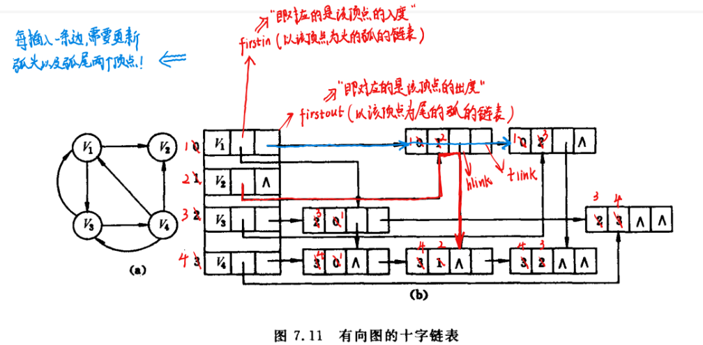
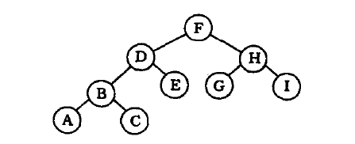

[TOC]


# 第三章 栈和队列的实现

## 3.3 栈和递归的实现

### 3.3.1 n阶Hanoi 汉诺塔问题

> 假设有三个分别命名为X、Y、Z的塔座，在塔座X上插有n个直径大小各不相同、从小到大编号为1，2，···，n的圆盘。现在要求将X轴上的n个圆盘移动至塔座Z并且仍然按照同样的顺序进行叠放，圆盘移动的时候必须遵循下列的规则：
>
> - 每一次只能移动一个圆盘；
> - 圆盘可以插在X、Y和Z中的任意塔座上；
> - 任何时刻都不能讲一个较大的圆盘压在较小的圆盘之上；

这个问题的递归思考过程为：

当n = 1 时，问题比较简单，我们只需要将编号为1的圆盘从塔座X直接移动至塔座Z上即可；

当n > 1时，需要利用塔座Y作为辅助塔座，若能设法将压在编号为n的圆盘之上的（n - 1）个圆盘从塔座X移动到塔座Y上，则可现将n的圆盘移动到塔座Z上，然后从塔座Y上将其余的（n - 1）个圆盘移动到Z上即可。

而如何将（n - 1）个圆盘从一个塔座移动到另外的一个塔座的问题又是另外的一个和原来的问题相同的特征属性的问题，只是问题的规模小于1而已，所以说可以使用同样的办法求解，一直递归到1个圆盘的时候，显然此时很容易解决问题。

具体代码实现为:

```C++
#include <cstdio>
#include <iostream>

int c = 0;
/**
 * move n from x to y
 */
void move(char x, int n, char y) {
  printf("%i. Move disk %i from %c to %c\n", ++c, n, x, y);
}

void hanoi(int n, char x, char y, char z){
  // the n disks numbered from 1 to n from top to bottom are moved
  // to z according to the rules, and y can be used as un auxiliary tower.
  //

  if (n == 1) {
    move(x, 1, z);
  }else {
    hanoi(n-1, x, z, y);
    move(x, n, z);
    hanoi(n-1, y, x, z);
  }
}

int main (int argc, char *argv[])
{
  hanoi(4, 'x', 'y', 'z');
  return 0;
}
```

由上面的分析我们可以知道对这类问题设计递归算法的时候，我们通常可以先写出问题求解的递归定义。和数学归纳法类似，递归定义由基本项和归纳项两部分组成。

基本项就是n = 1的那个可以直接进行运算的项。

# 第五章 数组和广义表

> 顾名思义，广义表是线性表的推广。

## 5.1 抽象数据类型广义表的定义

抽象数据类型的广义表的定义如下：

```C
ADT GList{
    数据对象：D = {ei | 1,2,···,n; n>=0; ei ∈ AtomSet 或 ei ∈GList,
             AtomSet 为某一个数据对象}
    数据关系：Rl ={<ei-1,ei>|ei-1,ei∈D，2<=i<=n }
}
```

关键就是广义表中的元素既可能为原子元素也可能为列表元素。

广义表的基本操作有:

1. ***广义表初始化，创建空的广义表L；***

```C
Init_GList(& L);
```

2. ***根据广义表的书写形式字符串S构造广义表L；***

```C
CreateGList(&L, S);
```

3. ***如果广义表存在，销毁广义表L；***

```C
DestroyGList(& L);
```

4. ***广义表的复制操作，如果广义表L存在，复制广义表L得到广义表T；***

```C
CopyGList(L);
```

5. ***求得广义表的长度，即元素个数；***

```C
GListLength(L);
```

6. ***求的广义表的深度，广义表为空的时候，深度为1；***

```C
GListDepth(L);
```

7. ***判断广义表L是否为空***；

```C
GListEmpty(L);
```

8. ***取广义表的头；***

```C
GetHead();
```

9. ***取广义表的尾；***

```C
GetTail();
```

10. ***插入元素e作为广义表L的第一元素***；

```C
InsertFirst_GL(&L, e);
```

11. ***删除广义表的第一个元素并且返回其值；***

```C
DeleteFirst_GL(&L, &e);
```

12. ***遍历广义表的每一个元素，并使用函数Visit来处理每一个元素；***

```C
Traverse_GL(L, Visit());
```

广义表一般记为：${LS = (a_{1},a_{2},\dots,a_{n})}$

其中，***n为广义表的长度***. 广义表中，${a_{i}}$可以是单个元素，也可以是广义表，分别称为广义表的***原子***和***子表***。当广义表非空的时候，称第一个元素${a_{1}}$为${LS}$广义表的***表头***，称其余元素所组成的表${(a_{2}, a_{3},a_{4}, \dots, a_{n})}$为${LS}$广义表的表尾。

> ***注意！！！！***
>
> 广义表  ${LS1 = ()}$   和广义表  ${LS2 = (())}$ 是不一样的！！！
>
> 前者为空表，长度为0，没有表头或者表尾；
>
> **后者不为空表，长度为1，其表头为第一个元素为${()}$ , 其表尾元素也为${()}$ **

## 5.2 广义表的存储结构

> 广义表中的数据元素可以具有不同的结构(或是原子，或是列表)，因此难以用顺序结构表示，***我们通常使用链式存储结构，每一个数据元素可以用一个结点来表示。***

### 5.2.1 广义表的头尾链表存储表示

该种存储结构的想法是任何广义表都是由一个表头和表尾组成的，特殊情况即为空表，此时的广义表的表头结点指向`nullptr`；其余情况下表头结点均指向一个***表结点***，因为广义表起码是一个表嘛！然后其中的`ptr.hp`指针指向的结点类型可能为原子结点，也可能为表结点!

```C
// ---------------广义表的头尾链表存储表示-----------------
typedef enum {ATOM, LIST} ElemTag; // ATOM == 0 : 原子; LIST == 1 : 子表
typedef struct GLNode {
    ElemTag tag;				     // 公共部分，用于区分原子结点和表结点
    union { 					     // 原子结点和表结点的联合部分
        AtomType atom; 				// atom是原子结点的值域，AtomType由用户定义
        struct { struct GLNode * head_ptr, * tail_ptr; } ptr;
        // ptr是表结点的指针域，ptr.head_ptr 和ptr.tail_ptr 分别指向子表的表头和表尾
    };
} * GList; // 广义表类型
```

如果广义表为空的话，有：

```C
GList glist = nullptr;
```

如果广义表非空的话，有：

```C
GList glist = (GList )malloc (sizeof (GLNode));
glist ->tag = LIST;
glist ->head_ptr = ...;
glist ->tail_ptr = ...;
```

### 5.2.2  广义表的扩展线性链表存储表示

> 该种存储结构是最和我们平时学习的线性表相似的地方，该种存储结构就是真正将广义表中的元素都看成一个结点，然后使用指针将这些结点串联起来，所有的广义表看做成最大的结点！

```C
// -----------------------广义表的扩展线性链表存储表示-----------------------
typedef enum {ATOM, LIST} ElemTag; // ATOM == 0 : 原子, LIST == 1 :子表
typedef struct GLNode {
    ElemTag tag;  					// 公共部分，用于区分原子结点和表结点
    union {
        AtomType atom; 				   // 原子结点的值域
        struct GLNode * head_ptr; 		 // 原子结点的表头指针
    };
    struct GLNode * next_ptr;  			      // 相当于线性链表的next, 指向下一个元素结点
} * GList;						    // 广义表类型GList 是一种扩展的线性链表
```

如果广义表为空的话，则有：

```C
GList glist = (GList)malloc(sizeof(GLNode));
glist -> tag = 1;
glist -> head_ptr = nullptr;
glist -> next_ptr = nullptr;
```

如果广义表不为空的话，则有:

```C
GList glist = (GList)malloc(sizeof(GLNode));
glist -> tag = 1;
glist -> head_ptr = other_node;
glist -> next_ptr = nullptr;  // 每一个广义表都可以看做一个巨大的结点，该节点肯定是单独的，是没有下一个结点的!!
```

## 5.3 广义表的递归算法

### 5.3.1 求广义表的深度

设非空广义表为${LS = (a_{1},a_{2}, \dots,a_{n})}$ , 则我们要想求得${LS}$的深度可以分解为n个子问题，每一个子问题为求${a_{i}}$的深度：

- 如果${a_{i}}$ 是原子的话，则其深度为0；
- 如果${a_{i}}$ 是空表的话，则其深度为1；
- 如果${a_{i}}$ 也是广义表的话，和上面一样做同样的处理，分解为另外的n个子问题，并且求出各子问题的深度中的最大值加1；

所以${LS = (a_{1},a_{2},\dots,a_{n})}$ 的深度`depth(LS)`为：

***基本项：***

- DEPTH(LS) = 1, 当${LS}$ 为空表时；

- DEPTH(LS) = 0, 当${LS}$ 为原子的时；

***归纳项：***

- ${DEPTH(LS) = 1 + Max\{DEPTH(a_{i})\}, 1\leq i \leq n, n \geq 1}$

所以说相应的递归代码应该为：

```C
int GListDepth(GListNode * node) {
    // 0. 采用扩展线性链表存储结构，求广义表L的深度
    int max = 0 , depth;
    GListNode * temp_node;
    // 1. 空表的深度为1
    if(!L) return 1;
    // 2. 原子的深度为0；
    if(L -> tag == ATOM) return 0;
    // 3. 如果是广义表的话，遍历每一个元素，求得所有元素的深度的最大值，并且将最大值加1即为广义表的最大值
    for( temp_node = node->head_ptr; temp_node ;temp_node = temp_node -> next_ptr) {
        depth = GListDepth(temp_node);
        if(depth > max) max = depth;
    }
    return max + 1;
}
```

***上述算法的执行过程实质上是遍历广义表的过程，在遍历中首先求得各个子表的深度，然后综合得到广义表的深度。***

### 5.3.2 遍历广义表

我们求广义表的深度的过程的实质上就是遍历广义表的过程：

```C++
void tranverse(Glist_node* node,void (*func)(Glist_node)) {
    // 1. 如果广义表为空，直接返回：
    if(node == nullptr) return;
    // 2. 如果node为原子，则指定相应的函数：
    if(node->tag == ATOM) return func(node->atom);
    // 3. 如果是广义表，遍历广义表中的每一个元素：
    for(node = node->head_ptr; node != nullptr; node = node -> next_ptr) 
        tranverse(node, func);
    return;
}
```

### 5.3.3 复制广义表

***在看广义表的存储结构的时候，我们知道有两种存储结构供我们进行选择：1. 头尾链表存储表示；2. 扩展线性链式存储表示；当时我认为后者更加的贴切我个人的认识，我觉得后者实现起来逻辑会更加的清晰，实则不然。在实现的过程中，我们会发现前者本身的表头和表尾是最大的优势，方便我们实现各种操作！***

任何一个非空广义表都可以分解为表头和表尾，反之，一对确定的表头和表尾可以唯一确定一个广义表。所以说我们复制一个广义表的时候只需要分别复制其表头和表尾即可。

假设${LS}$是原来的表，${NEWLS}$是复制的表，则复制的递归可以定义为：

***基本项：*** ${InitGList(NEWLS)\{置空表\}，当LS为空表时。}$

***归纳项：*** 

${COPY(GetHead(LS) ->GetHead(NEWLS)) \{复制表头\}}$

${COPY(GetTail(LS)->GetTail(NEWLS))\{复制表尾\}}$


### 5.3.4 建立广义表的存储结构

广义表的字符串S可能有两种情况：

(1) ${S = '()'}$   (带括弧的空白串)；

(2) ${S = (a_{1}, a_{2}, \dots, a_{n})}$, 其中${a_{i}(i = 1, 2,\dots,n)}$ 是S的子串。

> 这里，我们需要进行思考，如果使用头尾链表存储表示的话，每一个广义表可以分为头部和尾部，***注意尾部一定是子表！！！***头部可能是原子也可能是子表，这样的话，我们就可以将问题转换为${a_{i}(i = 1,2,\dots,n)}$ 建立子表的问题。又因为${a_{i}}$ 可能有三种情况：
>
> (1) 带括弧的空白串；
>
> (2) 长度为1的单字符串；
>
> (3) 长度大于1的字符串；

```C
Status CreateGList(GList &L, SString S) {
    // 采用头尾链表存储结构，由广义表的书写形式串S创建广义表L。设置emp = '()'
    if(StrCompare(S, emp)) L = NULL;// 创建空表
    else{
        if(!(L = (GList)malloc(sizeof(GLNode))) exit(OVERFLOW);// 建立表结点
        if(StrLength(S) == 1) {L -> tag = ATOM; L -> atom = S;}
        else{
            L -> tag = LIST; p = L;
            SubString(sub, S, 2, StrLength(S) - 2); // 脱外层括号
            do{
                sever(sub, hsub);
                CreateGList(p -> ptr.hp, hsub); q = p;
                if(!StrEmpty(sub)) {
                    if(!(p = (GLNode * ) malloc (sizeof(GLNode))))
                        exit(OVERFLOW);
                    p -> tag = LIST; q -> ptr.tp = p;
                }
            }while(!StrEmpty(sub));
            q -> ptr.tp = NULL;
        }     
    }
    return OK;
}
```

# 第六章 树和二叉树

## 6.1 二叉树(Binary Tree)

### 6.1.1 二叉树的性质

${性质1：}$在二叉树的第${i}$层上至多有${2^{i-1}}$个结点（${i \ge 1}$)。

${性质2：}$深度为${k}$的二叉树的最大结点数为：

​		${\sum_{i=1}^{k}(第i层上的最大结点数) = \sum_{i=1}^{k}2^{i-1} =2^k-1 \qquad}$

${性质3：}$对任何一棵二叉树${T}$,如果其终端结点数为${n_{0}}$， 度为2的结点数为${n_{2}}$,则${n_{0}=n_{2}+1}$,即叶子结点的个数是度为2的结点数加上1。

${性质4：}$ 对于一个含有n个结点的树T来讲，其所有节点的度的和为${n-1}$.

> 补充一条性质：
>
> 在含有${n}$个结点的二叉链表中有${n+1}$个空链表域。
>
> 证明：设一共有${n}$个结点，${x}$个度为2的结点，${x+1}$个终端（叶子）结点，那么度为1的结点有${n-(2x+1)}$个。
>
> ${n}$个结点，那么指针域一共有${2n}$, 没有使用掉的有***${2n - 2x - (n-(2x+1)) = n+1}$***。

### 6.1.2 满二叉树和完全二叉树

一棵深度为${k}$且有${2_{k}-1}$个结点的二叉树称为满二叉树。每一层上的结点数都是最大节点数，就是二叉树满了。我们可以对满二叉树的结点进行连续编号，约定编号从根结点开始，自上而下，自左至右。由此可以引出完全二叉树的定义：

***深度为k的，有n个结点的二叉树，当且仅当其每一个结点都与深度为k的满二叉树中编号从1至n的结点一一对应的时候，称为完全二叉树。***（若设二叉树的深度为h，除第 h 层外，其它各层 (1～h-1) 的结点数都达到最大个数，第 h 层所有的结点都连续集中在最左边，这就是完全二叉树）

***${性质4：}$*** 具有n个结点的完全二叉树的深度为${\lfloor log_{2}n \rfloor+1}$.

> 下面要介绍的性质5，与建立完全二叉树的顺序存储结构密切相关！！

***${性质5：}$***如果对一棵有n个结点的完全二叉树（其深度为${\lfloor log_{2}n \rfloor+1}$）的结点按照层序编号（从第一层到第${\lfloor log_{2}n \rfloor+1}$ 层，每层从左到右），则对任一结点${i(1\leq i \leq n)}$,有：

${(1)}$ 如果${i=1}$,则结点i是二叉树的根，没有双亲；如果${i>1}$，则其双亲${PARENT(i)}$是结点${\lfloor  i/2\rfloor}$.

${(2)}$ 如果${2i>n}$,则结点${i}$无左孩子（结点${i}$为叶子结点）；否则其左孩子${LCHILD(i)}$是结点${2i}$. 

${(3)}$ 如果${2i+1 >n}$, 则结点${i}$无右孩子；否则其右孩子${RCHILD(i)}$是结点${2i+1}$. 

***结点i乘以2之后，我们很容易发现，其对应的就是下一层中相应的位置靠左的元素，加1之后就是靠右的元素，所以我们很容易得到i和其两个孩子之间的关系。***

## 6.2 二叉树的存储结构

### 6.2.1 顺序存储结构

```C
// --------------------二叉树的顺序存储表示----------------------
#define MAX_TREE_SIZE 100
typedef int TElemType
typedef TElemType SeBiTree[MAX_TREE_SIZE]; // 给整形数组定义别名

SeBiTree bt;
```

> 注：该种顺序存储结构仅仅适用于完全二叉树。

### 6.2.2 链式存储结构

有两种方式，一种是二叉链表，另外一种是三叉链表。

(1) 二叉链表，***数据域和左右孩子指针域***；

(2) 三叉链表，***数据域、双亲指针域和左右孩子指针域***；

> 上面已经证明。含有n个结点的二叉链表中有${n+1}$个空链表域。
>
> 之后我们会看到我们可以利用这些空链表域存储其他有用的信息，从而得到另外一种链式存储结构---***线索链表***。

```C
// -----------------二叉树的二叉链表存储表示------------------
typedef struct BiTNode {
    TElemType data;
    struct BiTNode *lchild, *rchild; // 左右孩子指针
}BiTNode, *BiTree;

// -----------------基本操作的函数原型说明-------------------
// 1. 按照先序次序输入二叉树中结点的值（一个字符），空格字符表示空树；
// 构造二叉链表表示的二叉树T。
Status CreateBiTree(BiTree & T);

// 采用二叉链表存储结构，Vist是对结点操作的应用函数
// 先序遍历二叉树T，对每一个结点调用函数Visit一次
Status PreOrderTraverse(BiTree T, Status (* Visit)(TElemType e));

// 中序遍历二叉树T：
Status InOrderTraverse(BiTree T, Status (* Visit)(TElemType e));

// 后序遍历二叉树T:
Status PostOrderTraverse(BiTree T, Status (* Visit)(TElemType e));

// 层序遍历二叉树T:
Status LevelOrderTraverse(BiTree T, Status (* Visit)(TElemType e));
```

## 6.3 遍历二叉树

### 6.3.1 递归遍历二叉树（先序、中序、后序）

- 先序遍历二叉树；
- 中序遍历二叉树；

- 后序遍历二叉树；

以上三种遍历二叉树的方式均可以使用 ***递归进行实现***，主要实现方式就是递归。

```C++
// 先序遍历以r为根的二叉树
template<typename ElemType>
void BInaryTree<ElemType>::PreOrder(BinTreeNode<ElemType> *r,
                                   void (*Visit)(const ElemType &)) {
    if(r != nullptr){
        Visit(r->data);
        PreOrder(r->leftchild, Visit);
        PreOrder(r->rightchild, Visit);
    }
}

// 中序遍历以r为根的二叉树
template<typename ElemType>
void BInaryTree<ElemType>::InOrder(BinTreeNode<ElemType> *r,
                                   void (*Visit)(const ElemType &)) {
    if(r != nullptr){
        InOrder(r->leftchild, Visit);
        Visit(r->data);
        InOrder(r->rightchild, Visit);
    }
}

// 基本项： 
// 如果r == nullptr, 什么都不做；
// 如果r != nullptr, Visit(r->data);

// 归纳项：
// 中序遍历左子树；
// 访问根节点；
// 中序遍历右子树；

// 后序遍历以r为根的二叉树
template<typename ElemType>
void BinaryTree<ElemType>::PostOrder(BinTreeNode<ElemType> * r,
                                    void (*Visit)(const ElemType &)) {
    if(r != nullptr){
        PostOrder(r -> leftchild);
        PostOrder(r -> rightchild);
        (*Visit)(r -> data);
    }
}
```

### 6.3.2 非递归遍历二叉树（迭代法）

> 阅读自《代码随想录》，这是一本很好的基于C++以及LeetCode上的习题对各种算法进行讲解的书籍，非常值得阅读！

#### 6.3.2.1 标记法（***优先选择该种方法***）

#### 

该种方法的主要思想是将结点按照某一种特定的顺序进栈（注意此处的顺序是和当前遍历顺序相反的）：

比如说： 

***中序遍历：*** ${midnode \Rightarrow leftnode \Rightarrow rightnode}$

我们入栈的时候需要将其顺序反过来：${rightnode \Rightarrow midnode \Rightarrow leftnode}$

并且我们的入栈的时候如果遇到中间的节点的话，我们此时需要入栈一个`nulptr`结点， ***作一个标记，为了后面访问的时候如果遇到一个空节点的话，说明下一个结点就是我们的要访问的节点。***

```C++
template <typename T>
void BinaryTree<T>::inorderTarversal(void (*visit)(const T &), bool,
                                     bool) const {
  std::stack<TreeNode<T> *> _stack;

  if (!empty()) {
    _stack.push(root);
  }
  // begin: rightnode -> midnode -> leftnode
  // later: leftnode ->midnode -> rightnode
  while (!_stack.empty()) {
    TreeNode<T> *node = _stack.top();
    if (node) {
      _stack.pop();
        
      // add the right node if not nullptr:
      if (node->rchild)   _stack.push(node->rchild);
      _stack.push(node);
      // the key of this methods, we add a flag to the end of the visited node
      _stack.push(nullptr);
      if (node->lchild)   _stack.push(node->lchild);
        
    } else {
      // if the top node of stack is nullptr, we are about to visit the
      // corresponding node
      _stack.pop();
      node = _stack.top();
      _stack.pop();
      visit(node->data);
    }
  }
};
```

其余的两种方法类似一样的道理，只需交换${leftnode、 midnode、rightnode}$s的交换次序即可。

***后序遍历算法***

```C++
template <typename T>
void BinaryTree<T>::postorderTarversal(void (*visit)(const T &), bool,
                                       bool) const {
  std::stack<TreeNode<T> *> _stack;

  if (!empty()) {
    _stack.push(root);
  }

  // begin: midnode -> rightnode -> leftnode
  // later: leftnode ->rightnode -> midnode

  while (!_stack.empty()) {
    TreeNode<T> *node = _stack.top();

    if (node) {
      _stack.pop();

      _stack.push(node);
      // the key of this methods, we add a flag to the end of the visited node
      _stack.push(nullptr);

      // add the right node if not nullptr:
      if (node->rchild)
        _stack.push(node->rchild);

      if (node->lchild) {
        _stack.push(node->lchild);
      }
    } else {
      // if the top node of stack is nullptr, we are about to visit the
      // corresponding node
      _stack.pop();
      node = _stack.top();
      _stack.pop();
      visit(node->data);
    }
  }
};
```

***先序遍历算法：***

```C++
template <typename T>
void BinaryTree<T>::preorderTarversal(void (*visit)(const T &), bool,
                                      bool) const {
  std::stack<TreeNode<T> *> _stack;

  if (!empty()) {
    _stack.push(root);
  }

  // begin:  rightnode ->  leftnode -> mid node
  // later:  mid node -> leftnode -> rightnode

  while (!_stack.empty()) {
    TreeNode<T> *node = _stack.top();

    if (node) {
      _stack.pop();
      // add the right node if not nullptr:
      if (node->rchild)
        _stack.push(node->rchild);

      if (node->lchild) {
        _stack.push(node->lchild);
      }
      _stack.push(node);
      // the key of this methods, we add a flag to the end of the visited node
      _stack.push(nullptr);

    } else {
      // if the top node of stack is nullptr, we are about to visit the
      // corresponding node
      _stack.pop();
      node = _stack.top();
      _stack.pop();
      visit(node->data);
    }
  }
};
```

> 此种方法，我们只需要掌握该种标记方法的关键然后就可以记住其余的两种遍历算法。

#### 6.3.2.2 普通非递归方法

***先序遍历：***

```C++
template <typename T>
void BinaryTree<T>::preorderTarversal(void (*visit)(const T &), bool) const {
  std::stack<TreeNode<T> *> _stack;

  if (empty()) {
    return;
  }

  _stack.push(root);

  while (!_stack.empty()) {
    TreeNode<T> *node = _stack.top();
    _stack.pop();

    visit(node->data);

    // attention the order of instack
    if (node->rchild)
      _stack.push(node->rchild);
    if (node->lchild)
      _stack.push(node->lchild);
  }
}
```

***中序遍历：***

```C++
template <typename T>
void BinaryTree<T>::inorderTarversal(void (*visit)(const T &), bool) const {
  std::stack<TreeNode<T> *> _stack;
  TreeNode<T> *node = root;

  while (node || !_stack.empty()) {
    if (node) {
      _stack.push(node);
      node = node->lchild;
    } else {
      node = _stack.top();
      _stack.pop();
      visit(node->data);
      node = node->rchild;
    }
  }
}
```

***后序遍历算法：***

```C++
// Important:
// preorder: mid -> left -> right
// We exchange the instack order of (node->lchild) and (node->rchild),
// there will be mid -> right -> left
// and we reverse the order,
// there will be left -> right -> mid.
// Thus we get the result.
template <typename T>
void BinaryTree<T>::postorderTarversal(void (*visit)(const T &), bool) const {
  std::stack<TreeNode<T> *> _stack;
  TreeNode<T> *node = root;
  std::vector<T> result;
  if (empty()) {
    return;
  }

  _stack.push(node);

  while (!_stack.empty()) {
    node = _stack.top();
    _stack.pop();
    result.push_back(node->data);

    if (node->lchild)
      _stack.push(node->lchild);
    if (node->rchild)
      _stack.push(node->rchild);
  }

  // we reserse the order, then we will get the result.
  std::reverse(result.begin(), result.end());
  for (const T &element : result) {
    visit(element);
  }
}
```


- 层序遍历

层序遍历需要借助数据结构队列来实现：

> 上一层进队列，出队列之前将自己的孩子们全部入队，然后再出队列，并且进行访问！

```C++
template<typename ElemType>
void BinaryTree<ElemType>::LevelOrder(void (*Visit)(const ElemType &)) const {
    queue<BinTreeNode<ElemTyep> *> _queue;
    BinTreeNode<ElemType> * p;
    if(root != nullptr)
        _queue.enqueue();
    while(!_queue.empty()){
        _queue.dequeue(p);
        (*Visit)(p->data);
        if(p->leftchild != nullptr)
            _queue.enqueue(p->leftchild);
        if(p->rightchild != nullptr)
            _queue.enqueue(p->rightchild);
    }
}
```

### 6.3.3 层序遍历

***层序遍历很简单，我们需要利用到队列来进行实现！即我们现将根节点入队，之后每一次出队一个结点的时候，将这个结点的左右结点入队（前提是相应的结点不为`nullptr`），然后就这样一直循环直到队列为空！***

```C++
template <typename T>
void BinaryTree<T>::levelorderTarversal(void (*visit)(const T &)) const {
  std::queue<TreeNode<T> *> _queue;

  if (!empty()) {
    _queue.push(root);
  }

  while (!_queue.empty()) {
    TreeNode<T> *node = _queue.front();

    // push the children of the front node:
    if (node->lchild) {
      _queue.push(node->lchild);
    }
    if (node->rchild) {
      _queue.push(node->rchild);
    }

    visit(node->data);
    _queue.pop();
  }
}
```

## 6.4 二叉树的建立

- 由二叉树的先序序列和中序序列可以唯一的确定一棵二叉树；
- 由二叉树的后序序列和中序序列可以唯一的确定一棵二叉树；
- 由二叉树的层序序列也可以唯一的确定一棵二叉树；

***PS： 二叉树的前序序列和后序序列不可以唯一的确定一棵二叉树！！***

### 6.4.1 以先序序列建立二叉树

> 注意，之前自己认为的是建立一棵完整的二叉树需要至少两个遍历序列，这样才可以彼此参考建立一个二叉链表，注意那是我们人算的并不是计算的，那种情况是根据两种序列来建立二叉树。
>
> 我们完全可以格式化一个二叉树，如果对应的结点没有数据的话，就以' '来代替即可。

${A B C\Phi\Phi DE\Phi G \Phi \Phi F \Phi \Phi \Phi}$

```C++
template<typename T>
void CreateBinaryTreePre(std::string &str, BinTreeNode<T> *&root) {
  char ch;
  if (!str.empty()) {
    ch = str[0];
    str = str.substr(1);
  }

  if (ch == ' ') {
    root = nullptr;
  }else {
    root->data = ch;
    root->leftChild = new BinTreeNode<char>;
    root->rightChild = new BinTreeNode<char>;
    CreateBinaryTreePre(str, root->leftChild);
    CreateBinaryTreePre(str, root->rightChild);
  }
```

### 6.4.2 以先序序列以及中序序列建立二叉树

> 现有先序序列和中序序列：`std::vector<int> inorder` `std::vector<int> preorder`

要求构建一棵二叉树：

Step1: 如果数组的长度为0的话，则说明为空节点；

Step2: 如果数组不为空，那么将先序序列的第一个元素作为节点元素；

Step3: 找到前序序列的第一个元素在中序序列中的位置作为切割点；

Step4: 切割中序序列， 切成 ***左子树的中序序列*** 以及 ***右子树的中序序列***；（***注意，一定是对中序序列进行切割，原因很简单，因为我们第五步需要利用该步骤得到的左子树的中序序列的长度来对先序序列进行切割！***）

Step5: 切割先序序列，切成 ***左子树的先序序列*** 以及 ***右子树的先序序列；***

Step6: 递归的处理左子树和右子树，也就是左区间和右区间；

其中的关键是求得每一次递归中， 切割后的左子树和右子树的开始和终止位置。

[binary_tree.h](./BINARY_TREE/binary_tree/binary_tree.h)

你可以在`main.cpp`中这样去构建一棵二叉树， 并且利用辅助函数`Dump`进行打印:

```C++
  // construct the binary tree use a inorder and preorder:
  BinaryTree<int> tree_test_2({9, 3, 15, 20, 7}, {3, 9, 20, 15, 7}, true);
  Dump(tree_test_2);
```

### 6.4.3 以后序序列以及中序序列建立二叉树

> 其道理和以先序序列和中序序列构建二叉树一样，不再进行阐述。

[binary_tree.h](./BINARY_TREE/binary_tree/binary_tree.h)

你可以在`main.cpp`中这样去构建一棵二叉树， 并且利用辅助函数`Dump`进行打印:

```C++
// construct the binary tree use a inorder and postorder:
  BinaryTree<int> tree_test_1({9, 3, 15, 20, 7}, {9, 15, 7, 20, 3});
  Dump(tree_test_1);
```

## 6.5 线索二叉树

> 注意，之后提到的“前驱”和“后继”均指的是以某种次序遍历多得序列中的前驱和后继。

***二叉树的局限性：当以二叉链表作为存储结构的时候，只能找到结点的左右孩子信息，而不能直接得到结点在任一序列中的前驱和后继结点信息，此种信息只有在遍历的动态过程中才可以得到。***

由此引出线索二叉树，线索二叉树是利用每一个有`n`个结点的二叉链表必定存在`n+1`个空链表域来存储结点的前驱和后继的信息。


我们规定：如果结点有左子树，则其`lchild`域指示其左孩子，否则令`lchild`域指示其前驱；如果结点有右子树，则其`rchild`域指示其右孩子，否则令其`rchild`域指示其后继结点。

以这种接待您结构构成的二叉链表作为二叉树的存储结构，叫做 ***线索链表***，其中指向结点前驱和后继的指针， ***叫做线索***。加上线索的二叉树称为 ***线索二叉树(Threaded Binary Tree)***。对某一种次序遍历使其变为线索二叉树的过程叫做线索化。

```C++
// 二叉树的线索存储
typedef enum PointerTag {Link, Thread};
typedef struct BiThrNode {
    TElemType data;
    struct BiThrNode * lchild, rchild;
    PointerTag LTag, RTag;
}BinThrNode, * BiThrTree
```

### 6.5.1 中序遍历转化为线索二叉树

> 这里的代码逻辑有点难以理解，我们可以这么想，从最基本的开始思考，最简单的二叉树：无非就三个结点，完全满足相应的设定。
>
> 
>
> 参考文章：https://zq99299.github.io/dsalg-tutorial/dsalg-java-hsp/10/03.html#%E4%BB%A3%E7%A0%81%E5%AE%9E%E7%8E%B0

```C++
template<typename T>
void to_thread_tree(ThreadTreeNode<T> *&root, ThreadTreeNode<T> *&pre) {
    
  // Attention!!
  //-------O----
  //------/-\---
  //-----O--O---
  // we can think from the easist one!


  if(root == nullptr)
    return;

  // 1. process the left child tree
  to_thread_tree(root->lchild, pre);

  // 2. process the current node
  if(root->lchild == nullptr) {
    root->lchild = pre;
    root->ltag = Thread;
  }

  // process the previous node's next node
  if (pre != nullptr && pre->rchild == nullptr) {
    pre->rchild = root;
    pre->rtag = Thread;
  }
  // move to the next node and save the previous node
  pre = root;

  // 3. process the right child tree
  to_thread_tree(root->rchild, pre);
}
```

### 6.5.2 遍历线索二叉树

***上面的线索二叉树是由中序遍历建立而来，所以说我们遍历的时候也是按照中序遍历来！！***

想法就是:先遍历根节点的左子树，找到那个第一个输出的结点，然后根据我们后来建立的线索链表，依次遍历即可：

```C++
template<typename T>
void ThreadTree<T>::inorder_thread_tree(void (*visit)(const T &)){
  ThreadTreeNode<T> *p = _root;
  while (p != nullptr) {
    while (p->ltag == 0) {
      p = p->lchild;
    }
    // 找到最左边的结点之后，访问之
    (*visit)(p->data);
    // 注意这里很容易和之前的二叉树误解，这里是利用已经建立好的线索二叉树的线索进行遍历的，这里是往遍历刚才那个结点的祖先
    while (p->rtag == Thread) {
      p = p->rchild;
      (*visit)(p->data);
    }
    // 这里开始遍历右边的结点，又下来了，一整个过程就是先下再上，再下，再上
    p = p->rchild;
  }
}
```

## 6.6 树和森林

### 6.6.1 树的存储结构

<h4> 双亲表示法</h4>

> ***利用的是每一个结点（除了根结点以外）只有唯一的双亲的性质。***
>
> - 寻找结点的双亲操作PARENT(T, x)操作的时间复杂度为 ${O(1)}$. 
> - 我们反复的调用PARENT(T, x)操作，直到遇见无双亲的结点的时候， ***我们便找到了树的根.***
> - ***缺点：求结点的孩子时需要遍历整个结构.***

```C++
 // -------树的双亲存储表示--------
#define MAX_TREE_SIZE 100
typedef struct PTNode {
    TElemType data; // 存储数据
    int parent; 	  // 双亲位置
}PTNode;

typedef struct {
    PTNode nodes[MAX_TREE_SIZE];  // 存储所有的结点信息，注意，我们只能寻找到当前结点的双亲位置
    int r, n;   					// 根的位置以及结点数
}
```

<h4>孩子表示法</h4>

课本上第一种介绍的方法是采用多重链表，每一个结点有多个指针域，每一个指针域存储一个孩子结点。但是显然该种方法很老套，而且很容易浪费空间。

| 下面是     | 两种结点      | 格式：        |               |               |                    |
| ---------- | ------------- | ------------- | ------------- | ------------- | ------------------ |
| ***data*** | ***child_1*** | ***child_2*** | ***...***     | ***child_k*** |                    |
| ***data*** | ***degree***  | ***child_1*** | ***child_2*** | ***...***     | ***child_degree*** |

如果采用第一种格式的话，则多重链表的结点是同构的，什么意思呢？就是说**每一个结点的指针域的个数都是一样**的，**等于树的度**，但是应用的时候，一定存在很多结点的度是小于k的，所以说每一个结点会有很多空指针域，空间比较浪费。***一棵树有n个结点，那么其所有的结点的度数为n-1, 也就是说一共需要的指针域的个数为n-1, 然而如果按照这样的存储当时来的话，我们一共有nk个指针域，那么就浪费了${nk - (n-1)}$个指针域。***

如果采用第二种格式的话，则多重链表的结点是不同构的，就是说每一个结点的指针域的个数是由当前结点的度来决定的，这样虽然可以节约存储空间，但是操作不方便。

另外的一种方法才是我们最经常使用的，我们将***每一个结点的所有孩子结点使用链表的方式进行连接***，接着在结点当中增设一个域来存储孩子链表的头即可。然后采用顺序结构来存储所有的结点。

```C++
// -------树的孩子链表存储表示---------
typedef struct CTNode { // 孩子结点
    int child;
    struct CTNode* next; 
}* ChildPtr;

typedef struct {
    TELemType data;
    ChildPtr firstchild;       // 孩子的链表头指针
}CTBox;

typedef struct {
    CTBox nodes[MAX_TREE_SIZE];
    int n, r; 			// 结点数以及根的位置
}
```

我们可以将树的双亲表示法和孩子表示法结合起来。


<h4>孩子兄弟表示法</h4>

以二叉链表作为树的存储结构。链表中结点的两个链域分别指向该结点的第一个孩子结点和下一个兄弟结点，分别命名为`firstchild`域和`nextsibling`域。

```C++
// --------树的二叉链表（孩子-兄弟）存储表示
typedef struct CSNode {
    ElemType data;
    struct CSNode *firstchild, *nextsibling;
}CSNode, * CSTree;
```


### 6.6.2 森林或树与二叉树的转换

> 我们在谈论树的存储结构的时候，可能你会注意到如果使用 ***孩子-兄弟表示法***，树的物理结构和二叉树的结构是一模一样的，仅仅是解释不一样罢了，所以说我们可以以二叉链表作为媒介可以找到树和二叉树之间的一个对应关系。

***1. 树和二叉树的转换：***


这里主要就是利用 ***孩子-兄弟表示法***来将这棵树表示出来，形式上来看就是二叉树。

***注意：根节点是没有兄弟的，所以说树转换为二叉树之后，根节点是一定不存在右子树的！***


***2. 森林和二叉树的转换：***

其实就是将森林中第二棵树的根节点看作为第一棵树的根节点的兄弟，这样的既符合我们的认知，也将森林转换为了一个树，就可以使用 ***孩子-兄弟表示法*** 来将森林转换为二叉树。


### 6.6.3 树和森林的遍历

1. 树的遍历；

树的遍历一般是只有两种方式：

- 先根次序遍历，先访问树的根结点，然后遍历访问树的每一棵子树；
- 后根次序遍历，先遍历访问树的每一棵子树，然后访问根结点；

为什么没有 “中根次序遍历”？那么多子树，哪里来的中，只能是先或者后。

2. 森林的遍历；


森林的遍历是有两种：

***先序遍历：***

(1) 访问森林的第一棵树的根节点；

(2) 先序遍历第一棵树中根节点的子树森林；

(3) 先序遍历除去第一棵树之后剩余的树构成的森林；

上面对森林先序遍历之后：

${A BCDEFGHIJ}$


***中序遍历：***

(1)  中序遍历森林中的第一棵树的根节点的子树森林；

(2) 访问第一棵树的根节点；

(3) 中序遍历除去第一棵树之后剩余的树构成的森林；

对上面森林中序遍历之后：

${BCDAFEHJIG}$


以上对于森林的两种遍历是建立在森林没有转换为二叉树之前，但是如果将森林转化为二叉树之后再进行遍历，***则上面所阐述的先序和中序遍历即为其转换为二叉树之后对应的先序和中序遍历。***

## 6.7 哈（赫）弗曼树（Huffman）及其应用

### 6.7.1 最优二叉树（哈弗曼树）

首先补充几点基本概念：

- 从树中一个结点到达另外一个结点之间的分支构成这两个结点之间的***路径***，路径上的分支数目称为***路径长度***；
- 树的路径长度是从树根到每一个结点的路径长度之和；
- 考虑带权的结点。结点的***带权路径长度***为从该结点到树根之间的***路径长度乘以结点上权值***；
- 树的***带权路径长度***为树中所有***叶子结点***的***带权路径长度之和***；
- 其中带全路径长度最小的 ***带权路径长度*** WPL最小的二叉树称为最优二叉树或哈弗曼树；

实际上我们只要掌握哈夫曼编码即可，因为哈夫曼树完全就是利用哈弗曼编码的原理构建而来的，我们在多媒体技术这门课程中学习过信息的压缩存储，其中一种方法就是利用哈夫曼编码进行压缩，压缩的效果还是很可观的。

> 这里想到一些题外话，有的时候我们学习某一些东西的时候，可能当时会觉得这个东西是不是没有用，现在做的是不是浪费时间，但现在最近的一些学习经历，让我觉得我们一定不能这样去想，我们学习的东西看在近阶段起不到什么作用，但是我们眼界放的长远一点，可能我们以后的某一个领域就会使用到我们现在学习的内容。
>
> 我大学期间唯一挂科的一门课程叫做《多媒体技术》，这门课程讲述的是关于多媒体的一些知识，都是一些很久远的知识：比如说音频、视频等等信息的存储方式或者一些其他的知识。我当时因为是大三，有很多项目需要去做，就对这一门课程很没有耐心，觉得这么课程什么用都没有。但是现在看来，当时的学习还是有点用的（但是仍然不承认当时学习的关于唱片的存储等知识有用，因为我们几乎都用不到这些东西），比如说当时学习的哈弗曼编码就是一个很好的例子。
>
> 所以说我想对我自己说，你只管努力，一切交给时间！

### 6.7.2 哈夫曼算法

- 根据给定的n个权值${\{w_{1}, w_{2},w_{3},\cdots,w_{n}}\}$构成n棵二叉树的集合${F=\{T_{1},T_{2},T_{3},\dots, T_{n}\}}$,其中每一棵二叉树${T_{i}}$只有一个带权为${w_{i}}$的根结点，其左右子树为空；
- 在F中选择两棵根结点的权值最小的树当做左右子树构造一棵新的二叉树，而且新的二叉树的权值为刚才两棵二叉树的权值之和；
- 在F中删除这两棵树，同时将新得到的二叉树放在F中；
- 重复上面两个步骤，一直到F中只含有一棵树为止，这棵树就是哈弗曼树；


我们构建了一个哈弗曼树之后，约定左边分支为0， 右边分支为1，那么从根节点到指定的叶子结点的路径上的0和1的组合就是叶子结点对应权的编码，也就是***哈夫曼编码***，而且这样编码其中任何一个权值的编码都不是另外一个权值的编码的前缀，这称为 ***前缀编码***。


***PS: 注意我们可以注意到哈弗曼树中是不存在度为1的结点的，所以我们可以根据这个特性得到一些其余的性质，比如说含有n个叶子结点的哈弗曼树共有2n-1个结点。***

### 6.7.3 哈弗曼树的存储结构

```C++
typedef struct {
    unsigned int weight;
    unsigned int parent, lchild, rchild;
}HTNode, * HuffmanTree; // 动态分配数组存储哈夫曼树

typedef char ** HuffmanCode; // 动态分配输出存储哈弗曼编码表
```

## 6.8 回溯法与树的遍历

回溯算法是递归的副产品，只要有递归的过程就会有对应的回溯的过程。回溯法其实就是递归法，指的是同一种函数。

关于回溯法的性能，回溯的本质其实就是穷举，我们通过抽象的构建一棵树形结构来穷举出来各种情况，***任何可以使用回溯算法解决的问题都是可以抽象为树形结构的，因为回溯法解决的问题就是在集合中递归查找子集，集合的大小就构成了树的宽度，递归的深度构成了树的深度。***

***示例1:***

Problem: 求出一个数集的幂集，例如：给定${S = \{1,2,3\}}$, 则其幂集为：${\{\{1,2,3\},\{1,2\},\{1,3\},\{2,3\},\{1\},\{2\},\{3\},\{\}\}}$

```C++
#include <iostream>
#include <vector>

class Solution {
private:
  std::vector<std::vector<int>> result{};
  std::vector<int> path{};

  void get_powerset(const std::vector<int> &elements, int height) {
    if (height == elements.size()) {
      result.push_back(path);
      return;
    }

    path.push_back(elements[height]);
    get_powerset(elements, height + 1);

    path.pop_back();
    get_powerset(elements, height + 1);
  }

public:
  std::vector<std::vector<int>>
  get_the_powerset(const std::vector<int> &elements) {
    get_powerset(elements, 0);
    return result;
  }
};

template <typename T> void output(const std::vector<std::vector<T>> &sets, int index) {
  std::cout << "case" << index << ":";
  std::cout << "{";
  for (int i = 0; i < sets.size(); i++) {
    std::cout << "{";
    for (int j = 0; j < sets[i].size(); j++) {
      std::cout << sets[i][j];
      if (j != (sets[i].size() - 1)) {
        std::cout << ",";
      }
    }
    std::cout << "}";
    if (i != (sets.size() - 1)) {
      std::cout << ",";
    }
  }
  std::cout << "}" << std::endl;
}

int main(int argc, char *argv[]) {
  std::vector<int> elements{1, 2, 3, 4, 5, 6, 7, 8, 9};
  Solution solution;
  output(solution.get_the_powerset(elements), 1);
  return 0;
}
```

# 第七章  图ADT(Abstract Data Type)

## 7.1 图的基本概念和术语

${G = (V,E)}$, ***集合V中的元素称为顶点***；***集合E中的元素称为边***；

(1) 无向图、有向图和混合图；


(2) 度；

对于***无向图***来讲，与顶点v关联的边数称为v的度数；

对于***有向图***，度又分为***出度***和***入度***；


(3) ***简单图***；

联接于同一顶点的边，称为自环(self-loop)。***不含任何自环的图称之为简单图，我们之后主要讨论的就是简单图。***

### 7.1.1 通路与环路

(4) 通路与环路；

路径或者通路，就是由m+1个顶点与m条边交替而成的一个序列：

${\pi =\{v_{0},v_{1},v_{2},v_{3},\cdots,v_{m}\}}$


比如上图所示中，(a) 中的${C,A,B,A,D}$就是一条从C到D的通路，其长度为4，可见，***虽然通路上的边必须互异，但是顶点却可能重复。***沿途顶点互异的通路，称之为***777dz***。

例如(b) 中的顶点C到B的一条简单通路：${C,A,D,B}$就是一条C到B的简单通路，长度为3。


如果对于长度${m\ge 1}$的通路${\pi}$，如果起止地点相同，则我们称其为***环路***，长度为沿途边的总数。不含任何环路的有向图，称之为有向无环图(directed acyclic graph, DAG)。

如果环路中***顶点互不相等***，则称其为***简单环路***。

***欧拉环路，如果经过图中所有的边有且仅有依次，则称其为欧拉环路。注意是所有的边！！！***


上图(a) 中的${\{C,A,B,A,D,C,D,B,C\}}$就是一条欧拉环路，其长度为8。

***对偶的，如果经过图中各顶点有且只有一次的环路，称其为哈密顿环路，其长度等于顶点的个数，也等于构成环路的边数。***

上图(b) 中的${\{C,A,D,B,C\}}$就是一条长度为4的哈密顿环路。

### 7.1.2 带权网络

(5) 带权网络

为每一条边分配一个权值(weight), 然后各边均带有权重的图，称之为***带权图(weighted graph)***或者***带权网络(weighted network)***，又是也简称为***网络(network)***，记作${G(V,E,wt())}$。

## 7.2 图的存储结构

### 7.2.1 邻接矩阵

使用二维数组来保存图中的信息！

示例代码： [example.cpp](./GRAPH/matrix_main.cpp)

```C++
// The type of graph:
// --DG: directed graph,
// --DN: directed network,
// --UDG: undirected graph,
// --UDN: undirected network
typedef enum { DG, DN, UDG, UDN } GraphKind;

// The status of vertex:
typedef enum { UNVISITED, PROCESSING, VISITED, COMPLETED, PENDING } VStatus;

// the struct of vertex:
struct Vertex {
  int data;
  int indegree, outdegree;
  VStatus status;

  Vertex(const int &d)
      : data(d), indegree(0), outdegree(0), status(UNVISITED) {}
  Vertex(const Vertex &rhs)
      : data(rhs.data), indegree(rhs.indegree), outdegree(rhs.outdegree),
        status(rhs.status) {}
};

// the struct of edge:
struct Edge {
  int _weight;
  // judge the edge between _begin and _end:
  bool _exist;

  Edge(const int &weight) : _weight(weight), _exist(false) {}
};
// the graph implemented in matrix:
class Graph_Matrix {
private:
  std::vector<Vertex> vertexes; // the set of vertex
  std::vector<std::vector<Edge>> edges;

  int vexnum, edgenum; // the number of vertex and edge
public:
}
```

### 7.2.2 邻接表

邻接表应该是最经常使用的一种存储方式，因为它和我们的思维习惯比较相似而且也能节省存储空间！

其实现起来无非就是以链表为基本元素的数组：

示例代码：[example.cpp](./GRAPH/adj_main.cpp)

```C++
typedef enum { UNVISITED, PROCESSING, VISITED, COMPLETED, PENDING } VStatus;

// the struct of vertex:
struct Vertex {
  int data;
  int indegree, outdegree;
  VStatus status;

  Vertex(const int &d)
      : data(d), indegree(0), outdegree(0), status(UNVISITED) {}
  Vertex(const Vertex &rhs)
      : data(rhs.data), indegree(rhs.indegree), outdegree(rhs.outdegree),
        status(rhs.status) {}

  bool operator==(const Vertex &rhs) { return data == rhs.data; }
};

struct Node {
  Vertex _vertex;
  Node *_next;

  Node(const int &d, Node *next) : _vertex(d), _next(nullptr) {}
};

class Graph_Adj {
private:
  int vexnum;
  int edgenum;
  std::vector<Vertex> vertexes;
  std::vector<Node *> edges;
}
```

***严蔚敏的《数据结构（C语言版）》：***

```C++
// ------图的邻接表存储表示--------
#define MAX_VERTEX_NUM 20
typedef struct ArcNode {
    int adjvex;				        // 该弧所指向的顶点的位置
    struct ArcNode * nextarc; w	     // 指向下一条弧的指针
    InfoType * info;      			// 该弧相关信息的指针
}ArcNode;

typedef struct VNode {
    VertexType data;
    ArcNode *firstarc;
}VNode, AdjList[MAX_VERTEX_NUM][MAX_VERTEX_NUM];

typedef struct {
    AdjList vertices;			    
    int vernum, arcnum;			 // 图的当前顶点数和弧数
    int kind;					//图的种类标志
}ALGraph;
```

在无向图的邻接表中，顶点${v_{i}}$的度恰巧为第${i}$个链表的结点的个数，当然如果是利用对象的观念来设计邻接表的时候，你可以将顶点抽象化为一个对象，然后我们进行插入或者删除的时候，就可以 ***直接同步更新相关结点的度即可。***

在有向图的邻接表中，第${i}$个链表的结点的个数只是顶点${v_{i}}$的出度，如果想要求出入度的话，你就需要遍历整个邻接表。


### 7.2.3 逆邻接表

上面的分析我们可以看到如果我们在邻接表中想要去求的某一个结点的入度会十分的麻烦，那这个时候该怎么办呢？

类似于邻接表，我们只需要将邻接表中的邻接顶点修改为以顶点${v_{i}}$为头的弧即可。

***在邻接表中很容易找到任意顶点的第一邻接点和下一个邻接点，但是如果要判断两个顶点之间是否有边相连的话，就需要搜索相应的链表，因此，不如邻接矩阵方便。***

示例代码: [graph_adj.h](./GRAPH/include/graph_adj.h)

该头文件中提供了两种插入边的方式，一种是邻接表，另一种则是逆邻接表：

```C++
// inverse adjacency list operation:
  void insert_edge(const std::pair<int, int> &, INVERSE_ADJ);
  void insert_edge(const std::initializer_list<std::pair<int, int>> &,
                   INVERSE_ADJ);
```

### 7.2.4 十字链表

***首先声明十字链表是有向图的另一种链式存储结构。***我们可以将其看作为有向图的邻接表和逆邻接表结合得到的一种链表。

其实就是记录***以每一个顶点为头的所有边***以及***每一个顶点为尾的所有边***，并将这些边分别使用链表进行存储即可。一个是邻接表，另一个是逆邻接表。

在十字链表当中，对于于有向图中的每一条弧都有一个结点，对于每一个顶点也是存在一个结点。

示例代码：[example.cpp](./GRAPH/orthog_list_main.cpp)

```C++
// the vertex nodes:
struct Vertex {
  int _data;
  ArcNode *_firstin;
  ArcNode *_firstout;
  ...
};

// the arc nodes:
struct ArcNode {
  Vertex _headvex, _tailvex;
  ArcNode *hlink;
  ArcNode *tlink;
  ...
};
```

- ***顶点***中的`_firstin`域存储的是该顶点为头的弧的链表；顶点中的`_firstout`域存储的是以该顶点为尾的弧的链表；

- ***弧长结点***，也就是***图中的边***的结构中需要存储边的头部顶点以及尾部顶点。其中`hlink`存储的是入度链表中的下一个结点；`tlink`存储的是出度链表中的下一个结点；



在十字链表当中，我们既容易找到以${v_{i}}$为尾的弧，也容易找到以${v_{i}}$为头的弧，所有我们很容易求得顶点的***出度***和***入度***。


### 7.2.5 邻接多重表

邻接多重表是无向图的另一种链式存储方式，就是将所有依附于同一个顶点的边串联在同一个链表当中，由于每一条边依附于两个顶点，则每一个边结点同时链接在两个链表当中。

就是对于${\{1, 2\}}$这条边来讲的话，该条边既存在***顶点1的链表***当中，也存在***顶点2的链表***当中。

## 7.3 遍历算法

### 7.3.1 深度优先搜索算法

> https://www.51cto.com/article/614590.html 这里面的图示很清楚的说明了深度优先搜索算法以及广度优先搜索算法的思想。

深度优先，表面意思就是深度优先深度优先遍历从某一个顶点出发，访问该顶点，然后对该顶点的第一个未被访问的临界顶点再次使用深度优先遍历，直到访问结束之后。回溯到上一个顶点，查看该顶点是否存在未被访问的邻接顶点，如果存在的话继续对该邻接顶点进行深度优先遍历，直到所有的顶点全部访问结束。

示例代码：

[example.cpp](./GRAPH/adj_main.cpp) 

```C++
// 2.DFS, Depth_First Search:
  void dfs_traversal(void (*visit)(const int &)) {
    for (int i = 0; i < edges.size(); i++) {
      edges[i]->status = UNVISITED;
    }

    for (int i = 0; i < edges.size(); i++) {
      if (edges[i]->status == UNVISITED) {
        dfs(edges[i], visit);
      }
    }
  }

// traversal algorithm:
  void dfs(Node *node, void (*visit)(const int &)) {
    // find the node's location in edges:
    auto ptr = std::find_if(edges.begin(), edges.end(),
                            [node](const std::vector<Node *>::value_type &val) {
                              return val->_vertex == node->_vertex;
                            });
    if (ptr == edges.end()) {
      return;
    }

    node = edges[ptr - edges.begin()];

    if (node->status == VISITED) {
      return;
    }

    node->status = VISITED;
    visit(node->_vertex.data);

    for (; node != nullptr; node = node->_next) {
      if (node->status == UNVISITED) {
        dfs(node, visit);
      }
    }
  };
```

这里是对利用邻接表表示的图进行深度优先遍历，由于我当时设计这个数据结构的时候没有设计好，导致这里代码有点乱，如果设计好的数据结构的话，代码不会这么冗余。


### 7.3.1.1 (DFS性能分析)

首先DFS是一个递归算法，需要借助于一个递归工作栈进行实现，故其空间复杂度为${O(|V|)}$。

遍历图的过程实质上是对每个顶点查找其邻接点的过程，其耗费的时间取决于所用的存储结构。

- 以邻接矩阵表示时，查找每个顶点的邻接点所需的时间为 $\small O(|V|)$，故总的时间复杂度为 $\small O(|V|^2)$。
- 以邻接表表示时，查找所有顶点的邻接点所需的时间为 $\small O(|E|)$，访问顶点所需的时间为 $\small O(|V|)$，总的时间复杂度为 $\small O(|V| + |E|)$。


### 7.3.1.2 应用

***深度优先搜索算法是最重要的图遍历算法。***

与广度优先搜索一样，深度优先搜索也可以用作连通分量的分解或者有向无环图的判定。


### 7.3.2 广度优先搜索算法

广度优先遍历实际上就是二叉树中的层序遍历，先访问一个顶点的所有邻接顶点，然后使用队列来进行保存，之后再一个一个出队列，出队列的同时入队该结点的所有的邻接结点，......

其实本质是和树的层次遍历是一模一样的。

示例代码：

[example.cpp](./GRAPH/adj_main.cpp) 

```C++
void bfs_traversal(void (*visit)(const int &)) {
    // reset all nodes of graph:
    for (int i = 0; i < edges.size(); i++) {
      edges[i]->status = UNVISITED;
    }

    std::queue<Node *> queue;

    if (empty()) {
      return;
    }
    queue.push(edges[0]);

    while (!queue.empty()) {
      Node *node = queue.front();
      if (node->status == UNVISITED) {
        visit(node->_vertex.data);
        node->status = VISITED;
      }
      queue.pop();

      for (node = node->_next; node != nullptr; node = node->_next) {
        auto ptr =
            std::find_if(edges.begin(), edges.end(),
                         [node](const std::vector<Node *>::value_type &val) {
                           return val->_vertex == node->_vertex;
                         });

        queue.push(edges[ptr - edges.begin()]);
      }
    }
  }
```

### 7.3.2.1 (BFS性能分析)

无论是采用什么存储结构实现，BFS算法都需要借助于一个辅助队列Q，n个顶点均需要入队一次，在最坏的情况下，空间复杂度为$\small O(|V|)$.

采用邻接表存储方式的时候，每一个顶点均需要搜索一次，所以说时间复杂度为${O(|V|)}$，在搜索任意顶点的邻接点的时候，每一条边至少访问一次，所以时间复杂度为${O(|E|)}$, 所以说算法的总算法的时间复杂度为${O(|V|+|E|)}$。

当采用邻接矩阵的时候，查找每一个顶点的邻接点所需要的时间均为${O(|V|)}$,所以说总的时间复杂度为$O(|V|^2)$。

### 7.3.2.2 应用

基于BFS， 可以有效的解决连通域的分解问题，以及最短路径问题。

## 7.4 应用


### 7.4.1 最小生成树

#### 0. 基本概念

- 一个连通图的 ***生成树是一个极小连通子图，它拥有图中全部的顶点，但只有足以构成一棵树的${n-1}$条边***。

***注意：如果我们在一棵生成树上添加一条边的话，必定构成一个环，因为这条边使得它依附的那两个顶点之间存在第二条路径。***

- 一棵有n个顶点的生成树有且仅有${n-1}$条边。

- 如果一个图有n个顶点和小于${n-1}$条边，则该图为非连通图。如果它多余${n-1}$条边，则一定存在环。***但是有${n-1}$条边的图不一定是生成树***。

- 如果一个有向图恰有一个顶点的入度为0，其余顶点的入度均为1，则这是一棵有向树。

- 一个有向图的生成森林由若干棵有向树组成，含有图中全部顶点，但是只有足以构成若干棵不相交的有向弧。


#### 1. 问题背景

> 假设要在n个城市之间建立通信联络网，则连通${n}$个城市只需要${n-1}$条线路。这个时候，自然会考虑这样一个问题，如何在最节省经费的前提下建立这个通信网。
>
> ${n}$个城市之间，最多可能设置${n(n-1)/2}$条线路，那么如何在这些可能的线路中选择${n-1}$条，以使得总的耗费最少呢？

建立一个上述问题描述的一棵生成树，并且使得总耗费为最低，也就是边上的权值加起来为最小。这个问题就是构造连通网的最小代价生成树，简称为 ***最小生成树***的问题。一棵树的代价就是树上各边的权值之和。

#### 2. Prime(普里姆)算法

假设${N =(V,\{E\})}$是连通网，${TE}$是${N}$上最小生成树中边的集合。算法从${U = \{u_{0}\}}(u_{0}\epsilon V)$，${TE=\{\}}$开始，重复执行下面的步骤：在所有的$u\ \epsilon\  U$，$v\ \epsilon \ V-U$的边$(u,v)\ \epsilon\ E $中找一条代价最小的边$(u_{0},v_{0})$并入集合$TE$当中，同时${v_{0}}$并入$U$，直至$U=V$为止。此时$TE$中必有$n-1$条边，则$T = (V,\{TE\})$为$N$的最小生成树。


Prim算法的时间复杂度为$O(|V|^{2})$, 不依赖于边数 $\small |E|$，因此它适用于求解边稠密的图的最小生成树。虽然采用其他方法能改进 Prim 算法的时间复杂度，但增加了实现的复杂性。


#### 3. 克鲁斯卡尔(Kruskal)算法

> 贪心算法，贪心的本质是选择每一个阶段的局部最优，从而实现全局最优。

克鲁斯卡尔算法是从另一途径求网的最小生成树。该算法的本质就是贪心算法。最小生成树的初始状态是只有$n$个顶点而无边的非连通图$T = (V,\{\})$。也就是说一开始什么都没有，然后从图的所有边进行选择，***选择那些权重最小的边，并且该边的顶点是落在不同的连通分量上的，一直到所有的顶点都在同一连通分量上为止。***


通常在 Kruskal 算法中，采用堆来存放边的集合，因此每次选择最小权值的边只需 $\small O(log|E|)$ 的时间。此外，由于生成树 $\small T$ 中的所有边可视为一个等价类，因此每次添加新的边的过程类似于求解等价类的过程，由此可以采用并查集的数据结构来描述 $\small T$，从而构造 $\small T$ 的时间复杂度为$ \small O(|E|log|E|)$。因此，Kruskal 算法适合于边稀疏而顶点较多的图。

### 7.4.2 有向无环图(DAG)以及其应用

#### 0. 基本概念

有向无环图就是图中不会出现环的有向图。例如下面图示：


左边的图示中如果是无向图的话就存在环，但是是有向图。右边的图中就是一个普通的有向图，并非是有向无环图。

有向无环图，也是描述一项工程或者系统的进行过程的有效工具，除了最简单的情况之外，几乎所有的工程都可以分为若干个**活动***的子工程，而这些子工程之间通常存在一定的条件约束，存在严格的前后关系。

对于整个工程和系统，人们关心的是两个方面的问题：

- 工程能否顺利进行，即是否存在“环”导致，无法完成任务；

- 估算整个工程完成所必须的最短时间；

对应于有向图来说的话，上面人们所关心的两个问题就是进行拓扑排序(工程能否完成)以及求关键路径(估算整个工程完成所必须的最短时间)的操作。

#### 1. 拓扑排序

> https://oi-wiki.org/graph/topo/

***拓扑排序要解决的问题是给一个有向无环图的所有结点进行排序。***

我们可以拿大学每学期排课的例子来描述这个过程，比如说学习大学课程中：$程序设计算法语言$，$高等数学$，$离散数学$，$编译技术$，$普通物理$，$数据结构$，$数据库系统$等。按照例子中的排课，当我们想要学习 数据结构 的时候，就必须先学会 离散数学 和 编译技术。当然还有一个更加前的课程 算法语言。这些课程就相当于几个顶点，顶点之间的有向边 $(u,v)$就相当于学习课程的顺序。教务处安排这些课程，使得在逻辑关系符合的情况下排出课表，就是拓扑排序的过程。

***如果有向图中存在环路的话，那么我们就无法进行拓扑排序。***

给定一个DAG，如果说存在从$i$到$j$的边，则认为$j$依赖于$i$。可以理解为如果前面的工作没有完成的话，后面的工作就无法进行。

拓扑排序的目标就是将所有的节点进行排序，使得排在前面的节点不能依赖于排在后面的节点。


<h4>AOV网络</h4>

日常生活中，一项大的工程可以看做由若干个子工程组成的集合，这些子工程之间必定存在一定的先后顺序，即某些子工程必须在其他的一些子工程完成后才能开始。

我们用有向图来表现子工程之间的先后关系，子工程之间的先后关系为有向边，这种有向图称为 ***顶点活动网络，即AVO网(Activity On Vertex Network)***。一个AOV网必定是一个有向无环图。

从$AOV$图中找到一个顶点序列，使得每一个顶点代表的活动的前驱活动结点都排在该顶点的前面，这样的排序称为 ***拓扑排序***.

***需要注意的是，一个AOV网的拓扑序列不是唯一的，因为我们只需要满足将每一个顶点的前驱顶点排在该顶点的前面即可。***

> - 前驱活动，有向边起点的活动称为终点的前驱活动，***只有当一个活动的前驱活动结点全部完成之后，这个活动才可以进行；***
> - 后继活动，有向边终点的活动称之为起点的后继活动；

检测$AOV$网中是否带有环的方式是构造拓扑序列，看是否包含所有的顶点。


***构造拓扑序列步骤：***

- 从图中选择一个 ***入度为零的顶点；***
- 输出该顶点，从图中删除此顶点以及其所有的出边；

***重复以上两个步骤，直到所有的顶点都输出，拓扑排序完成，或者如果图中不存在入度为0的点，此时说明图是有环图，拓扑排序无法完成，陷入死锁。***


#### 2. 关键路径

> https://oi-wiki.org/graph/topo/
>

在上面的$AOV$网络上每一个边上添加对应的权值，就变成了$AOE(Activity\ On\ Edge\ NetWork)$.

$AOE$网应该是无环的，而且存在***唯一入度为0的起始顶点(源点)***. 以及***唯一出度为0的完成顶点(汇点)***.


因为一项工程需要完成所有工程内的活动，所以说最长的活动路径也是***关键路径***，他决定这个工程完成的总时间。因为有的活动是可以同时进行的，造成了木桶效应。

> - 活动：AOE 网中，弧表示活动。弧的权值表示活动持续的时间，活动在事件被触发后开始。
> - 事件：AOE 网中，顶点表示事件，事件能被触发。
>
> 如果想要触发事件***V5***的话，需要完成活动***a4***以及***a5***。


事件$V_{A}$的最早发生时间$ve(k)$$-----$决定了所有从$v_{k}$开始的活动能够开工的最早时间。

活动$a_{i}$的最早开始时间$------$指该活动弧的起点所表示的事件的最早发生时间。

***上面两种是相等的，即$V_{A} = a_{i}$***.

---

***求关键路径的步骤：***

1. 求出所有事件的最早发生时间$ve()$；
2. 求出所有事件的最迟发生时间$vl()$；
3. 求出所有活动的最早发生时间$e()$；
4. 求出所有活动的最迟发生时间$l()$；
5. 求所有活动的时间余量$d()$

***$d_{i}$为零的活动就是关键活动，由关键活动就可以求得关键路径。***

---

！！！***以下面的AOE图示为例来演示一遍求关键路径的过程：***

---

1. ***求所有事件的最早发生时间$ve()$:***

​		按照拓扑排序依次求得各个顶点的$ve(k)$:

​		$ve(源点)=0$；

​		$ve(k)=Max\{ve(j) + Weight(v_{j},v_{k}\}$，$v_{j}$为$v_{k}$的任意前驱。

***拓扑排序：***

​		$V_{1},V_{3},V_{2},V_{5},V_{4},V_{6}$

***各个顶点的$ve(k)$:***

​		$ve(1)=0;$ $ve(3)=2;$

​		$ve(2)=3;$ $ve(5)=6;$

​		$ve(4)=6;$ $ve(6)=8$

---

2. ***求出所有事件的最迟发生时间$vl():$***

​		按照逆拓扑排序序列，依次求出各个顶点的$vl(k):$

​		$vl(汇点)=ve(汇点)$

​		$vl(k)=Min\{vl(j)-Weight(v_{k},v_{j})\},$$v_{j}为v_{k}的任意后继$；

***逆拓扑排序：***

$V_{6},V_{5},V_{4},V_{2},V_{3},V_{1}$

各个顶点的$vl(k):$

​		$vl(6)=8;$ $vl(5)=7;$

​		$vl(4)=6;$ $vl(2)=4;$

​		$vl(3)=2;$ $vl(1)=0;$


---

3. ***求出所有活动的最早发生时间$e():$***

​		$边<v_{k},v_{j}>,表示活动a_{i},则有e(i)=ve(k);$

---

4. 求出所有活动的最迟发生时间$l():$

​	$若边<v_{k},v_{j}>表示活动a_{i},则有l(i)=vl(i)-Weight(v_{k},v_{j})$.

​	就是根据事件的最迟发生时间减去前面的活动需要耗费的时间就是前面的活动的最迟发生时间。

|         |         |         | V1      | V2      | V3      | V4      | V5      | V6      |
| ------- | ------- | ------- | ------- | ------- | ------- | ------- | ------- | ------- |
| $vl(k)$ |         |         | 0       | 4       | 2       | 6       | 7       | 8       |
| $l(k)$  | 1       | 0       | 4       | 4       | 2       | 5       | 6       | 7       |
|         | $a_{1}$ | $a_{2}$ | $a_{3}$ | $a_{4}$ | $a_{5}$ | $a_{6}$ | $a_{7}$ | $a_{8}$ |

---

5. 求出所有活动的时间余量$d()$

​	也就是活动的最迟发生时间 $l()$ 减去最早发生时间$e()$.

​	

|                    | $a_{1}$ | $a_{2}$ | $a_{3}$ | $a_{4}$ | $a_{5}$ | $a_{6}$ | $a_{7}$ | $a_{8}$ |
| ------------------ | ------- | ------- | ------- | ------- | ------- | ------- | ------- | ------- |
| $e()$ 最早发生时间 | 0       | 0       | 3       | 3       | 2       | 2       | 6       | 6       |
| $l()$ 最迟发生时间 | 1       | 0       | 4       | 4       | 2       | 5       | 6       | 7       |
| $d()$时间余量      | 1       | 0       | 1       | 1       | 0       | 3       | 0       | 1       |
|                    |         | √       |         |         | √       |         | √       |         |

***关键活动***有: $a_{2}, a_{5}, a_{7};$

***关键活动路径***就是: $V_{1}, V_{3}, V_{4}, V_{6};$

---

***关键活动、关键路径的特性：***

1. 如果关键活动耗时增加，则整个工程的工期将增长；
2. 缩短关键活动的时间，可以缩短整个工程的工期；
3. 当缩短到一定程度的时候，***关键活动可能会变为非关键活动***；
4. ***AOE网络中是可能存在多条关键路径的，只提高一条关键路径上的关键活动并不能缩短整个工程的工期，只有加快那些包括在所有的关键路径上的关键活动才能达到缩短工期的目的；***

---

### 7.4.3 最短路径


#### 0. 单源最短路径算法(BFS算法--|无权图| 以及 Dijkstra算法--|带权图|无权图|)

---

***BFS算法求无权图的单源最短路径：***

（本质上就是对图进行一次广度优先遍历）

```C++
bool visited[MAX_VERTEX_NUM];   // 访问标记数组

// 广度优先遍历
void BFS(Graph G, int v) {
    visit(v);
    visited[v]=TRUE;
    Enqueue(Q,v);
    while(!isEmpty(Q)){
        Dequeue(Q,v);
        for(w  = FirstNeighbor(G, v); w >= 0; w = NextNeighbor(G, v, w) )
            // 检测v所有的邻接顶点
            if(!visited[w]) { // w为v的尚未被访问的邻接顶点
                visit(w);	  // 访问顶点w
                visited[w] = TRUE; // 对w做已访问标记
                EnQueue(Q, w);      // 顶点w入队列
            }
    }
}
```

对上面的算法进行进一步的改进：


***我们通过上面的图示可以看到我们通过广度优先生成树可以直接得到从根节点到其余的各个顶点的最短路径，即在树中，两个顶点之间的路径。***

```C++
// 求出顶点 u 到其他的顶点的最短路径
void BFS_MIN_Distance(Graph G, int u) {
    // d[i]表示从u到i结点的最短路径
    for(int i = 0; i < G.vexnum; ++i) {
        d[i] = ∞; 		// 初始化路径长度
        path[i] = -1;	  // 最短路径从哪一个顶点过来
    }
    d[u] = 0;
    visited[u]=TRUE;
    Enqueue(Q,u);
    while(!isEmpty(Q)){
        Dequeue(Q,v);
        for(w  = FirstNeighbor(G, u); w >= 0; w = NextNeighbor(G, u, w) )
            // 检测v所有的邻接顶点
            if(!visited[w]) { // w为v的尚未被访问的邻接顶点
                d[w] = d[u] + 1;
                path[w] = u;
                visited[w] = TRUE; // 对w做已访问标记
                EnQueue(Q, w);      // 顶点w入队列
            }
    }
}
```

---

***Dijkstra算法求单源最短路径， 针对带权图以及无权图：***


> 王道这里讲的很清楚：
>
> https://www.bilibili.com/video/BV1b7411N798/?p=64&spm_id_from=pageDriver&vd_source=fab299451215981d1b6ba4532cbf0861


***注意迪杰斯特拉算法对于边上存在负数的值来讲并不适用。***


***迪杰斯特拉算法的复杂度：***

我们需要处理$n-1$轮，每一轮都要遍历一遍数组，所有时间复杂度为$O(n^{2})$.人们可能只希望找到从源点到某一特定的终点的最短路径，但是这个问题和求源点到其他所有顶点的最短路径一样复杂，其时间复杂度为$O(n^{2})$

---

#### 1. 每对顶点之间的最短路径(Floyd算法--|带权图|无权图|)

> 利用动态规划思想，将问题的求解分为多个阶段。
>

***求所有顶点之间的最短路径问题描述如下：已知一个各边权值均大于 0 的带权有向图，对任意两个顶点 $\small v_i \ne v_j$，要求求出 $\small v_i$ 与 $\small v_j$ 之间的最短路径和最短路径长度。***

对以上问题有两种方法可以求解：其一是分别以图中的每个顶点为源点共调用 n 次 Dijkstra 算法；其二是采用下面介绍的 Floyd 算法。两种算法的时间复杂度均为 $\small O(n^3)$，但后者形式上较简单。

Floyd 算法仍然使用带权的邻接矩阵 arcs 来表示有向图 G，求从顶点 $\small v_i$ 到 $\small v_j$ 的最短路径。算法的实现要引入以下辅助的数据结构：

- 二维数组 $\small path[i][j]$：最短路径上顶点 $\small v_j$ 的前一顶点的序号。
- 二维数组 $\small dist[i][j]$：记录顶点 $\small v_i$ 和 $\small v_j$ 之间的最短路径长度。

Floyd 算法的基本思想是：递推产生一个 n 阶方阵序列 $\small dist^{(-1)},dist^{(0)},\dots,dist^{(k)},\dots,dist^{(n-1)}$，其中 $\small dist^{(k)}[i][j]$ 表示绕行第 $\small k$ 个顶点，从顶点 $\small v_i$ 到顶点 $\small v_j$ 的路径长度。

初始时，对于任意两个 顶点 $\small v_i$ 和 $\small v_j$，若它们之间存在边，则以此边上的权值作为它们之间的最短路径长度；若它们之间不存在有向边，则以 $\small \infty$ 作为它们之间的最短路径长度。即  $\small dist^{(-1)}[i][j]=arcs[i][j]$。

以后逐步尝试在原路径中加入顶点 $\small k~(k=0,1,\dots,n-1)$ 作为中间顶点。若增加中间顶点后，得到的路径比原来的路径长度减少了 ，则以此新路径代替原路径。即 $\small dist^{(k)}[i][j]=min\{dist^{(k-1)}[i][j],~dist^{(k-1)}[i][k]+dist^{(k-1)}[k][j]\}$。

算法步骤如下：

- 将 $v_i$ 到 $\small v_j$ 的最短路径长度初始化，即 $\small dist[i][j]=arcs[i][j]$；若 $\small v_i$ 与 $\small v_j$ 之间有弧，$\small path[i][j]=i$，否则，$\small path[i][j]=-1$。

- 在 $\small v_i$ 和 $\small v_j$ 间加入顶点 $\small v_0$，比较  $\small (v_i, v_j)$ 和 $\small (v_i, v_0, v_j)$ 的路径长度，取其中较短者作为 $v_i$ 到 $\small v_j$ 的最短路径。即 $\small dist[i][j]=min\{dist[i][j], dist[i][0] + dist[0][k]\}$。若 $\small (v_i, v_0, v_j)$ 更短，还需更新 $\small path[i][j]=path[0][j]$。

- 依次类推，在 $\small v_i$ 和 $\small v_j$ 间加入顶点 $\small v_k$，若 $\small (v_i, \dots, v_k)$ 和 $\small (v_k, \dots, v_j)$ 分别是从 $\small v_i$ 到 $\small v_k$ 和从 $\small v_k$ 到 $\small v_j$ 的最短路径，则将 $\small (v_i, \dots, v_k, \dots, v_j)$ 和已经得到的从 $\small v_i$ 到 $\small v_j$ 的最短路径相比较，其长度较短者便是从 $\small v_i$ 到 $\small v_j$ 的最短路径。若 $\small (v_i, \dots, v_k, \dots, v_j)$ 更短，还需更新 $\small path[i][j]=path[k][j]$。这样，经过 n 次比较后，最后求得的 $\small dist^{(n-1)}[i][j]$ 必是从 $\small v_i$ 到 $\small v_j$ 的最短路径。按此方法，可以同时求得各对顶点间的最短路径。

  - Q：若 $\small (v_i, \dots, v_k, \dots, v_j)$ 更短，更新 $\small path[i][j]$ 时，令 $\small path[i][j]=k$ 是否可行？为什么要使   $\small path[i][j]=path[k][j]$？

    不可行，因为节点 $v_k$在 $v_i$ 和 $v_j$ 最短路径的上的位置不确定，算法结束后通过 path 数组无法得到完整的路径信息。

    令  $\small path[i][j]=path[k][j]$，即 $\small path[i][j]$ 保存的是 $v_i$ 和 $v_j$ 最短路径上离终点 $v_j$ 最近的节点的索引。在算法结束后通过 $\small path[i][j]$可获得路径上倒数第二个节点，记为 $\small v_{n}$，再通过 $\small path[i][n]$ 获取路径上倒数第三个节点，记为 $\small v_m$，再通过 $\small path[i][m]$ 获取下一个节点…… 依次类推，最后到达 $\small path[i][i]$。将沿路遍历到的节点反转便是 $v_i$ 和 $v_j$ 最短路径信息：$i \to \dots \to m \to n \to j$。

    从这里我们可以看到， $v_i$ 和 $v_j$ 的最短路径信息中包含着 $v_i$ 到 $v_m$、 $v_i$ 到 $v_n$ 等的最短路径信息。

下图所示为带权有向图 G 及其邻接矩阵。应用 Floyd 算法求所有顶点之间的最短路径长度的过程如表所示。算法执行过程的说明如下。


每一对顶点 $\small i$ 和 $\small j$ 之间的最短路径 $\small path[i][j]$（表中用 $\small Path[i][j]$ 表示）以及其路径长度 $\small dist[i][j]$（表中用 $\small D[i][j]$ 表示）在求解过程中的变化如表所示（高亮为每轮相比上一轮修改之处）。


上图中是依次加入$V_{0},V_{1},V_{2},V_{3}$.

Floyd 算法的时间复杂度为 $\small O(|V|^3)$，空间复杂度 $\small O(|V|^2)$。不过由于其代码很紧凑，且并不包含其他复杂的数据结构，因此隐含的常数系数是很小的，即使对于中等规模的输入来说，它仍然是相当有效的。

***Floyd 算法允许图中有带负权值的边，但不允许有包含带负权值的边组成的回路。***Floyd 算法同样适用于带权无向图，因为带权无向图可视为权值相同往返二重边的有向图。

---

# 第八章 查找
## 8.1 查找的基本概念
- 对查找表所进行的操作：

1. 查找某一個特定的数据元素是否在查找表当中
2. 检索满足条件的某一個特定的数据元素的各种属性
3. 在查找表当中插入一个数据元素
4. 从查找表当中删除一个数据元素

- 静态查找（不需要对表进行修改就是静态查找）

- 动态查找（需要对表进行修改就是动态查找）

## 8.2 顺序查找和折半查找

### 8.2.1 顺序查找（暴力破解，遍历）

### 8.2.2 折半查找（二分法）

实现折半查找的关键是先选择我们查找区域的选择规则，是 ***左开右闭***还是 ***左闭右闭***，下面的代码给出了这两种不同的实现方法。

***示例代码：***

```C++
#include <iostream>
#include <vector>

// []
int binary_search(std::vector<int> &nums, int target) {
  int begin = 0;
  int end = nums.size() - 1;

  while (begin <= end) {
    int mid = (begin + end) / 2;
    if (nums[mid] == target) {
      return mid;
    } else if (nums[mid] > target) {
      end = mid - 1;
    } else {
      begin = mid + 1;
    }
  }
  return -1;
}

// [)
int binary_search(std::vector<int> &nums, int target, bool) {
  int begin = 0;
  int end = nums.size();

  while (begin < end) {
    int mid = (begin + end) / 2;
    if (nums[mid] == target) {
      return mid;
    } else if (nums[mid] > target) {
      end = mid;
    } else {
      begin = mid + 1;
    }
  }
  return -1;
}

int main(int argc, char *argv[]) {
  std::vector<int> nums_0{1, 2, 3, 4, 5, 8, 9};
  std::vector<int> nums_1{1};

  std::cout << binary_search(nums_0, 5, true) << std::endl;
  std::cout << binary_search(nums_1, 1, true) << std::endl;
  return 0;
}
```

### 8.2.3 索引查找（分块查找）

将查找表按照特征分为若干个子块，接着对这几个子块建立索引，子块之间是有序的，块内的数据元素是无序的。

***分块查找的平均查找长度分为索引查找和块内查找的平均长度之和。***

意思就是我们在分块查找中需要先利用前面的规则（二分查找等等）寻找我们的目标数据元素所在的数据块，找到之后，我们再对该数据块进行遍历。

***拓展思考：***

如果对于动态查找表，对于分块查找有没有更好的实现方法？

如果仍然是原来的实现方法的话就会导致，当插入一个新的数据元素的时候，我们需要将其插入到指定的位置，这样就会导致大量的数据元素的移动。所以说我们需要另外的一种实现方式来对其进行改良，比如说 ***采用链表的存储结构进行实现。***

### 8.2.4 考试侧重点

1. ASL(Average Search Length)的计算；
2. 对于分块查找的ASL来讲，***ASL的值=查索引表的平均查找长度+查分块的平均查找长度***；

## 8.3 树型查找

### 8.3.1 二叉排序树BST(Binary Search Tree)

#### ***1.二叉排序树的定义：***

- 左子树上所有结点的关键字均小于根结点的关键字；

- 右子树上所有结点的关键字均大于根结点的关键字；

- 左子树和右子树又各自是一棵二叉排序树；

#### ***2.二叉排序树的查找：***

从根结点开始，沿着某一个分支逐层向下进行比较：

如果二叉排序树非空，先将给定值与根结点的关键字进行比较，如果相等，则查找成功；

如果不等，若小于根结点的关键字，则在根结点的左子树上进行查找；

否则在根结点的右子树上进行查找；


#### ***3.实现：***

二叉排序树的查找可以使用非递归以及递归的方式分别进行实现，但是其中递归的查找方式效率比较底下。

非递归：***最坏的时间复杂度为O(1)***

```c++
BSTNode *BST_Search(BSTree T, int key) {
    while(T != NULL && key != T->key) {
        if(key < T->key) T = T->lchild;
        else T = T->rchild;
    }
    return T;
}
```

递归：***最坏的时间复杂度为O(h)***

```C++
BSTNode *BSTSearch(BSTree T, int key) {
    if(T == NULL)
        return NULL;
    if(key == T->key)
        return T;
    else if(key < T->key)
        return BSTSearch(T->lchild, key); // 在左子树中进行寻找
    else
        return BSTSearch(T->rchild, key); // 在右子树中进行寻找
}
```

#### ***4.二叉排序树的插入***

如果原二叉排序树为空，则直接插入结点；否则，若关键字小于根结点值，则插入到左子树，如果关键字K大于根结点值，则插入到右子树。

#### ***5.二叉排序树的构造***

递归一个一个插入即可。

```C++
// insert a node in order of size:
// recursive implementation:
template <typename T>
void BinaryTree<T>::_insert(TreeNode<T> *&node, const T &value) {
  if (node == nullptr) {
    node = new TreeNode(value);
  } else if (value < node->data) {
    _insert(node->lchild, value);
  } else if (value > node->data) {
    _insert(node->rchild, value);
  } else {
    // ignore case of duplicate
  }
}


// insert the element into tree:
template <typename T> void BinaryTree<T>::insert(const T &value) {
  _insert(root, value);
}
```

#### ***6.二叉排序树的删除***

#### *我们在删除结点的同时，需要保证二叉排序树的特征不能发生改变。*

***1.***   先搜索查找到指定的结点，如果被删除结点z是叶子结点，则直接删除，不会破坏二叉排序树的性质。

***2.***   如果结点z仅仅只有一棵左子树或者一棵右子树，则让z的子树直接成为z父结点的子树，替代z的位置。

***3.***   如果结点z有左右两棵子树，则令z结点的直接后继或者直接前驱来替代结点z,***接着注意我们需要从二叉排序树当中删除这个直接后继或者直接前驱结点。***

- 如果是选择直接前驱结点的来代替即将要被删除的结点的话，该种情况是最简单的，我们只需要将左子树中最右边的那个结点(也就是最大的那个结点)移动至我们想要删除的结点位置即可。
- 如果是选择直接后继结点来代替要被删除的结点的话，***我们先需要找到右子树中最小的结点，也就是最左下的结点，***找到之后将其移动至即将要被删除的结点的位置，之后在原来的位置上遵循二叉排序树的删除的规则删除该结点。

#### 7.查找效率分析

二叉排序树的查找效率，主要取决于树的高度，若二叉排序树的左右子树的高度之差的绝对值不超过1(就是平衡二叉树)，他的平均查找长度为$O(log_{2}n)$。如果二叉排序树是一个只有左孩子或者右孩子的单支树的话，则其平均查找长度为$O(n)$.

在查找运算当中，我们需要对比关键字的次数称之为查找长度，反映了查找操作时间复杂度。



例如该图所示：

在等概率的情况下，查找成功的平均查找长度为：

$ASL_{a}=(1+2\times2 +3\times 4+4\times2 )$.

#### 8.考试侧重点

1. 删除操作考虑各种情况；
2. 查找效率分析：平均查找长度的计算（查找成功的情况；查找失败的情况）

### 8.3.2 平衡二叉树(Balanced Binary Tree)

#### 1. 平衡二叉树的定义：

为了防止二叉排序树出现单支树的最坏情况，我们规定在插入和删除结点的时候，要保证任意结点的左右孩子高度差的绝对值不超过1,这样的二叉树称之为 ***二叉排序树***，或者为AVL树。

我们规定左子树和右子树的高度之差为该结点的平衡因子，则平衡二叉树的结点的平衡因子只可能为-1、0、1.

数据存储结构：

```C++
typedef struct AVLNode {
    int key;	 // 数据域
    int balance; // 平衡因子
    struct AVLNode *lchild, *rchild;
}AVLNode, *AVLTree;
```


#### 2. 平衡二叉树的插入

在二叉排序树中插入新结点之后，如何保持平衡？

在插入点往回找到第一个不平衡的结点，调整以该结点为根的子树，该子树被称为“***最小不平衡子树***”。 注意我们每一次对平衡二叉树进行调整的时候都是对最小不平衡子树进行调整。

***如何调整最小不平衡子树A：***

关键就在于我们在旋转的时候，需要同时保证所有的结点的顺序依然满足二叉排序树的定义。

- LL: 在A的左子树的左子树中插入导致不平衡；


- RR: 在A的右子树的右子树中插入导致不平衡；


***具体代码实现思路：***


- LR: 在A的左孩子的右子树中插入导致不平衡；


旋转之后的结果：


***关键就在于我们在旋转的时候，需要同时保证所有的结点的顺序依然满足二叉排序树的定义。***

- RL: 在A的右孩子的左子树中插入导致不平衡；


#### 3. 平衡二叉树的删除操作

平衡二叉树的删除操作：

- 删除结点之后，我们要保持二叉排序树的特性不变；
- 如果删除结点导致不平衡，则需要调整平衡；


平衡二叉树的删除操作：

1.删除结点，方法和二叉排序树一样；

> #### *我们在删除结点的同时，需要保证二叉排序树的特征不能发生改变。*
>
> ***1.***   先搜索查找到指定的结点，如果被删除结点z是叶子结点，则直接删除，不会破坏二叉排序树的性质。
>
> ***2.***   如果结点z仅仅只有一棵左子树或者一棵右子树，则让z的子树直接成为z父结点的子树，替代z的位置。
>
> ***3.***   如果结点z有左右两棵子树，则令z结点的直接后继或者直接前驱来替代结点z,***接着注意我们需要从二叉排序树当中删除这个直接后继或者直接前驱结点。***
>
> - 如果是选择直接前驱结点的来代替即将要被删除的结点的话，该种情况是最简单的，我们只需要将左子树中最右边的那个结点(也就是最大的那个结点)移动至我们想要删除的结点位置即可。
> - 如果是选择直接后继结点来代替要被删除的结点的话，***我们先需要找到右子树中最小的结点，也就是最左下的结点，***找到之后将其移动至即将要被删除的结点的位置，之后在原来的位置上遵循二叉排序树的删除的规则删除该结点。

2.一路向北找到最小不平衡子树，找不到就结束；

3.找到最小不平衡子树下，“个头”最高的儿子、孙子；

4.根据孙子的位置，调整平衡（LL/RR/LR/RL）;

- 如果孙子的位置在LL，则进行相应的操作；
- 如果孙子的位置在RR ...;

***总的来讲，就是利用孙子的位置来选择我们调整平衡的规则。***

5.如果调整之后，仍然存在不平衡的地方，继续2；

#### 4. 查找效率分析

平均查找长度为$O(log_{2}n)$.

#### 5. 考试侧重点

***在一棵平衡二叉树中插入一个数据元素之后，我们该如何对该平衡二叉树进行调整。***

### 8.3.3 红黑树(RBT)（820不考）

#### 1. 红黑树和平衡二叉树的对比

<font color =red>三种排序树的时间复杂度对比：</font>

|            |      | BST    | AVL TREE      | RED BLACK TREE |
| ---------- | ---- | ------ | ------------- | -------------- |
| 时间复杂度 | 查找 | $O(n)$ | $O(log_{2}n)$ | $O(log_{2}n)$  |
|            | 插入 | $O(n)$ | $O(log_{2}n)$ | $O(log_{2}n)$  |
|            | 删除 | $O(n)$ | $O(log_{2}n)$ | $O(log_{2}n)$  |

我们通过对比可以发现，红黑树和平衡二叉树的时间复杂度是几乎一样的，那么我们为什么还要引进一个红黑树呢？

这个是因为平衡二叉树AVL, 插入和删除很容易破坏平衡的特性，需要频繁的调整树的形态。比如说插入操作导致不平衡，我们需要先计算平衡因子，找到最小不平衡树(时间开销很大)，再进行LL/RR/LR/RL调整。

***相比之下，红黑树的插入和删除很多时候不会破坏红黑树的特性，我们不需要去调整树的形态，即便需要调整，一般都是可以在常数级别时间内完成。***

<font color = red>适用场景：</font>

***平衡二叉树***：适用于以查为主、很少插入/删除的场景；

***红黑树***：适用于频繁插入、删除的场景，适用性更强；

#### 2. 红黑树的定义与性质

<font color=red>红黑树的存储结构：</font>

```C++
struct RBNode {
    int key;
    RBNode* parent;
    RBNode* lchild;
    RBNode* rchild;
    int color;		// 结点的颜色；
};
```

<font color=red>红黑树的性质：</font>

1.每一个结点或者是红色，或者是黑色；

2.根结点是黑色的；

3.叶子结点（在红黑树中的叶子结点就相当于二叉排序树中的***查找失败结点***）都是黑色的；

4.不存在两个相邻的红色结点，该性质是针对于***红色结点***来讲的，红色结点的父亲以及孩子都是黑色结点；

5.对于每一个结点，从该结点到任意一个叶子结点的简单路径上，所含的黑色结点相同；


***黑高的概念：***

从某一个结点出发（<font color=red>不包含该结点</font>）到达一个叶子结点的任意一个简单路径上的黑结点总数称之为该结点的黑高；根结点的黑高称之为红黑树的黑高。

<font color=red>红黑树的结论：</font>

***$结论1： 从根结点到叶子结点的最长路径不大于最短路径的两倍；$***

由性质5可知，从根结点到任意一个叶子结点的简单路径最短的时候，这一条路径就必然全由黑色结点所构成。由性质4,当某一条路径最长的时候，这条路径必然是有黑色结点已经红色结点交替组成，此时红色结点和黑色结点的数量相同。


> 由该结论我们可以得到任意两个结点之差的高度不会超过两倍！ 


***$结论2：有n个内部结点的红黑树的高度h\leqslant 2log_{2}(n+1)；$***

由结论1可知，从根结点到叶子结点（不含叶子结点）的任意一条简单路径上都至少有一般是黑结点。因此，根的黑高至少是$h/2$，于是有$n\geqslant 2^{h/2}-1$, 即可求的该结论。

#### 3.红黑树的插入(***)


> 我们每一次插入一个新的结点，我们只需要去判断是否破坏了红黑树的第四个特性，即连续两个结点不能是红色的！
>
> 这里也是红黑树在插入的过程中为什么不容易破坏的原因！


LL型插入：


​	


#### 4.红黑树的删除(***)

***重要考点：***

1. 红黑树删除操作的时间复杂度为$O(log_{2}n；$
2. 在红黑树中删除结点的处理方式和“二叉排序树的删除一样”；
3. 按照2删除结点之后，可能会破坏“红黑树特性”，此时需要调整结点颜色以及位置。使其再次满足“红黑树特性”；

***删除的时候破坏的性质：***

红黑树的插入的话，我们唯一会破坏的红黑树的性质就是性质4,即不能连续出现两个红色结点。而对于红黑树的删除操作，很容易造成子树黑高的变化（删除结点的时候会导致根结点到叶子结点之间的黑色结点数变少），从而破坏性质5.

### 8.3.4 B树和B+树（820不考）

所谓的m阶B树是所有结点的平衡因子都等于0的m路平衡二叉树。

一棵m阶B树或为空树，或为满足如下特性的m叉树：

1. 树中每一个结点至多有m棵子树，即至多含有m-1个关键字；
2. 如果根结点不是叶子结点，则至少存在两棵子树；
3. 除了根结点之外的所有非叶子结点至少有$\lceil m/2 \rceil$棵子树，即至少含有$\lceil m/2 \rceil - 1$个关键字；
4. 所有的叶子结点都出现在同一层次上，并且不带信息（可以视为外部结点或者类似于折半查找判定树的查找失败结点，实际上这些结点不存在，指向这些结点的指针为空）；

所有的非叶子结点的结构如下：


也就是说每一个非叶子结点中有n个结点，以及n+1个指针。

## 8.4 哈希查找（散列查找）

> 考察哈希函数的基本构造方法，解决地址冲突的基本策略。

### **8.4.1 哈希查找（散列查找）的基本概念**

如果能在元素的存储位置和其关键字之间建立某种直接关系，那么在进行查找时，就无需做比较或做很少次的比较，按照这种关系直接由关键字找到相应的记录。这就是哈希查找法（Hash Search）的思想，它通过对元素的关键字值进行某种运算，直接求出元素的地址，即使用关键字到地址的直接转换方法，而不需要反复比较。

- 哈希函数：又称散列函数，一个把查找表中的关键字映射成该关键字对应的哈希（散列）地址的函数，记为 Hash(key)= Addr（这里的地址可以是数组下标、索引或内存地址等）。

  哈希函数可能会把两个或两个以上的不同关键字映射到同一地址 ，称这种情况为冲突，这些发生碰撞的不同关键字称为同义词。一方面，设计得好的哈希函数应尽量减少这样的冲突；另一 方面，由于这样的冲突总是不可避免的，所以还要设计好处理冲突的方法。

- 哈希表：一个有限连续的地址空间，用以存储按哈希函数计算得到相应地址的数据记录。通常哈希表的存储空间是一个一维数组，地址是数组的下标。

理想情况下，对哈希表进行查找的时间复杂度为 O(1)，即与表中元素的个数无关。

### **8.4.2 哈希函数的基本构造方法**

在构造哈希函数时，必须注意以下几点：

- 哈希函数的定义域必须包含全部需要存储的关键字，而值域的范围则依赖于哈希表的大小或地址范围。
- 哈希函数计算出来的地址应该能等概率、均匀地分布在整个地址空间中，从而减少冲突的发生。
- 哈希函数应尽量简单，能够在较短的时间内计算出任一关键字对应的地址。

下面介绍常用的哈希函数。

1. 直接定址法

   直接取关键字的某个线性函数值为哈希地址，哈希函数为 $\small H(key) = key$ 或 $\small H(key) = a×key + b$。式中，a 和 b 是常数。这种方法计算最简单，且不会产生冲突。它适合关键字的分布基本连续的情况，若关键字分布不连续，空位较多，则会造成存储空间的浪费。

2. 除留余数法

   这是一种最简单、最常用的方法，假定哈希表表长为 m，取一个不大于 m 但最接近或等于 m 的质数P，利用哈希函数 $\small H(key) = key~\%~p$  把关键字转换成哈希地址。

   除留余数法的关键是选好 p，使得每个关键字通过该函数转换后等概率地映射到哈希表上的任一地址，从而尽可能减少冲突的可能性。

3. 数字分析法 设关键字是 r 进制数(如十进制数)，而 r 个数码在各位上出现的频率不一定相同，可能在某些位上分布均匀一些，每种数码出现的机会均等；而在某些位上分布不均匀，只有某几种数码经常出现，此时应选取数码分布较为均匀的若干位作为哈希地址。这种方法适合于已知的关键字集合，若更换了关键字，则需要重新构造新的哈希函数。

4. 平方取中法

   取关键字平方后的中间几位为哈希地址。通常在选定哈希函数时不一定能知道关键字的全部情况，取其中的哪几位也不一定合适，而一个数平方后的中间几位数和数的每一位都相关，由此使随机分布的关键字得到的哈希地址也是随机的。取的位数由表长决定。适用于关键字的每位取值都不够均匀或均小于哈希地址所需的位数。

5. 折叠法

   将关键字分割成位数相同的几部分（最后一部分的位数可以不同），然后取这几部分的叠加和（舍去最高位的进位）作为哈希地址。适合于哈希地址的位数较少，而关键字的位数较多，且难于直接从关键字中找到取值较分散的几位。

6. 随机数法

   选择一随机函数，取关键字的随机值作为哈希地址，即 $\small H(key)=random(key)$ 其中 random 为随机函数，通常用于关键字长度不等的场合。

# 第九章 排序

## 9.1 排序的基本概念

***算法的稳定性：***

当对某一个待排序的数组进行排序之后，对于原来数组中的相同的元素的相对位置仍然保持不变，那么该算法就是稳定的，否则就是不稳定的。当然了，如果说待排序的数组中的关键字不允许重复的话，那么算法的稳定性就没有存在的意义。


***排序算法的分类：***

1.***内部排序：***是指在排序期间元素全部存放在内存中的元素；

2.***外部排序：***是指在排序期间元素无法全部同时存放在内存当中，必须在排序的过程中根据要求不断地在内存以及外存之间移动的排序；


## 9.2 插入排序

### 9.2.1 直接插入排序

算法的思想是从第二个元素开始，和前面的已经排好顺序的元素进行比较，也就是说整个数组被分为两部分，一部分是已经排好顺序的部分，也就是右边；还有一部分是待排序的部分，也就是左边。

我们只需要比较待插入元素和他的前驱元素的大小即可，如果说比他前面的元素大，说明已经是有序的；如果比他前面的元素小，那么我们需要在已经排好序的部分中找到属于待插入元素的位置，然后将该位置之后的有序的部分往后移动一位，并且将待插入元素放到他属于的位置即可。

***示例代码：***

```C++
#include <algorithm>
#include <iostream>
#include <vector>

void insert_sort(std::vector<int> &nums) {
  int n = nums.size();
  int temp, j;

  // 从第二个元素开始，和前面的元素进行比较:
  // 如果是大于前面的一个元素的话,就说明已经是有序的；
  // 如果说小于前面的元素的话，就说明是无序的，此时我们需要将该元素移动到前面的元素的合适位置；
  for (int i = 1; i < n; i++) {
    // 如果小于前面的元素的话：
    if (nums[i] < nums[i - 1]) {
      temp = nums[i];

      for (j = i - 1; j >= 0 && nums[j] > temp; --j) {
        nums[j + 1] = nums[j];
      }

      nums[j + 1] = temp;
    }
  }
}

void show_nums(const std::vector<int> &nums) {
  for (const auto &elem : nums) {
    std::cout << elem << " ";
  }

  std::cout << std::endl;
}

int main(int argc, char *argv[]) {
  std::vector<int> nums{49, 38, 65, 97, 76, 13, 27, 49};
  show_nums(nums);
  Insert_Sort(nums);
  show_nums(nums);
  return 0;
}
```

#### (算法效率)

***空间复杂度：***由于我们在算法中额外使用的空间只有几个`int`型变量，所以说空间复杂度为$O(1)$.

***时间复杂度：***<font color=red>最好的情况</font>就是原来待排序的数组就是有序数组，这个时候我们无需进行移动，但是仍然需要进行比较，我们只需要遍历一遍即可，此时的时间复杂度为$O(n)$；<font color=red>最坏的情况</font>就是原来待排序的数组是逆序数组，这个时候，总的比较次数达到最大，总的移动次数也是达到最大，总的时间复杂度为$O(n^{2})$.

平均情况下，时间复杂度考虑最好和最坏的情况，为$O(n_{2})$, 所以说直接排序算法的时间复杂度为$O(n^{2})$.

(***稳定性***)

不难看出，该算法是稳定的。

### 9.2.2 折半插入排序

该算法的思想是对直接插入排序的算法作进一步的优化，直接插入排序算法中，我们向前查找待插入位置的时候，需要依次往前去比较，所以说我们可以在这里进行进一步的优化，我们可以对前面已经有序的部分进行二分查找，这样的花，我们查找待插入位置的时间复杂度就为$O(log_{2}n)$. 找到之后再将插入位置之后的元素全部往后移动一位即可。

***示例代码：***

```C++
#include <algorithm>
#include <iostream>
#include <vector>

// 2. 折半插入排序:
void insert_sort(std::vector<int> &nums, bool) {
  int n = nums.size();
  int temp;

  for (int i = 1; i < n; ++i) {
    if (nums[i] < nums[i - 1]) {
      int begin = 0;
      int end = i;
      // 这里的折半查找采取左闭右开的查找方式：[)
      int mid = (begin + end) / 2;
      int temp = nums[i];
      while (begin < end) {
        // 为了保持该排序算法的稳定性，所以当找到中间的那个值等于待插入的元素的时候
        // 需要继续往后面进行寻找，这样才能保证算法的稳定性;
        if (nums[mid] == temp) {
          begin = mid + 1;
        } else if (nums[mid] > temp) {
          end = mid;
        } else {
          begin = mid + 1;
        }
        mid = (begin + end) / 2;
      }
      // 将begin指向的元素依次往后进行移动:
      for (int j = i; j > begin; --j) {
        nums[j] = nums[j - 1];
      }
      nums[begin] = temp;
    }
  }
}

void show_nums(const std::vector<int> &nums) {
  for (const auto &elem : nums) {
    std::cout << elem << " ";
  }

  std::cout << std::endl;
}

int main(int argc, char *argv[]) {
  std::vector<int> nums_1{49, 38, 65, 97, 76, 13, 27, 49};
  Insert_Sort(nums_1, true);
  std::cout << "折半插入排序:" << std::endl;
  show_nums(nums_1);
  return 0;
}
```

#### (算法效率)

***空间复杂度：***仍旧为$O(1)$;

***时间复杂度：***折半查找仅仅是减少了比较元素的次数，现在的比较次数约为$O(nlog_{2}n)$, 该比较次数与待排序表的初始状态无关，仅仅取决于表中的元素个数n; 而元素的移动次数并没有发生改变，依赖于待排序表的初始状态。因此折半插入排序的时间复杂度仍然为$O(n_{2})$.

(***稳定性***)

不难看出，该算法是稳定的。

### 9.2.3 希尔排序

算法的思想就是先将待排序表切分为若干个子表，子表由多慢慢变的少起来，一直到最终对整个表进行排序。


***示例代码：***

```C++
// 3. 希尔排序:
void shell_sort(std::vector<int> &nums) {
  std::size_t n = nums.size();
  int dk;

  // 分为不同的步长，从总长度的一半开始，依次每一次除以2:
  for (dk = n / 2; dk >= 1; dk = dk / 2) {
    // 遍历各个分好的小组:
    // (注意，这里的循环遍历每一次是进行加一的操作，每一轮进行直接插入排序是不位于一个
    // 组的，是在不同的小组之间进行切换的.)
    for (int i = dk; i < n; ++i) {
      // 如果当前分组的当前元素小于前面的元素的话，进行直接插入排序:
      if (nums[i] < nums[i - dk]) {
        int temp = nums[i];
        int j;
        for (j = i - dk; j >= 0 && nums[j] >= temp; j = j - dk) {
          nums[j + dk] = nums[j];
        }
        nums[j + dk] = temp;
      }
    }
  }
}
```

#### (算法效率)

***空间复杂度***：$O(1)$.

***时间复杂度：***和增量序列$d_{1},d_{2},d_{3},...$的选择有关，目前无法使用数学手段证明确切的时间复杂度，最坏的时间复杂度为$O(n_{2})$, 当n在某一个范围之内的话，可以达到$O(n_{1.3})$.

(***稳定性***)

**不稳定.**

由于我们每一次排序是将表先拆分为若干个子表进行排序，所以说很有可能原本两个相等的元素被拆为到另外的两个子表当中，排序之后可能会导致该两个相同的元素的相对位置发生改变。

## 9.3 交换排序

> 所谓交换排序，是根据序列中两个元素关键字的比较结果来对换这两个记录在序列中的位置。

*冒泡排序和快速排序.*

### 9.3.1冒泡排序

该种算法的思想就是，每一次两个两个从前往后进行比较，如果不符合我们的规定的顺序就进行交换。我们从头到尾遍历一遍就相当于冒泡一遍，最坏的情况下我们需要冒泡n次，除非中间我们发现已经有序了，就停止冒泡。

***示例代码：***

```C++
// 4.冒泡排序:
void bubble_sort(std::vector<int> &nums) {
  int temp;
  for (int i = 0; i < nums.size(); ++i) {
    bool flag = true;
    for (int j = 0; j < nums.size() - 1; ++j) {
      if (nums[j] > nums[j + 1]) {
        flag = false;
        temp = nums[j + 1];
        nums[j + 1] = nums[j];
        nums[j] = temp;
      }
    }
    show_nums(nums);
    // 如果该轮冒泡之后，flag变量仍然为true，说明此时的序列已经有序，我们不需要再次进行排序:
    if (flag) {
      return;
    }
  }
}
```

#### (算法效率)

***空间复杂度：***$O(1)$.

***时间复杂度：***

​		最好$O(n).$

​		最坏$O(n_{2})$.

​		平均$O(n_{2})$.

(***稳定性***)

看你实现，一般是稳定的，也就是我们要求只有不等的时候才进行交换。

### 9.3.2快速排序算法

该算法的思想是从待排序的表中取出一个元素，然后在该表当中寻找该元素的正确位置，使得该元素左边的元素全部都是小于该元素，右边的元素全部大于该元素。接着将整个待排序表分为两部分，分别对左边的部分和右边的部分分别使用快速排序算法递归调用。

```C++
// 5. 快速排序算法:
int quick(std::vector<int> &nums, int low, int high);
void quick_sort(std::vector<int> &nums, int low, int high);

void quick_sort_algorithm(std::vector<int> &nums) {
  if (nums.empty()) {
    return;
  }
  quick_sort(nums, 0, nums.size() - 1);
}

void quick_sort(std::vector<int> &nums, int low, int high) {
  // 注意这里不能写low == high,第一次写该算法的时候就是这里写了== 导致在这里找bug找了半天
  // 如果这里是等于的话，当左边或者右边只有连个元素的时候，下一轮一定是相等的，在调用了quick_sort()算法
  // 时候，会导致high比low小，但是不相等，但是由于我们在这里写的是==导致不会停止.
  if (low >= high) {
    return;
  }
  int pivot = quick(nums, low, high);
  quick_sort(nums, low, pivot - 1);
  show_nums(nums);
  quick_sort(nums, pivot + 1, high);
  show_nums(nums);
}

// 快速排序算法辅助函数，我们此算法的目的是为了获得当前low指针指向的元素应该在的位置，然后再次分为两组.
int quick(std::vector<int> &nums, int low, int high) {
  int temp = nums[low];
  while (low < high) {
    // 从右边寻找空位:
    for (; low < high && nums[high] >= temp; --high);
    nums[low] = nums[high];
    // 从左边寻找空位:
    for (;low < high && nums[low] <= temp; ++low);
    nums[high] = nums[low];
  }

  nums[low] = temp;
  return low;
}
```

#### (算法效率)

其实快速排序就是将所有的元素组织成为一棵二叉树，而二叉树的层数就是算法递归的深度，也就是我们的空间复杂度。

***空间复杂度：***

​		最好情况: $O(log_{2}n)$.

​		最坏情况: $O(n)$.n 

***时间复杂度：***

​		最好情况: $O(nlog_{2}n)$.

​		最坏情况: $O(n_{2})$. 此时的二叉树就是单边树.

​		***平均情况：***$O(nlog_{2}n)$

整个待排序数组分成了一个二叉树，我们对每一个结点的所花费的时候为$O(n)$.

(***稳定性***)

不稳定.当low或者high指向的元素和pivot元素相等的时候，我们会选择略过，这就会导致原来位于pivot左边的low在经过排序之后，low会跑到pivot右边.

## 9.4 选择排序

> 每一趟在待排序元素中选取关键字最小或者最大的元素加入有序子序列。

### 9.4.1 简单选择排序

该算法的思想就是对待排序的$n$个元素进行$(n-1)$趟排序，第i趟排序会将区间$[i,n]$之间的最小的元素或者最大的元素和位于第i个位置的元素交换位置。这样的话，经过$n-1$趟排序就可以将原来无序的序列排序为有序的。

***示例代码：***

```C++
#include <iostream>
#include <vector>

// 辅助输出函数:
void show_nums(const std::vector<int> &nums) {
  for (const auto &elem : nums) {
    std::cout << elem << " ";
  }

  std::cout << std::endl;
}

void select_sort(std::vector<int> &nums) {
  // 首先需要进行n-1趟排序:
  for (int i = 0; i < (nums.size() - 1); ++i) {
    // 每一次排序从区间[j,n-1]中选择出最小的元素，将其和元素j进行交换:
    // 我们是记录位置:
    int min = i;
    for (int j = i + 1; j < nums.size(); ++j) {
      if (nums[j] < nums[min]) {
        min = j;
      }
    }
    // 找出最小的元素之后，将其余位置i上的元素进行交换:
    std::swap(nums[i], nums[min]);
    /* int temp = nums[i];
    nums[i] = nums[min];
    nums[min] = temp; */
    show_nums(nums);
  }
}

int main(int argc, char *argv[]) {
  std::vector<int> nums{49, 38, 65, 97, 76, 13, 27, 49};
  show_nums(nums);
  select_sort(nums);
  std::cout << "简单选择排序:" << std::endl;
  show_nums(nums);
  return 0;
}
```

#### (算法效率)

***空间复杂度：***$O(1)$.

***时间复杂度：***$O(n_{2})$.

无论有序、逆序还是乱序，都需要进行$n-1$趟处理，总共需要对比关键字$(n-1)+(n-2)+...+1= \frac{n(n-1)}{2}$次，元素交换次数小于$n-1$.

(***稳定性***)

不稳定.

### 9.4.2 堆排序

堆排序(Heap Sort)是一种树型选择排序，在排序的过程中，将待排序的记录$L[1...n]$看成一棵完全二叉树的顺序存储结构，利用完全二叉树中双亲结点和孩子结点之间的内在联系，在当前无序中选择关键字最大或者最小的记录。

堆的定义如下，n个关键字序列$L[1...n]$称为堆，当且仅当该序列满足:

1. $L(i)\ge L(2i)$且$L(i)\ge L(2i+1)$ ($i \leq n/2$), 在树型结构中的意思就是所有的父结点都比左孩子以及右孩子都要大，满足该种定义的话，称之为大堆；
2. $L(i)\leq L(2i)$且$L(i)\leq L(2i+1)$ ($i \leq n/2$), 在树型结构中的意思就是所有的父结点都要左孩子以及右孩子都要小，满足该定义的话，称之为小堆；

> PS: 在顺序存储的完全二叉树中，非终端结点的编号为$i \leq n/2$.

(***建立大根堆***)

从后面往前依次遍历非终端结点，检查当前结点是否满足根 $\ge$ 左、右，如果不满足的话，将当前结点与更大的一个孩子进行互换。

***若元素互换破坏了下一级的堆，则采用相同的方法继续往下进行调整。***

(***算法思想***)

堆排序算法的思想就是对待排序序列建立大根堆，这样的话我们就可以得到一个最大值(也就相当于选择排序，只不过我们寻找最大值或者最小值的方法不一样而已)，我们将最大值和最后的一个元素进行交换。***接着，我们再次对除去已经插好位置的元素再次建立大根堆***，这就又得到了又一个最大值，然后将其插放在适当的位置之后，再次建立大根堆，一直到元素的个数为1为止。

所以说代码的核心在于我们如何建立大根堆或者小根堆，我们建立之后只需遍历一边即可完成排序。

***示例代码：***

```C++
#include <iostream>
#include <vector>

// 辅助输出函数:
void show_nums(const std::vector<int> &nums) {
  for (const auto &elem : nums) {
    std::cout << elem << " ";
  }

  std::cout << std::endl;
}

void heap_adjust(std::vector<int> &nums, int end);

// 堆排序算法:
void heap_sort(std::vector<int> &nums) {
  int temp;
  for (int i = nums.size() - 1; i > 0; --i) {
    // 循环n-1次，每一次我们都构建一个大根堆
    heap_adjust(nums, i);
    // 交换最大值和i指向的元素，然后进入下一次遍历
    temp = nums[i];
    nums[i] = nums[0];
    nums[0] = temp;
    show_nums(nums);
  }
}

// 建立大根堆算法:
// 将nums数组的[0,end]区间的元素建立大根堆.
void heap_adjust(std::vector<int> &nums, int end) { 
  for (int i = (end - 1) / 2; i >= 0; --i) { 
    // 由于我们的数组是从[0,n]开始的，所以说最后一个非终端结点为(end -1) / 2.
    // 这里使用next变量来存储我们待会i指向的值可能会被换到的位置:
    int next = i;
    int temp = nums[i];
    for (int k = (next * 2 + 1); k <= end;) {
      int max = k;                           
      // 这里的k < end是为了防止只有一个孩子结点，此时就会出现越界的情况:
      // 后面的判断条件是只有当右孩子更大的时候，我们才更新max为k+1,否则就是原来的k
      if (k < end && nums[k] < nums[k + 1])
        max = k + 1;
      if (nums[next] < nums[max]) {  
        // 比较父母结点与左右孩子结点中的最大值，如果父母本来就比两个孩子大的话
        // 就什么也不用做，如果父母没有两个孩子大，就将父母和两个孩子交换位置:
        nums[next] = nums[max];
        nums[max] = temp;
        next = max;
      }
      // 查看下面是否由于我们本次的调整导致下面不满足最大堆的的定义:
      k = (k * 2 + 1);
    }
  }
}

int main(int argc, char *argv[]) {
  std::vector<int> nums{49, 38, 65, 97, 76, 13, 27, 49};
  show_nums(nums);
  heap_sort(nums);
  std::cout << "堆排序:" << std::endl;
  show_nums(nums);
  std::cout << "---------------------" << std::endl;
  std::vector<int> nums_1{87, 45, 78, 32, 17, 65, 53, 9};
  show_nums(nums_1);
  heap_sort(nums_1);
  std::cout << "堆排序:" << std::endl;
  show_nums(nums_1);
  return 0;
}
```

#### (算法效率)

调整的时间与树高有关，为 $\small O(h)$。在建含 n 个元素的堆时，关键字的比较总次数不超过 4n，时间复杂度为$ \small O(n)$，这说明***可以在线性时间内将一个无序数组建成一个堆。***

***堆排序适合关键字较多的情况。***例如，在 1 亿个数中选出前 100 个最大值？首先使用一个大小为 100 的数组，读入前100个数，建立小顶堆，而后依次读入余下的数，若小于堆顶则舍弃，否则用该数取代堆顶并重新调整堆，待数据读取完毕，堆中 100 个数即为所求。 

z堆排序算法的性能分析如下：

空间效率：仅使用了常数个辅助单元，所以空间复杂度为 0(1)。

*时间效率：**建堆时间为 $\small O(n)$**，之后有 n - 1 次向下调整操作，**每次调整的时间复杂度为 $\small O(h)$**，故在最好、最坏和平均情况下，**堆排序的时间复杂度为 $\small O(nlogn)$。***

(***稳定性***)

进行筛选时，有可能把后面相同关键字的元素调整到前面，所以堆排序算法是一种不稳定的排序方法。例如，表 L = {1, **2**, 2}，构造初始堆时可能将 **2** 交换到堆顶，此时 L = {**2**, 1, 2}，最终排序序列为 L = {1, 2, **2**}，显然，2 与 **2** 的相对次序已发生变化。

#### (堆的插入和删除)

- 堆的插入：

对于小根堆的话，我们插入一个元素的时候，我们先将其放在最后面，接着依次去比较***新插入元素***以及***其父结点元素***的大小，如果小的话，就交换***新插入元素***和***其父结点元素***。一直进行比较和交换，一直到根结点。

- 堆的删除：

对于小根堆的话，我们删除一个元素之后，将堆底的元素来代替刚刚删除的元素的位置然后，让该元素进行下坠，一直到不能下坠为止。这里的下坠即使将刚才代替的元素和其孩子结点的大小进行比较，如果是大于的话，就进行交换，也就是所谓的下坠。

## 9.5 归并排序

归并，就像名字所展示的那样，我们是将两个或者两个以上的已经有序的序列合并成一个有序的序列。

**归并排序**：归并排序指的是一开始可以将带排序表视作n个有序的子表，接着两个两个进行归并，一直到整张表变得有序即可。


```C++
#include <iostream>
#include <vector>

/*
 * 归并排序算法实现:
 */
void merge(std::vector<int> &nums, int low, int mid, int high) {
  std::vector<int> temp(nums.size());

  int i, j, k;

  /*临时存储相应的元素:*/
  for (k = low; k <= high; ++k) {
    temp[k] = nums[k];
  }

  for (i = low, j = mid + 1, k = low; i <= mid && j <= high; ++k) {
    if (temp[i] <= temp[j]) {
      nums[k] = temp[i++];
    } else {
      nums[k] = temp[j++];
    }
  }

  /*如果上面有一个序列已经排好，则在这里将另外的一个序列全部依次放在后面*/

  while (i <= mid) {
    nums[k++] = temp[i++];
  }

  while (j <= mid) {
    nums[k++] = temp[j++];
  }
}
void merge_sort(std::vector<int> &nums, int low, int high) {
  if (low < high) {
    /*从中间进行划分*/
    int mid = (low + high) / 2;

    /*对左边部分进行归并排序*/
    merge_sort(nums, low, mid);
    /*对右边部分进行归并排序*/
    merge_sort(nums, mid + 1, high);
    /*归并*/
    merge(nums, low, mid, high);
  }
}

int main(int argc, char *argv[]) {
  std::vector<int> vector{45, 56, 23, 34, 100, 90};
  merge_sort(vector, 0, vector.size() - 1);

  for (const auto &elem : vector) {
    std::cout << elem << " ";
  }
  std::cout << std::endl;
  return 0;
}

```

### (算法效率)

**时间复杂度：**$O(nlog_2n)$, 每一趟归并排序的时间复杂度为$O(n)$,整个归并排序需要进行$log_2n$趟，所以说归并排序的时间复杂度为$O(nlog_2n)$.

**空间复杂度：**$O(n)$.


**(稳定性)**

稳定.

## 9.6 基数排序

基数排序是和前面各种排序算法完全不一样的一种排序算法。实现基数排序不需要进行记录关键字之间的比较，基数排序是一种借助于多关键字排序的思想对单逻辑关键字进行排序的方法。

基数排序又分为 ***最高位优先排序法(Most Significant Digit first)***, 简称MSD法，和 ***最低位优先法(Least Significant Digit first)***，简称LSD法。

注意，MSD和LSD只约定按照什么样的“关键字次序”来进行比较，而并未规定对每一个关键字进行排序的时候所用的方法。

另外需要注意的是，如果我们采用最高位优先排序法来进行排序的话，我们先按照最高位的关键字进行排序，会产生若干个子序列，接下来我们需要对子序列依次再进行排序，直到有序；


而如果我们采用最低位优先排序法来进行排序的话，我们就按照正常的先比较低位，然后依次比较高位即可，无需将其分为若干个子序列进行排序.


### (算法效率)

**时间复杂度：**一趟分配$O(n)$,一趟收集$O(r)$, 一共d趟分配、收集，总的时间复杂度为$O(d(n+r))$.

**空间复杂度：**需要r个辅助队列，空间复杂度为$O(r)$.


(**稳定性**)

稳定.

### (应用)

对学生年龄递减排序，学生的信息有出生年、月、日。

第一趟按照日递增，日越大，年龄越小；

第二趟按照月递增，月越大，年龄越小；

第三趟按照年递增，年越大，年龄越小；

**基数排序擅长解决的问题：**

- 数据元素的关键字可以方便的拆分为d组，且d较小；
- 每组关键字的取值范围不大，即r较小；
- 数据元素个数n较大;

## 9.7 排序算法的比较 

| 排序方法     | 最好时间      | 平均时间      | 最坏时间      | 辅助空间  | 稳定性 |
| ------------ | ------------- | ------------- | ------------- | --------- | ------ |
| 冒泡排序     | $O(n)$        | $O(n^2)$      | $O(n^2)$      | $O(1)$    | 稳定   |
| 直接选择排序 | $O(n^2)$      | $O(n^2)$      | $O(n^2)$      | $O(1)$    | 不稳定 |
| 直接插入排序 | $O(n)$        | $O(n^2)$      | $O(n^2)$      | $O(1)$    | 稳定   |
| 二分插入排序 | $O(n)$        | $O(n^2)$      | $O(n^2)$      | $O(1)$    | 稳定   |
| 希尔排序     |               | 无法确定      |               | $O(1)$    | 不稳定 |
| 堆排序       | $O(nlogn)$    | $O(nlogn)$    | $O(nlogn)$    | $O(1)$    | 不稳定 |
| 归并排序     | $O(nlogn)$    | $O(nlogn)$    | $O(nlogn)$    | $O(n)$    | 稳定   |
| 快速排序     | $O(nlogn)$    | $O(nlogn)$    | $O(n^2)$      | $O(logn)$ | 不稳定 |
| 基数排序     | $O(d(n + r))$ | $O(d(n + r))$ | $O(d(n + r))$ | $O(r)$    | 稳定   |

> 基数排序中(n 个记录，d 个关键码, 关键码的取值范围为 r)

- 与待排序列初始有序状态无关：堆排序、归并排序、选择排序、基数排序
- 不能保证一趟排序后一定有元素放在最终位置上：插入排序、归并排序


# 补充

## 1. 并查集

> 参考网站内容：
>
> https://labuladong.github.io/algo/di-yi-zhan-da78c/shou-ba-sh-03a72/bing-cha-j-323f3/
>
> https://oi-wiki.org/ds/dsu/

> 并查集的就是将相同属性的元素放在一块，基本的操作分为两种：合并（合并***相同属性的元素***）和寻找（注意，寻找的元素是给定元素的***代表元素***）。

这里其实和图论里面的连通图大差不差，一个图中的连通图就是具有相同属性的元素，求一个图的连通分量的个数实际上就是求出有多少种不同类型属性的元素，这就是并查集主要可以做的事情。

***注意，我们在分析问题的时候采用森林来表示图的连通性，在代码实现的时候我们采用数组的形式具体实现这个森林。***

- *我们怎么利用森林来表示图的连通性？*

其实很简单，就是一棵树上的元素都是属性相同的元素，有多少棵树就有多少中属性的元素。

- *我们怎么利用数组来表示这个森林呢？*

一开始的时候，所有的结点都是独立的，每一个结点的代表元素就是自己。之后两个元素$(p, q)$进行合并的时候，我们先在森林当中寻找，如果两个元素的代表元素相同的话，那么就不需要进行合并；当然，初始化之后，这个是一定不相同的，这个时候我们只需要将$p$的代表元素(有的地方称之为父亲结点)设置为$q$即可。这样就完成了合并。

示例代码：


### 1.1 初始化

初始的时候，每一个元素都是一个单独的集合，每一个人都是自己的代表元素，即初始化的时候，将自己的父亲设置为自己！

```C++
explicit DisJointSet(std::size_t size) : parent(size), count(size) {
    std::iota(parent.begin(), parent.end(), 0);
}
```

### 1.2 查询

查询的话，我们只需要根据我们要查询的元素的父亲的值的情况来进行查询即可：

如果说$parent[x] == x$,说明x就是我们要寻找的代表元素；

如果说$parent[x] != x$, 说明x不是我们要寻找的代表元素(根结点)，我们需要继续往上进行寻找；

```C++
inline size_t find(size_t x) { return pa[x] == x ? x : find(pa[x]); } // 一个简单的递归
```

### 1.3 路径压缩

我们在查询的过程中，其实没必要从下往上一一去进行比较寻找，***因为一棵树的根结点都是一样的，也就是说一棵树的代表元素是一样的，我们完全可以将除了根结点的其余的元素的父亲结点设置为根结点。***


```C++
 //寻找到给定元素的代表元素:
// 注意：这里是进行过优化的，我们在寻找相应结点的过程中的修改原来并查集的值，
// 下面的修改方案是每一棵树的根结点的都是相同的，那么我们可以不可以直接将除了
// 根结点的所有的结点的父亲结点修改为根结点!!!
inline std::size_t find(std::size_t  x) {
  if(parent[x] != x)
    parent[x] = find(parent[x]);
  return parent[x];
}
```

### 1.4 合并

要合并两棵树，我们只需要将一棵树的根结点的父亲设置为另一棵树的根结点即可。


```C++
// 合并两个结点:
inline void unite(std::size_t x, std::size_t y) {
  // 如果两个结点已经在同一个集合当中的话，就直接返回
  if (find(x) == find(y)) {
    return;
  }
  // 否则的话，就将x的根结点设置为y的根结点;
  parent[find(x)] = find(y);
}
```

### 1.5 启发式合并

合并的时候，选择哪一棵树的根节点来作为新树的根结点会影响未来操作的复杂度。我们可以将结点较少或者深度较小的树连到另一棵，以免发生退化。

> 注意，在算法竞赛的实际代码当中，即使不采用启发式合并的话，代码往往也是可以在规定的时间内完成任务的。我们具体采用哪一種实现方案，我们要根据题目的描述来确定。由于路径压缩单次合并可能造成大量的修改，所有，有的时候路径压缩并不适合使用。例如，在可持久化并查集、线段树分治以及并查集当中，一般仅仅使用启发式合并的并查集。

```C++
struct dsu {
  vector<size_t> pa, size;

  explicit dsu(size_t size_) : pa(size_), size(size_, 1) {
    iota(pa.begin(), pa.end(), 0);
  }

  void unite(size_t x, size_t y) {
    x = find(x), y = find(y);
    if (x == y) return;
    if (size[x] < size[y]) swap(x, y);
    pa[y] = x;
    size[x] += size[y];
  }
};
```

### 示例题目

#### 200. 岛屿数量问题

> https://leetcode.com/problems/number-of-islands/

> 通过该道题我们可以看到，如果我们想要去利用并查集去解决问题的话，我们首先需要先抓住问题的核心关键点，该题目中，我们首先需要将那些'0'即海水的结点给排除掉，因为他们不参与合并的过程，我们仅仅需要考虑那些岛屿结点，我们将这些岛屿结点合并之后就可以很快的解决这个问题！
>
> 还有一点需要注意的是，我们有的时候可以直接简单手搓一个并查集，因为并查集这个数据结构本身的内容就不多，所以说我们可以选择直接写一个并查集，然后去使用他；但是有的时候我们其实只是利用其中的一个逻辑就是合并和查找，我们有的时候也没有必要去重新实现一个！

- *并查集解决方案：*

[200.Number_Of_Islands](../LEET_CODE/UnionSet/200.Number_Of_Islands/200.number-of-islands-union-find.cpp)

- *dfs深度优先遍历解决方案：*

[200.Number_Of_Islands](../LEET_CODE/UnionSet/200.Number_Of_Islands/200.number-of-islands-dfs.cpp)


#### 128. 求最长连续序列的长度问题

> #### https://leetcode.com/problems/longest-consecutive-sequence/description/ 

> 经过分析我们很明显的可以感觉到这个题目就是一个可以使用并查集来解决的问题，而且我们注意到我们求的是不是并查集的个数，而是并查集当中最大的那一个树的结点的数量，我们最好的解决办法就是之前在启发式合并当中使用到的`size`数组，我们可以利用来记录每一个集合的数量，接着我们只需要构建并查集这个数据结构即可。
>
> 我们也可以多一个成员变量`maxsize`，就是动态的实时的记录并查集当中的最大的那一个树的结点的个数。
>
> ***注意，我们在分析问题的时候注意变通，上一个并查集题目我们不需要求出每一个集合当中元素的个数，所以说上一道题目我们不需要去设置`maxsize`这个成员变量，但是本题目的话，很显然，我们是需要的！！！***

- *并查集解决方案*：

[200.Longest-consecutive-sequence](../LEET_CODE/UnionSet/128.Longest_Consecutive_Sequence/128.Longest_Consecutive_Sequence.cpp)

- *另外一种简单的解决方案：*

[200.Longest-consecutive-sequence](../LEET_CODE/UnionSet/128.Longest_Consecutive_Sequence/128.Longest_Consecutive_Sequence_another.cpp)

## 2. 图论补充

> 参考网站: https://labuladong.github.io/algo/di-yi-zhan-da78c/shou-ba-sh-03a72/tu-lun-ji--d55b2/

关于图论算法方面的话，我们最经常使用的是邻接表和邻接矩阵的存储方式。


