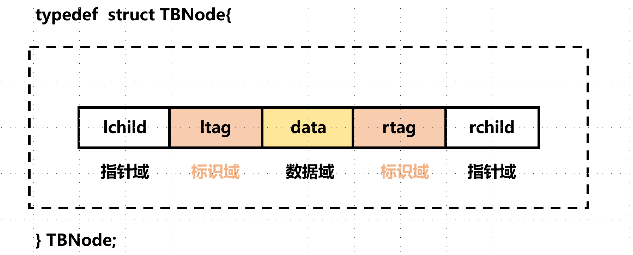

# 第三章 栈和队列的实现

## 3.3 栈和递归的实现

### 3.3.1 n阶Hanoi 汉诺塔问题

> 假设有三个分别命名为X、Y、Z的塔座，在塔座X上插有n个直径大小各不相同、从小到大编号为1，2，···，n的圆盘。现在要求将X轴上的n个圆盘移动至塔座Z并且仍然按照同样的顺序进行叠放，圆盘移动的时候必须遵循下列的规则：
>
> - 每一次只能移动一个圆盘；
> - 圆盘可以插在X、Y和Z中的任意塔座上；
> - 任何时刻都不能讲一个较大的圆盘压在较小的圆盘之上；

这个问题的递归思考过程为：

当n = 1 时，问题比较简单，我们只需要将编号为1的圆盘从塔座X直接移动至塔座Z上即可；

当n > 1时，需要利用塔座Y作为辅助塔座，若能设法将压在编号为n的圆盘之上的（n - 1）个圆盘从塔座X移动到塔座Y上，则可现将n的圆盘移动到塔座Z上，然后从塔座Y上将其余的（n - 1）个圆盘移动到Z上即可。

而如何将（n - 1）个圆盘从一个塔座移动到另外的一个塔座的问题又是另外的一个和原来的问题相同的特征属性的问题，只是问题的规模小于1而已，所以说可以使用同样的办法求解，一直递归到1个圆盘的时候，显然此时很容易解决问题。

具体代码实现为:

```C++
#include <cstdio>
#include <iostream>

int c = 0;
/**
 * move n from x to y
 */
void move(char x, int n, char y) {
  printf("%i. Move disk %i from %c to %c\n", ++c, n, x, y);
}

void hanoi(int n, char x, char y, char z){
  // the n disks numbered from 1 to n from top to bottom are moved
  // to z according to the rules, and y can be used as un auxiliary tower.
  //

  if (n == 1) {
    move(x, 1, z);
  }else {
    hanoi(n-1, x, z, y);
    move(x, n, z);
    hanoi(n-1, y, x, z);
  }
}

int main (int argc, char *argv[])
{
  hanoi(4, 'x', 'y', 'z');
  return 0;
}
```

由上面的分析我们可以知道对这类问题设计递归算法的时候，我们通常可以先写出问题求解的递归定义。和数学归纳法类似，递归定义由基本项和归纳项两部分组成。

基本项就是n = 1的那个可以直接进行运算的项。

# 第五章 数组和广义表

> 顾名思义，广义表是线性表的推广。

## 5.1 抽象数据类型广义表的定义

抽象数据类型的广义表的定义如下：

```C
ADT GList{
    数据对象：D = {ei | 1,2,···,n; n>=0; ei ∈ AtomSet 或 ei ∈GList,
             AtomSet 为某一个数据对象}
    数据关系：Rl ={<ei-1,ei>|ei-1,ei∈D，2<=i<=n }
}
```

关键就是广义表中的元素既可能为原子元素也可能为列表元素。

广义表的基本操作有:

1. ***广义表初始化，创建空的广义表L；***

```C
Init_GList(& L);
```

2. ***根据广义表的书写形式字符串S构造广义表L；***

```C
CreateGList(&L, S);
```

3. ***如果广义表存在，销毁广义表L；***

```C
DestroyGList(& L);
```

4. ***广义表的复制操作，如果广义表L存在，复制广义表L得到广义表T；***

```C
CopyGList(L);
```

5. ***求得广义表的长度，即元素个数；***

```C
GListLength(L);
```

6. ***求的广义表的深度，广义表为空的时候，深度为1；***

```C
GListDepth(L);
```

7. ***判断广义表L是否为空***；

```C
GListEmpty(L);
```

8. ***取广义表的头；***

```C
GetHead();
```

9. ***取广义表的尾；***

```C
GetTail();
```

10. ***插入元素e作为广义表L的第一元素***；

```C
InsertFirst_GL(&L, e);
```

11. ***删除广义表的第一个元素并且返回其值；***

```C
DeleteFirst_GL(&L, &e);
```

12. ***遍历广义表的每一个元素，并使用函数Visit来处理每一个元素；***

```C
Traverse_GL(L, Visit());
```

广义表一般记为：${LS = (a_{1},a_{2},\dots,a_{n})}$

其中，***n为广义表的长度***. 广义表中，${a_{i}}$可以是单个元素，也可以是广义表，分别称为广义表的***原子***和***子表***。当广义表非空的时候，称第一个元素${a_{1}}$为${LS}$广义表的***表头***，称其余元素所组成的表${(a_{2}, a_{3},a_{4}, \dots, a_{n})}$为${LS}$广义表的表尾。

> ***注意！！！！***
>
> 广义表  ${LS1 = ()}$   和广义表  ${LS2 = (())}$ 是不一样的！！！
>
> 前者为空表，长度为0，没有表头或者表尾；
>
> **后者不为空表，长度为1，其表头为第一个元素为${()}$ , 其表尾元素也为${()}$ **

## 5.2 广义表的存储结构

> 广义表中的数据元素可以具有不同的结构(或是原子，或是列表)，因此难以用顺序结构表示，***我们通常使用链式存储结构，每一个数据元素可以用一个结点来表示。***

### 5.2.1 广义表的头尾链表存储表示

该种存储结构的想法是任何广义表都是由一个表头和表尾组成的，特殊情况即为空表，此时的广义表的表头结点指向`nullptr`；其余情况下表头结点均指向一个***表结点***，因为广义表起码是一个表嘛！然后其中的`ptr.hp`指针指向的结点类型可能为原子结点，也可能为表结点!

```C
// ---------------广义表的头尾链表存储表示-----------------
typedef enum {ATOM, LIST} ElemTag; // ATOM == 0 : 原子; LIST == 1 : 子表
typedef struct GLNode {
    ElemTag tag;				     // 公共部分，用于区分原子结点和表结点
    union { 					     // 原子结点和表结点的联合部分
        AtomType atom; 				// atom是原子结点的值域，AtomType由用户定义
        struct { struct GLNode * head_ptr, * tail_ptr; } ptr;
        // ptr是表结点的指针域，ptr.head_ptr 和ptr.tail_ptr 分别指向子表的表头和表尾
    };
} * GList; // 广义表类型
```

如果广义表为空的话，有：

```C
GList glist = nullptr;
```

如果广义表非空的话，有：

```C
GList glist = (GList )malloc (sizeof (GLNode));
glist ->tag = LIST;
glist ->head_ptr = ...;
glist ->tail_ptr = ...;
```

### 5.2.2  广义表的扩展线性链表存储表示

> 该种存储结构是最和我们平时学习的线性表相似的地方，该种存储结构就是真正将广义表中的元素都看成一个结点，然后使用指针将这些结点串联起来，所有的广义表看做成最大的结点！

```C
// -----------------------广义表的扩展线性链表存储表示-----------------------
typedef enum {ATOM, LIST} ElemTag; // ATOM == 0 : 原子, LIST == 1 :子表
typedef struct GLNode {
    ElemTag tag;  					// 公共部分，用于区分原子结点和表结点
    union {
        AtomType atom; 				   // 原子结点的值域
        struct GLNode * head_ptr; 		 // 原子结点的表头指针
    };
    struct GLNode * next_ptr;  			      // 相当于线性链表的next, 指向下一个元素结点
} * GList;						    // 广义表类型GList 是一种扩展的线性链表
```

如果广义表为空的话，则有：

```C
GList glist = (GList)malloc(sizeof(GLNode));
glist -> tag = 1;
glist -> head_ptr = nullptr;
glist -> next_ptr = nullptr;
```

如果广义表不为空的话，则有:

```C
GList glist = (GList)malloc(sizeof(GLNode));
glist -> tag = 1;
glist -> head_ptr = other_node;
glist -> next_ptr = nullptr;  // 每一个广义表都可以看做一个巨大的结点，该节点肯定是单独的，是没有下一个结点的!!
```

## 5.3 广义表的递归算法

### 5.3.1 求广义表的深度

设非空广义表为${LS = (a_{1},a_{2}, \dots,a_{n})}$ , 则我们要想求得${LS}$的深度可以分解为n个子问题，每一个子问题为求${a_{i}}$的深度：

- 如果${a_{i}}$ 是原子的话，则其深度为0；
- 如果${a_{i}}$ 是空表的话，则其深度为1；
- 如果${a_{i}}$ 也是广义表的话，和上面一样做同样的处理，分解为另外的n个子问题，并且求出各子问题的深度中的最大值加1；

所以${LS = (a_{1},a_{2},\dots,a_{n})}$ 的深度`depth(LS)`为：

***基本项：***

- DEPTH(LS) = 1, 当${LS}$ 为空表时；

- DEPTH(LS) = 0, 当${LS}$ 为原子的时；

***归纳项：***

- ${DEPTH(LS) = 1 + Max\{DEPTH(a_{i})\}, 1\leq i \leq n, n \geq 1}$

所以说相应的递归代码应该为：

```C
int GListDepth(GListNode * node) {
    // 0. 采用扩展线性链表存储结构，求广义表L的深度
    int max = 0 , depth;
    GListNode * temp_node;
    // 1. 空表的深度为1
    if(!L) return 1;
    // 2. 原子的深度为0；
    if(L -> tag == ATOM) return 0;
    // 3. 如果是广义表的话，遍历每一个元素，求得所有元素的深度的最大值，并且将最大值加1即为广义表的最大值
    for( temp_node = node->head_ptr; temp_node ;temp_node = temp_node -> next_ptr) {
        depth = GListDepth(temp_node);
        if(depth > max) max = depth;
    }
    return max + 1;
}
```

***上述算法的执行过程实质上是遍历广义表的过程，在遍历中首先求得各个子表的深度，然后综合得到广义表的深度。***

### 5.3.2 遍历广义表

我们求广义表的深度的过程的实质上就是遍历广义表的过程：

```C++
void tranverse(Glist_node* node,void (*func)(Glist_node)) {
    // 1. 如果广义表为空，直接返回：
    if(node == nullptr) return;
    // 2. 如果node为原子，则指定相应的函数：
    if(node->tag == ATOM) return func(node->atom);
    // 3. 如果是广义表，遍历广义表中的每一个元素：
    for(node = node->head_ptr; node != nullptr; node = node -> next_ptr) 
        tranverse(node, func);
    return;
}
```

### 5.3.3 复制广义表

***在看广义表的存储结构的时候，我们知道有两种存储结构供我们进行选择：1. 头尾链表存储表示；2. 扩展线性链式存储表示；当时我认为后者更加的贴切我个人的认识，我觉得后者实现起来逻辑会更加的清晰，实则不然。在实现的过程中，我们会发现前者本身的表头和表尾是最大的优势，方便我们实现各种操作！***

任何一个非空广义表都可以分解为表头和表尾，反之，一对确定的表头和表尾可以唯一确定一个广义表。所以说我们复制一个广义表的时候只需要分别复制其表头和表尾即可。

假设${LS}$是原来的表，${NEWLS}$是复制的表，则复制的递归可以定义为：

***基本项：*** ${InitGList(NEWLS)\{置空表\}，当LS为空表时。}$

***归纳项：*** 

${COPY(GetHead(LS) ->GetHead(NEWLS)) \{复制表头\}}$

${COPY(GetTail(LS)->GetTail(NEWLS))\{复制表尾\}}$


### 5.3.4 建立广义表的存储结构

广义表的字符串S可能有两种情况：

(1) ${S = '()'}$   (带括弧的空白串)；

(2) ${S = (a_{1}, a_{2}, \dots, a_{n})}$, 其中${a_{i}(i = 1, 2,\dots,n)}$ 是S的子串。

> 这里，我们需要进行思考，如果使用头尾链表存储表示的话，每一个广义表可以分为头部和尾部，***注意尾部一定是子表！！！***头部可能是原子也可能是子表，这样的话，我们就可以将问题转换为${a_{i}(i = 1,2,\dots,n)}$ 建立子表的问题。又因为${a_{i}}$ 可能有三种情况：
>
> (1) 带括弧的空白串；
>
> (2) 长度为1的单字符串；
>
> (3) 长度大于1的字符串；

```C
Status CreateGList(GList &L, SString S) {
    // 采用头尾链表存储结构，由广义表的书写形式串S创建广义表L。设置emp = '()'
    if(StrCompare(S, emp)) L = NULL;// 创建空表
    else{
        if(!(L = (GList)malloc(sizeof(GLNode))) exit(OVERFLOW);// 建立表结点
        if(StrLength(S) == 1) {L -> tag = ATOM; L -> atom = S;}
        else{
            L -> tag = LIST; p = L;
            SubString(sub, S, 2, StrLength(S) - 2); // 脱外层括号
            do{
                sever(sub, hsub);
                CreateGList(p -> ptr.hp, hsub); q = p;
                if(!StrEmpty(sub)) {
                    if(!(p = (GLNode * ) malloc (sizeof(GLNode))))
                        exit(OVERFLOW);
                    p -> tag = LIST; q -> ptr.tp = p;
                }
            }while(!StrEmpty(sub));
            q -> ptr.tp = NULL;
        }     
    }
    return OK;
}
```

# 第六章 树和二叉树

## 6.1 二叉树(Binary Tree)

### 6.1.1 二叉树的性质

${性质1：}$在二叉树的第${i}$层上至多有${2^{i-1}}$个结点（${i \ge 1}$)。

${性质2：}$深度为${k}$的二叉树的最大结点数为：

​		${\sum_{i=1}^{k}(第i层上的最大结点数) = \sum_{i=1}^{k}2^{i-1} =2^k-1 \qquad}$

${性质3：}$对任何一棵二叉树${T}$,如果其终端结点数为${n_{0}}$， 度为2的结点数为${n_{2}}$,则${n_{0}=n_{2}+1}$,即叶子结点的个数是度为2的结点数加上1。

> 补充一条性质：
>
> 在含有${n}$个结点的二叉链表中有${n+1}$个空链表域。
>
> 证明：设一共有${n}$个结点，${x}$个度为2的结点，${x+1}$个终端（叶子）结点，那么度为1的结点有${n-(2x+1)}$个。
>
> ${n}$个结点，那么指针域一共有${2n}$, 没有使用掉的有***${2n - 2x - (n-(2x+1)) = n+1}$***。

### 6.1.2 满二叉树和完全二叉树

一棵深度为${k}$且有${2_{k}-1}$个结点的二叉树称为满二叉树。每一层上的结点数都是最大节点数，就是二叉树满了。我们可以对满二叉树的结点进行连续编号，约定编号从根结点开始，自上而下，自左至右。由此可以引出完全二叉树的定义：

***深度为k的，有n个结点的二叉树，当且仅当其每一个结点都与深度为k的满二叉树中编号从1至n的结点一一对应的时候，称为完全二叉树。***（若设二叉树的深度为h，除第 h 层外，其它各层 (1～h-1) 的结点数都达到最大个数，第 h 层所有的结点都连续集中在最左边，这就是完全二叉树）

***${性质4：}$*** 具有n个结点的完全二叉树的深度为${\lfloor log_{2}n \rfloor+1}$.

> 下面要介绍的性质5，与建立完全二叉树的顺序存储结构密切相关！！

***${性质5：}$***如果对一棵有n个结点的完全二叉树（其深度为${\lfloor log_{2}n \rfloor+1}$）的结点按照层序编号（从第一层到第${\lfloor log_{2}n \rfloor+1}$ 层，每层从左到右），则对任一结点${i(1\leq i \leq n)}$,有：

${(1)}$ 如果${i=1}$,则结点i是二叉树的根，没有双亲；如果${i>1}$，则其双亲${PARENT(i)}$是结点${\lfloor  i/2\rfloor}$.

${(2)}$ 如果${2i>n}$,则结点${i}$无左孩子（结点${i}$为叶子结点）；否则其左孩子${LCHILD(i)}$是结点${2i}$. 

${(3)}$ 如果${2i+1 >n}$, 则结点${i}$无右孩子；否则其右孩子${RCHILD(i)}$是结点${2i+1}$. 

***结点i乘以2之后，我们很容易发现，其对应的就是下一层中相应的位置靠左的元素，加1之后就是靠右的元素，所以我们很容易得到i和其两个孩子之间的关系。***

## 6.2 二叉树的存储结构

### 6.2.1 顺序存储结构

```C
// --------------------二叉树的顺序存储表示----------------------
#define MAX_TREE_SIZE 100
typedef int TElemType
typedef TElemType SeBiTree[MAX_TREE_SIZE]; // 给整形数组定义别名

SeBiTree bt;
```

> 注：该种顺序存储结构仅仅适用于完全二叉树。

### 6.2.2 链式存储结构

有两种方式，一种是二叉链表，另外一种是三叉链表。

(1) 二叉链表，***数据域和左右孩子指针域***；

(2) 三叉链表，***数据域、双亲指针域和左右孩子指针域***；

> 上面已经证明。含有n个结点的二叉链表中有${n+1}$个空链表域。
>
> 之后我们会看到我们可以利用这些空链表域存储其他有用的信息，从而得到另外一种链式存储结构---***线索链表***。

```C
// -----------------二叉树的二叉链表存储表示------------------
typedef struct BiTNode {
    TElemType data;
    struct BiTNode *lchild, *rchild; // 左右孩子指针
}BiTNode, *BiTree;

// -----------------基本操作的函数原型说明-------------------
// 1. 按照先序次序输入二叉树中结点的值（一个字符），空格字符表示空树；
// 构造二叉链表表示的二叉树T。
Status CreateBiTree(BiTree & T);

// 采用二叉链表存储结构，Vist是对结点操作的应用函数
// 先序遍历二叉树T，对每一个结点调用函数Visit一次
Status PreOrderTraverse(BiTree T, Status (* Visit)(TElemType e));

// 中序遍历二叉树T：
Status InOrderTraverse(BiTree T, Status (* Visit)(TElemType e));

// 后序遍历二叉树T:
Status PostOrderTraverse(BiTree T, Status (* Visit)(TElemType e));

// 层序遍历二叉树T:
Status LevelOrderTraverse(BiTree T, Status (* Visit)(TElemType e));
```

## 6.3 遍历二叉树

### 6.3.1 递归遍历二叉树（先序、中序、后序）

- 先序遍历二叉树；
- 中序遍历二叉树；

- 后序遍历二叉树；

以上三种遍历二叉树的方式均可以使用 ***递归进行实现***，主要实现方式就是递归。

```C++
// 先序遍历以r为根的二叉树
template<typename ElemType>
void BInaryTree<ElemType>::PreOrder(BinTreeNode<ElemType> *r,
                                   void (*Visit)(const ElemType &)) {
    if(r != nullptr){
        Visit(r->data);
        PreOrder(r->leftchild, Visit);
        PreOrder(r->rightchild, Visit);
    }
}

// 中序遍历以r为根的二叉树
template<typename ElemType>
void BInaryTree<ElemType>::InOrder(BinTreeNode<ElemType> *r,
                                   void (*Visit)(const ElemType &)) {
    if(r != nullptr){
        InOrder(r->leftchild, Visit);
        Visit(r->data);
        InOrder(r->rightchild, Visit);
    }
}

// 基本项： 
// 如果r == nullptr, 什么都不做；
// 如果r != nullptr, Visit(r->data);

// 归纳项：
// 中序遍历左子树；
// 访问根节点；
// 中序遍历右子树；

// 后序遍历以r为根的二叉树
template<typename ElemType>
void BinaryTree<ElemType>::PostOrder(BinTreeNode<ElemType> * r,
                                    void (*Visit)(const ElemType &)) {
    if(r != nullptr){
        PostOrder(r -> leftchild);
        PostOrder(r -> rightchild);
        (*Visit)(r -> data);
    }
}
```

### 6.3.2 非递归遍历二叉树（迭代法）

> 阅读自《代码随想录》，这是一本很好的基于C++以及LeetCode上的习题对各种算法进行讲解的书籍，非常值得阅读！

#### 6.3.2.1 标记法（***优先选择该种方法***）

该种方法的主要思想是将结点按照某一种特定的顺序进栈（注意此处的顺序是和当前遍历顺序相反的）：

比如说： 

***中序遍历：*** ${midnode \Rightarrow leftnode \Rightarrow rightnode}$

我们入栈的时候需要将其顺序反过来：${rightnode \Rightarrow midnode \Rightarrow leftnode}$

并且我们的入栈的时候如果遇到中间的节点的话，我们此时需要入栈一个`nulptr`结点， ***作一个标记，为了后面访问的时候如果遇到一个空节点的话，说明下一个结点就是我们的要访问的节点。***

```C++
template <typename T>
void BinaryTree<T>::inorderTarversal(void (*visit)(const T &), bool,
                                     bool) const {
  std::stack<TreeNode<T> *> _stack;

  if (!empty()) {
    _stack.push(root);
  }
  // begin: rightnode -> midnode -> leftnode
  // later: leftnode ->midnode -> rightnode
  while (!_stack.empty()) {
    TreeNode<T> *node = _stack.top();
    if (node) {
      _stack.pop();
        
      // add the right node if not nullptr:
      if (node->rchild)   _stack.push(node->rchild);
      _stack.push(node);
      // the key of this methods, we add a flag to the end of the visited node
      _stack.push(nullptr);
      if (node->lchild)   _stack.push(node->lchild);
        
    } else {
      // if the top node of stack is nullptr, we are about to visit the
      // corresponding node
      _stack.pop();
      node = _stack.top();
      _stack.pop();
      visit(node->data);
    }
  }
};
```

其余的两种方法类似一样的道理，只需交换${leftnode、 midnode、rightnode}$s的交换次序即可。

***后序遍历算法***

```C++
template <typename T>
void BinaryTree<T>::postorderTarversal(void (*visit)(const T &), bool,
                                       bool) const {
  std::stack<TreeNode<T> *> _stack;

  if (!empty()) {
    _stack.push(root);
  }

  // begin: midnode -> rightnode -> leftnode
  // later: leftnode ->rightnode -> midnode

  while (!_stack.empty()) {
    TreeNode<T> *node = _stack.top();

    if (node) {
      _stack.pop();

      _stack.push(node);
      // the key of this methods, we add a flag to the end of the visited node
      _stack.push(nullptr);

      // add the right node if not nullptr:
      if (node->rchild)
        _stack.push(node->rchild);

      if (node->lchild) {
        _stack.push(node->lchild);
      }
    } else {
      // if the top node of stack is nullptr, we are about to visit the
      // corresponding node
      _stack.pop();
      node = _stack.top();
      _stack.pop();
      visit(node->data);
    }
  }
};
```

***先序遍历算法：***

```C++
template <typename T>
void BinaryTree<T>::preorderTarversal(void (*visit)(const T &), bool,
                                      bool) const {
  std::stack<TreeNode<T> *> _stack;

  if (!empty()) {
    _stack.push(root);
  }

  // begin:  rightnode ->  leftnode -> mid node
  // later:  mid node -> leftnode -> rightnode

  while (!_stack.empty()) {
    TreeNode<T> *node = _stack.top();

    if (node) {
      _stack.pop();
      // add the right node if not nullptr:
      if (node->rchild)
        _stack.push(node->rchild);

      if (node->lchild) {
        _stack.push(node->lchild);
      }
      _stack.push(node);
      // the key of this methods, we add a flag to the end of the visited node
      _stack.push(nullptr);

    } else {
      // if the top node of stack is nullptr, we are about to visit the
      // corresponding node
      _stack.pop();
      node = _stack.top();
      _stack.pop();
      visit(node->data);
    }
  }
};
```

> 此种方法，我们只需要掌握该种标记方法的关键然后就可以记住其余的两种遍历算法。

#### 6.3.2.2 普通非递归方法

***先序遍历：***

```C++
template <typename T>
void BinaryTree<T>::preorderTarversal(void (*visit)(const T &), bool) const {
  std::stack<TreeNode<T> *> _stack;

  if (empty()) {
    return;
  }

  _stack.push(root);

  while (!_stack.empty()) {
    TreeNode<T> *node = _stack.top();
    _stack.pop();

    visit(node->data);

    // attention the order of instack
    if (node->rchild)
      _stack.push(node->rchild);
    if (node->lchild)
      _stack.push(node->lchild);
  }
}
```

***中序遍历：***

```C++
template <typename T>
void BinaryTree<T>::inorderTarversal(void (*visit)(const T &), bool) const {
  std::stack<TreeNode<T> *> _stack;
  TreeNode<T> *node = root;

  while (node || !_stack.empty()) {
    if (node) {
      _stack.push(node);
      node = node->lchild;
    } else {
      node = _stack.top();
      _stack.pop();
      visit(node->data);
      node = node->rchild;
    }
  }
}
```

***后序遍历算法：***

```C++
// Important:
// preorder: mid -> left -> right
// We exchange the instack order of (node->lchild) and (node->rchild),
// there will be mid -> right -> left
// and we reverse the order,
// there will be left -> right -> mid.
// Thus we get the result.
template <typename T>
void BinaryTree<T>::postorderTarversal(void (*visit)(const T &), bool) const {
  std::stack<TreeNode<T> *> _stack;
  TreeNode<T> *node = root;
  std::vector<T> result;
  if (empty()) {
    return;
  }

  _stack.push(node);

  while (!_stack.empty()) {
    node = _stack.top();
    _stack.pop();
    result.push_back(node->data);

    if (node->lchild)
      _stack.push(node->lchild);
    if (node->rchild)
      _stack.push(node->rchild);
  }

  // we reserse the order, then we will get the result.
  std::reverse(result.begin(), result.end());
  for (const T &element : result) {
    visit(element);
  }
}
```


- 层序遍历

层序遍历需要借助数据结构队列来实现：

> 上一层进队列，出队列之前将自己的孩子们全部入队，然后再出队列，并且进行访问！

```C++
template<typename ElemType>
void BinaryTree<ElemType>::LevelOrder(void (*Visit)(const ElemType &)) const {
    queue<BinTreeNode<ElemTyep> *> _queue;
    BinTreeNode<ElemType> * p;
    if(root != nullptr)
        _queue.enqueue();
    while(!_queue.empty()){
        _queue.dequeue(p);
        (*Visit)(p->data);
        if(p->leftchild != nullptr)
            _queue.enqueue(p->leftchild);
        if(p->rightchild != nullptr)
            _queue.enqueue(p->rightchild);
    }
}
```

### 6.3.3 以先序序列建立二叉树

> 注意，之前自己认为的是建立一棵完整的二叉树需要至少两个遍历序列，这样才可以彼此参考建立一个二叉链表，注意那是我们人算的并不是计算的，那种情况是根据两种序列来建立二叉树。
>
> 我们完全可以格式化一个二叉树，如果对应的结点没有数据的话，就以' '来代替即可。

${A B C\Phi\Phi DE\Phi G \Phi \Phi F \Phi \Phi \Phi}$

```C++
template<typename T>
void CreateBinaryTreePre(std::string &str, BinTreeNode<T> *&root) {
  char ch;
  if (!str.empty()) {
    ch = str[0];
    str = str.substr(1);
  }

  if (ch == ' ') {
    root = nullptr;
  }else {
    root->data = ch;
    root->leftChild = new BinTreeNode<char>;
    root->rightChild = new BinTreeNode<char>;
    CreateBinaryTreePre(str, root->leftChild);
    CreateBinaryTreePre(str, root->rightChild);
  }
```

## 6.4 线索二叉树

> 注意，之后提到的“前驱”和“后继”均指的是以某种次序遍历多得序列中的前驱和后继。

***二叉树的局限性：当以二叉链表作为存储结构的时候，只能找到结点的左右孩子信息，而不能直接得到结点在任一序列中的前驱和后继结点信息，此种信息只有在遍历的动态过程中才可以得到。***

由此引出线索二叉树，线索二叉树是利用每一个有`n`个结点的二叉链表必定存在`n+1`个空链表域来存储结点的前驱和后继的信息。



我们规定：如果结点有左子树，则其`lchild`域指示其左孩子，否则令`lchild`域指示其前驱；如果结点有右子树，则其`rchild`域指示其右孩子，否则令其`rchild`域指示其后继结点。

以这种接待您结构构成的二叉链表作为二叉树的存储结构，叫做 ***线索链表***，其中指向结点前驱和后继的指针， ***叫做线索***。加上线索的二叉树称为 ***线索二叉树(Threaded Binary Tree)***。对某一种次序遍历使其变为线索二叉树的过程叫做线索化。

```C++
// 二叉树的线索存储
typedef enum PointerTag {Link, Thread};
typedef struct BiThrNode {
    TElemType data;
    struct BiThrNode * lchild, rchild;
    PointerTag LTag, RTag;
}BinThrNode, * BiThrTree
```

### 6.4.1 中序遍历转化为线索二叉树

> 这里的代码逻辑有点难以理解，我们可以这么想，从最基本的开始思考，最简单的二叉树：无非就三个结点，完全满足相应的设定。
>
> 
>
> 参考文章：https://zq99299.github.io/dsalg-tutorial/dsalg-java-hsp/10/03.html#%E4%BB%A3%E7%A0%81%E5%AE%9E%E7%8E%B0

```C++
template<typename T>
void to_thread_tree(ThreadTreeNode<T> *&root, ThreadTreeNode<T> *&pre) {
    
  // Attention!!
  //-------O----
  //------/-\---
  //-----O--O---
  // we can think from the easist one!


  if(root == nullptr)
    return;

  // 1. process the left child tree
  to_thread_tree(root->lchild, pre);

  // 2. process the current node
  if(root->lchild == nullptr) {
    root->lchild = pre;
    root->ltag = Thread;
  }

  // process the previous node's next node
  if (pre != nullptr && pre->rchild == nullptr) {
    pre->rchild = root;
    pre->rtag = Thread;
  }
  // move to the next node and save the previous node
  pre = root;

  // 3. process the right child tree
  to_thread_tree(root->rchild, pre);
}
```

### 6.4.2 遍历线索二叉树

***上面的线索二叉树是由中序遍历建立而来，所以说我们遍历的时候也是按照中序遍历来！！***

想法就是:先遍历根节点的左子树，找到那个第一个输出的结点，然后根据我们后来建立的线索链表，依次遍历即可：

```C++
template<typename T>
void ThreadTree<T>::inorder_thread_tree(void (*visit)(const T &)){
  ThreadTreeNode<T> *p = _root;
  while (p != nullptr) {
    while (p->ltag == 0) {
      p = p->lchild;
    }
    // 找到最左边的结点之后，访问之
    (*visit)(p->data);
    // 注意这里很容易和之前的二叉树误解，这里是利用已经建立好的线索二叉树的线索进行遍历的，这里是往遍历刚才那个结点的祖先
    while (p->rtag == Thread) {
      p = p->rchild;
      (*visit)(p->data);
    }
    // 这里开始遍历右边的结点，又下来了，一整个过程就是先下再上，再下，再上
    p = p->rchild;
  }
}
```


