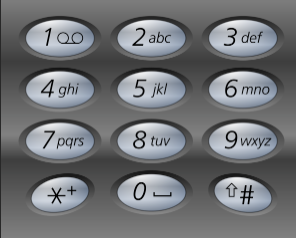

# Algorithm

# 1. 数组

## 1.Two Sum

> Question: https://leetcode.com/problems/two-sum/description/
>
> Given an array of integers `nums` and an integer `target`, return *indices of the two numbers such that they add up to `target`*.
>
> You may assume that each input would have ***exactly\* one solution**, and you may not use the *same* element twice.
>
> You can return the answer in any order.

***Solution:***

```C++
#include <vector>
#include <unordered_map>
#include <map>
using namespace std;
class Solution {
public:
  // 1. Brute Force
  // Runtime: 291ms;
  // Memory: 10.2MB;
  vector<int> twoSum(vector<int> &nums, int target) {
    vector<int> result;
    for (int i = 0; i < nums.size() - 1; ++i) {
      for (int j = i + 1; j < nums.size(); ++j) {
        if ((nums[i] + nums[j]) == target) {
          return (result = {i, j});
        }
      }
    }
    return result;
  }

  // Use One-pass Hash Table:
  // Runtime: 12ms;
  // Memory: 12.1mb;
  vector<int> twoSum_v1(vector<int>& nums, int target) {
    unordered_map<int, int> numMap;
    int n = nums.size();

    // Build the hash table
    for (int i = 0; i < n; i++) {
      numMap[nums[i]] = i;
    }

    // Find the complement
    for (int i = 0; i < n; i++) {
      int complement = target - nums[i];
      // if the complement belongs to hash table and it's index != i
      if(numMap.count(complement) && numMap[complement] != i) {
        return {i, numMap[complement]};
      }
    }
    return {};
  }

  // Use map to compare with unordered_map:
  // Runtime: 18ms;
  // Memory: 12.5ms
  vector<int> twoSum_v2(vector<int>& nums, int target) {
    map<int, int> numMap;
    int n = nums.size();

    // Build the hash table
    for (int i = 0; i < n; i++) {
      numMap[nums[i]] = i;
    }

    // Find the complement
    for (int i = 0; i < n; i++) {
      int complement = target - nums[i];
      // if the complement belongs to hash table and it's index != i
      if(numMap.count(complement) && numMap[complement] != i) {
        return {i, numMap[complement]};
      }
    }
    return {};
  }
  // One-pass Hash Table:
  // Runtime: 7ms;
  // Memory: 10.9mb;
  vector<int> twoSum_v3(vector<int> &nums, int target) {
    unordered_map<int, int> num_map;
    int n = nums.size();

    // The key of this method is to search while inserting!
    for (int i = 0; i < n; i++) {
      int complement = target - nums[i];
      if (num_map.count(complement)) {
        return {num_map[complement], i};
      }
      num_map[nums[i]] = i;
    }
    return {};
  }
};
```

### (1. 解题关键)

如您所见，有四种解决方案。

- 第一个是暴力破解方法，我们可以通过循环来完成。
- 第二种使用哈希表来使用快速查找，从而缩短查找时间。 我们最关键的因素是利用映射来解决这个问题。 unordered_map的实现原理是一个哈希表。
- 第三个只是想知道unordered_map和map之间的区别。 事实证明unordered_map比map更高效。 Map的实现原理是红黑树，保持元素有序。
- 第四种方法的关键是我们边插入边搜索！

## 2. Add The Two Big Numbers

> Question: https://leetcode.com/problems/add-two-numbers/description/
>
> You are given two **non-empty** linked lists representing two non-negative integers. The digits are stored in **reverse order**, and each of their nodes contains a single digit. Add the two numbers and return the sum as a linked list.
>
> You may assume the two numbers do not contain any leading zero, except the number 0 itself.

***Solution:***

```C++
class Solution {
public: 
   // The second solution:
  // It's right!
  ListNode *addTwoBigNumbers(ListNode *l1, ListNode *l2) const {
    // numbers on units:
    int left = l1->val, right = l2->val;
    // the carry number:
    int carry;

    // the result of single units:
    int result = left + right;
    carry = result / 10;
    result = result % 10;

    ListNode *newNode = new ListNode(result);
    ListNode *temp = newNode;

    while (l1->next || l2->next) {
      if (l1->next != nullptr) {
        left = l1->next->val;
        result += left;
        l1 = l1->next;
      }

      if (l2->next != nullptr) {
        right = l2->next->val;
        result += right;
        l2 = l2->next;
      }

      result += carry;

      carry = result / 10;
      result = result % 10;
      temp->next = new ListNode(result);
      temp = temp->next;
    }
    if (carry != 0) {
      temp->next = new ListNode(carry);
      temp = temp->next;
    }

    return newNode;
  }
   // Wrong Solution!!!
  // The first one solution:
  // It is wrong!!!!, because I don't consider the size of number!
  // No matter how big I set the type of number, there are always
  // numbers lager than the maximum value of this type.
  //
  // So we can't easy convert the linked-list to a number, we must
  // calculate while inserting new nodes!
  ListNode *addTwoNumbers(ListNode *l1, ListNode *l2) {
    int number_1, number_2, result;
    int temp_int = 10;
    ListNode *temp;

    // convert the two linked-lists to numbers:
    temp = l1->next;
    number_1 = l1->val;
    while (temp) {
      number_1 = number_1 + (temp->val * temp_int);
      temp = temp->next;
      temp_int *= 10;
    }

    temp_int = 10;

    temp = l2->next;
    number_2 = l2->val;
    while (temp) {
      number_2 = number_2 + (temp->val * temp_int);
      temp = temp->next;
      temp_int *= 10;
    }
    // end convert
    std::cout << "number_1 is :" << number_1 << std::endl;
    std::cout << "number_2 is :" << number_2 << std::endl;

    result = number_1 + number_2;

    std::cout << "result is :" << result << std::endl;
    // convert the result into linked-list:
    ListNode *result_list = new ListNode(result % 10);
    ListNode *temp_result = result_list;
    while ((result = result / 10)) {
      temp_result->next = new ListNode(result % 10);
      temp_result = temp_result->next;
    }
    return result_list;
  }
};
```

### (2. 解题关键)

如您所见，有两种解决方案：

- 第一个是错误的，因为我没有考虑数字的大小。
- 第二个是对的！ 逻辑很简单！

这个话题的关键是我们需要清楚这个数字可能非常大，我们可能无法使用现有的类型来存储这个数字，所以我们需要边计算边插入。

***补充：*** 示例程序中添加了测试代码，您可以直接在您的环境中运行它，而无需使用LeetCode官网提供的环境进行调试！

有示例代码：[example.cpp](./Array/AddTwoNums.cpp)

# 2. 二叉树

> 我们在学习这一章节之前，这里实现了一个二叉树类，其成员函数包括遍历算法、前序、中序、后序和层序遍历。 并实现了递归版本和非递归版本（迭代版本）。
>
> 示例代码： [example.cpp](./BinaryTree/main.cpp) 。 您可以在`./BinaryTree/include/`中找到源代码。

## 106.Construct_Binary_Tree_from_Inorder_and_Postorder_Traversal

> Question: https://leetcode.com/problems/construct-binary-tree-from-inorder-and-postorder-traversal/description/
>
> Given two integer arrays `inorder` and `postorder` where `inorder` is the inorder traversal of a binary tree and `postorder` is the postorder traversal of the same tree, construct and return *the binary tree*.

```C++
/**
 * Definition for a binary tree node.
 * struct TreeNode {
 *     int val;
 *     TreeNode *left;
 *     TreeNode *right;
 *     TreeNode() : val(0), left(nullptr), right(nullptr) {}
 *     TreeNode(int x) : val(x), left(nullptr), right(nullptr) {}
 *     TreeNode(int x, TreeNode *left, TreeNode *right) : val(x), left(left), right(right) {}
 * };
 */
class Solution {
public:
    TreeNode* buildTree(vector<int>& inorder, vector<int>& postorder) {
      if (inorder.size() == 0 || postorder.size() == 0) {
      return nullptr;
    }

    unordered_map<int, int> number_map;

    for (int i = 0; i < inorder.size(); ++i) {
      number_map[inorder[i]] = i;
    }

    return buildHelper(inorder, postorder, 0, inorder.size(), 0,
                       postorder.size(), number_map);
  }

private:
  static TreeNode*buildHelper(vector<int> &inorder,
                                    vector<int> &postorder, int instart,
                                    int inend, int poststart, int postend, unordered_map<int, int>& number_map) {
    // nullptr node:
    if (poststart == postend) {
      return nullptr;
    }

    int rootValue = postorder[postend - 1];
    TreeNode *root = new TreeNode(rootValue);
    // leaf node:
    if (instart == (inend - 1) && poststart == (postend - 1)) {
      return root;
    }

    // find the cut point in the inorder:
    int delemiterIndex = number_map[rootValue];
    // for (delemiterIndex = instart; delemiterIndex < inend; delemiterIndex++) {
    //   if (inorder[delemiterIndex] == rootValue) {
    //     break;
    //   }
    // }


    // construct the left children:
    // inorder:
    int left_inorder_begin = instart;
    int left_inorder_end = delemiterIndex;

    int right_inorder_begin = delemiterIndex + 1;
    int right_inorder_end = inend;

    // postorder:
    int left_post_begin = poststart;
    int left_post_end = poststart + delemiterIndex - instart;

    int right_post_begin = poststart + delemiterIndex - instart;
    int right_post_end = postend - 1;

    root->left =
        buildHelper(inorder, postorder, left_inorder_begin, left_inorder_end,
                    left_post_begin, left_post_end, number_map);

    // construct the right children:
    root->right =
        buildHelper(inorder, postorder, right_inorder_begin, right_inorder_end,
                    right_post_begin, right_post_end, number_map);

    return root;
  }
};
```

### (106.解题关键)

解决这个问题的关键是理解二叉树的后序遍历和中序遍历。

理解之后，我们可以将问题分为以下步骤：

- 如果数组大小为零，则返回 nullptr；
- 如果数组不为NULL，则让后序的最后一个节点为节点元素；
- 使用节点元素将中序数组拆分为两个子中序数组；
- 使用两个子中序数组将后序数组拆分为另外两个子后序数组；
- 递归处理左子节点和右子节点；

PS：您可以使用哈希表来提高性能。

示例代码：[example.cpp](./BinaryTree/106.Construct_Binary_Tree_from_Inorder_and_Postorder_Traversal/main.cpp)。 您可以在`./BinaryTree/include/`中看到头文件相关的代码。

# 3. 回溯

## 77.Combinations

> Question: https://leetcode.com/problems/combinations/description/
>
> Given two integers `n` and `k`, return *all possible combinations of* `k` *numbers chosen from the range* `[1, n]`.
>
> You may return the answer in **any order**.
>
> **Example 1:**
>
> ```shell
> Input: n = 4, k = 2
> Output: [[1,2],[1,3],[1,4],[2,3],[2,4],[3,4]]
> Explanation: There are 4 choose 2 = 6 total combinations.
> Note that combinations are unordered, i.e., [1,2] and [2,1] are considered to be the same combination.
> ```
>
> **Example 2:**
>
> ```shell
> Input: n = 1, k = 1
> Output: [[1]]
> Explanation: There is 1 choose 1 = 1 total combination.
> ```
>
> ***Constrains:***
>
> - `1 <= n <= 20`
> - `1 <= k <= n`

```C++
class Solution {
private:
  vector<int> path;
  vector<vector<int>> result;
  void backtracking(int n, int k, int index) {
    // if path.size() == k, then it means that we have traversed to the leaf
    // node, that is to say, we have found a qualified subset
    if (path.size() == k) {
      result.push_back(path);
      return;
    }

    for (int i = index; i <= n - (k - path.size()) + 1; i++) {
      path.push_back(i);
      backtracking(n, k, i + 1);
      // backtracking: undo this step!
      path.pop_back();
    }
  }

public:
  vector<vector<int>> combine(int n, int k) {
    path.clear();
    result.clear();
    backtracking(n, k, 1);
    return result;
  }
};
```

### (77.解题关键)

显然，我们不可能用***for循环***来遍历这道题，因为k可能会很大。 这样的话我们的***for循环***就可以完成了，所以这道题最重要的就是用回溯的方法。

事实上，回溯算法是一种递归算法，我们将回溯算法能够解决的问题抽象成树结构，因为回溯算法解决的问题是递归地搜索集合中的子集。 集合的大小构成了树的宽度。 递归的深度构成了树的深度。

我们在编写回溯算法时，一般需要考虑以下几点：

- 回溯算法一般不需要返回值，因为它们实际上修改了一些公共变量。
- 回溯算法的参数一般不是一开始就确定的，而是在写逻辑的过程中一一确定的。
- 算法的回溯其实就是回溯我们这一步所做的事情，就是回溯，剩下的都是递归算法解决的问题。
- ***回溯算法中的剪枝操作***其实就是限制我们for循环遍历的条件，然后直接过滤掉那些错误的情况。

## 216.CombinationSumIII

> Question: https://leetcode.com/problems/combination-sum-iii/
>
> Find all valid combinations of `k` numbers that sum up to `n` such that the following conditions are true:
>
> - Only numbers `1` through `9` are used.
> - Each number is used **at most once**.
>
> Return *a list of all possible valid combinations*. The list must not contain the same combination twice, and the combinations may be returned in any order.
>
> 
>
> **Example 1:**
>
> ```
> Input: k = 3, n = 7
> Output: [[1,2,4]]
> Explanation:
> 1 + 2 + 4 = 7
> There are no other valid combinations.
> ```
>
> **Example 2:**
>
> ```
> Input: k = 3, n = 9
> Output: [[1,2,6],[1,3,5],[2,3,4]]
> Explanation:
> 1 + 2 + 6 = 9
> 1 + 3 + 5 = 9
> 2 + 3 + 4 = 9
> There are no other valid combinations.
> ```
>
> **Example 3:**
>
> ```
> Input: k = 4, n = 1
> Output: []
> Explanation: There are no valid combinations.
> Using 4 different numbers in the range [1,9], the smallest sum we can get is 1+2+3+4 = 10 and since 10 > 1, there are no valid combination.
> ```
>
> 
>
> **Constraints:**
>
> - `2 <= k <= 9`
> - `1 <= n <= 60`

```C++
class Solution {
private:
  int path_sum = 0;
  vector<int> path;
  vector<vector<int>> result;
  void backtracking(int k, int sum, int index) {
    bool flag = true;
    if (path_sum == sum && path.size() == k) {
      result.push_back(path);
      return;
    } else if (path_sum > sum || path.size() > k) {
      return;
    }

    for (int i = index; i <= 9; i++) {
      path_sum += i;
      path.push_back(i);
      backtracking(k, sum, i + 1);
      path_sum -= i;
      path.pop_back();
      if ((path_sum + i) > sum) {
        return;
      }
    }
  }

public:
  vector<vector<int>> combinationSum3(int k, int n) {
    backtracking(k, n, 1);
    return result;
  }
};
```

### (216.解题关键)

这个问题可以利用回溯算法来解决。

##  17.LetterCombinationsOfaPhoneNumber

> Question: Given a string containing digits from `2-9` inclusive, return all possible letter combinations that the number could represent. Return the answer in **any order**.
>
> A mapping of digitscl to letters (just like on the telephone buttons) is given below. Note that 1 does not map to any letters
>
> 
>
> **Example 1:**
>
> ```
> Input: digits = "23"
> Output: ["ad","ae","af","bd","be","bf","cd","ce","cf"]
> ```
>
> **Example 2:**
>
> ```
> Input: digits = ""
> Output: []
> ```
>
> **Example 3:**
>
> ```
> Input: digits = "2"
> Output: ["a","b","c"]
> ```

```C++
class Solution {
private:
  vector<string> result;
  string path;
  unordered_map<char, string> map{{'2', "abc"}, {'3', "def"}, {'4', "ghi"},
                                  {'5', "jkl"}, {'6', "mno"}, {'7', "pqrs"},
                                  {'8', "tuv"}, {'9', "wxyz"}};

  void backtracking(string digits, int index) {
    if (index == digits.size()) {
      result.push_back(path);
      return;
    }

    for (int i = 0; i < map[digits[index]].size(); i++) {
      path += map[digits[index]][i];
      backtracking(digits, index + 1);
      path = path.substr(0, path.size() - 1);
    }
  }

public:
  vector<string> letterCombinations(string digits) {
    if(digits.size() == 0) {
      return vector<string>();
    }
    result.clear();
    path = "";
    backtracking(digits, 0);
    return result;
  }
};
```

### (17.解题关键)

由于循环，我们无法列出所有情况。 所以我们使用回溯算法（实际上是递归），但需要注意的是，本主题并不要求我们执行剪枝操作，因为我们需要所有情况。

## 39.CombinationSum

> Question: https://leetcode.com/problems/combination-sum/description/
>
> Given an array of **distinct** integers `candidates` and a target integer `target`, return *a list of all **unique combinations** of* `candidates` *where the chosen numbers sum to* `target`*.* You may return the combinations in **any order**.
>
> The **same** number may be chosen from `candidates` an **unlimited number of times**. Two combinations are unique if the 
>
> frequency
>
>  of at least one of the chosen numbers is different.
>
> 
>
> The test cases are generated such that the number of unique combinations that sum up to `target` is less than `150` combinations for the given input.
>
>  
>
> **Example 1:**
>
> ```
> Input: candidates = [2,3,6,7], target = 7
> Output: [[2,2,3],[7]]
> Explanation:
> 2 and 3 are candidates, and 2 + 2 + 3 = 7. Note that 2 can be used multiple times.
> 7 is a candidate, and 7 = 7.
> These are the only two combinations.
> ```
>
> **Example 2:**
>
> ```
> Input: candidates = [2,3,5], target = 8
> Output: [[2,2,2,2],[2,3,3],[3,5]]
> ```
>
> **Example 3:**
>
> ```
> Input: candidates = [2], target = 1
> Output: []
> ```

```C++
#include <algorithm>
#include <iomanip>
#include <iostream>
#include <vector>

using std::vector;

class Solution {
  vector<vector<int>> result;
  vector<int> path;

  int sum_of_vector() {
    int sum = 0;
    for (const auto &elem : path) {
      sum += elem;
    }
    return sum;
  }

  // check out if the path already exist in result:
  bool check() {
    for (auto &elem : result) {
      if (check_exist(elem)) {
        return true;
      }
    }
    return false;
  }

  bool check_exist(vector<int> vector1) {
    vector<int>::iterator iter;
    for (auto &elem : path) {
      if ((iter = std::find(vector1.begin(), vector1.end(), elem)) ==
          vector1.end()) {
        return false;
      }
      vector1.erase(iter);
    }
    return true;
  }

  // BackTracing Algorithm
  // The method is very slow: because we consider too much useless situations
  // Runtime: 1479ms;
  // Memory: 257.6MB;
  void get_combination(vector<int> &candidates, int target) {
    if (sum_of_vector() == target) {
      if (check()) {
        return;
      }
      result.push_back(path);
      return;
    } else if (sum_of_vector() > target) {
      return;
    }

    for (auto iter = candidates.begin(); iter != candidates.end(); iter++) {
      if (sum_of_vector() > target) {
        break;
      }
      path.push_back(*iter);
      get_combination(candidates, target);
      path.pop_back();
    }
  }

  void get_combination(vector<int> &candidates, int target, int startIndex,
                       bool) {
    if (sum_of_vector() > target) {
      return;
    }
    if (sum_of_vector() == target) {
      result.push_back(path);
      return;
    }

    for (int i = startIndex; i < candidates.size(); i++) {
      path.push_back(candidates[i]);
      // it means we can put the same element into path
      get_combination(candidates, target, i, true);
      path.pop_back();
    }
  }

public:
  // BackTracing Algorithm
  // The method is very slow: because we consider too much useless situations
  // Runtime: 1479ms;
  // Memory: 257.6MB;

  vector<vector<int>> combinationSum(vector<int> &candidates, int target) {
    path.clear();
    result.clear();
    get_combination(candidates, target);
    std::cout << "The size of result is " << result.size() << std::endl;
    return result;
  }

  // BackTracing Algorithm
  // Runtime: 9ms;
  // Memory: 10.9MB;

  vector<vector<int>> combinationSum(vector<int> &candidates, int target,
                                     bool) {
    path.clear();
    result.clear();
    get_combination(candidates, target, 0, true);
    return result;
  }
};

template <typename T> void output(const vector<vector<T>> &sets, int index) {
  std::cout << "case" << index << ":";
  std::cout << "[";
  for (int i = 0; i < sets.size(); i++) {
    std::cout << "[";
    for (int j = 0; j < sets[i].size(); j++) {
      std::cout << sets[i][j];
      if (j != (sets[i].size() - 1)) {
        std::cout << ",";
      }
    }
    std::cout << "]";
    if (i != (sets.size() - 1)) {
      std::cout << ",";
    }
  }
  std::cout << "]" << std::endl;
}

int main(int argc, char **argv) {
  Solution solution;

  vector<int> candidates_1{2, 3, 6, 7};
  vector<int> candidates_2{7, 3, 2};
  output(solution.combinationSum(candidates_1, 7, true), 1);
  output(solution.combinationSum(candidates_2, 18, true), 2);

  return 0;
}
```

### (39.解题关键)

解决这个问题的关键是我们需要考虑重复数字的情况，以及如果实现这种情况我们需要做什么。 如果我们选择每次递归都遍历所有候选数字，这最终会导致需要去除那些重复项（这些重复项只是数字的顺序不一样）。 正确的做法是依次缩小遍历的范围。

那么就需要考虑数字重复相加的情况。

示例代码：[example.cpp](./BackTracking/39.CombinationSum/main.cpp)。

## 40.Combination Sum II

> Question:https://leetcode.com/problems/combination-sum-ii/description/
>
> Given a collection of candidate numbers (`candidates`) and a target number (`target`), find all unique combinations in `candidates` where the candidate numbers sum to `target`.
>
> Each number in `candidates` may only be used **once** in the combination.
>
> **Note:** The solution set must not contain duplicate combinations.
>
> **Example 1:**
>
> ```
> Input: candidates = [10,1,2,7,6,1,5], target = 8
> Output: 
> [
> [1,1,6],
> [1,2,5],
> [1,7],
> [2,6]
> ]
> ```
>
> **Example 2:**
>
> ```
> Input: candidates = [2,5,2,1,2], target = 5
> Output: 
> [
> [1,2,2],
> [5]
> ]
> ```

```C++
#include <algorithm>
#include <iostream>
#include <vector>
using std::vector;

class Solution {
  vector<vector<int>> result;
  vector<int> path;
  int sum = 0;

  void findCombination(const vector<int> &candidates, const int &target,
                       int index) {
    if (sum > target) {
      return;
    }
    if (sum == target) {
      result.push_back(path);
      return;
    }

    // If we write i >= 1, it will become remove duplicates on the same branch
    // else if we write i > index, it will become remove duplicates on the same
    // tree level. One is vertical and the other is horizontal.
    for (int i = index; i < candidates.size(); i++) {
      if ((i > index) && (candidates[i] == candidates[i - 1])) {
        continue;
      }
      path.push_back(candidates[i]);
      sum += candidates[i];
      findCombination(candidates, target, i + 1);
      path.pop_back();
      sum -= candidates[i];
    }
  }

public:
  vector<vector<int>> combinationSum2(vector<int> &candidates, int target) {
    std::sort(candidates.begin(), candidates.end());
    findCombination(candidates, target, 0);
    return result;
  }
};

template <typename T> void output(const vector<vector<T>> &sets, int index) {
  std::cout << "case" << index << ":";
  std::cout << "[";
  for (int i = 0; i < sets.size(); i++) {
    std::cout << "[";
    for (int j = 0; j < sets[i].size(); j++) {
      std::cout << sets[i][j];
      if (j != (sets[i].size() - 1)) {
        std::cout << ",";
      }
    }
    std::cout << "]";
    if (i != (sets.size() - 1)) {
      std::cout << ",";
    }
  }
  std::cout << "]" << std::endl;
}

// Input: candidates = [10,1,2,7,6,1,5], target = 8
// Output:
// [
// [1,1,6],
// [1,2,5],
// [1,7],
// [2,6]
// ]

int main(int argc, char *argv[]) {
  vector<int> candidates{10, 1, 2, 7, 6, 1, 5};

  Solution solution;
  output(solution.combinationSum2(candidates, 8), 1);

  return 0;
}
```


### (40.解题关键)

这一道题，我们乍一看，感觉和前面的题目不是一样的吗？其实不一样，这道题的关键在于，给定的数字集合当中虽然存在有相同的数字，但是我们最终筛选出来的结果集合中不可以存在重复的数字。

比如说：给定`{1,1,2,3,4}`这个数字集合当中，如果要求target为5，虽然两个1和4分别相加都可以使得其和为target，但是结果集中，这二者是重复的，不能同时存在。但是对于1 + 1 + 3 = target，对于`{1,1,3}`这个是可以存在的。就是说对于同一种情况当中，你随便使用集合中的数字，每一个数字只能使用一次，如果有相同的数字就可以使用两次。

这样的话就涉及到了***去重***的问题，其实就是说使用过的元素不能重复选取。

但是什么叫做使用过的元素不能重复选取，难道是我选择`{1,1,3}`中的第二个1的时候认为已经有1了，所以我不可以再次选择1了吗?这个角度看的话是对我们***最终形成的树的树枝进行去重***。

或者说我第一次遍历`{1,1,2,3,4}`的时候，第一次的时候肯定选择第一个1，然后入栈出栈，接下来轮到第二个1了，这个时候由于我们前面已经选择过一次1了，所以说我们不可以再次选择这个1了吗？从这个角度看的话是对我们 ***最终形成的树的同一树层进行去重。***

所以说，对于***去重***，在树形结构中是存在两个维度的，一个维度是在树枝上使用过，另一个维度是同一树层使用过。***我们需要清楚的认识到什么情况下应该以什么角度来思考去重！***


# 4. 哈希

## 49.Group Anagrams(字母异位词)

> Question: https://leetcode.com/problems/group-anagrams/description/
>
> Given an array of strings `strs`, group **the anagrams** together. You can return the answer in **any order**.
>
> An **Anagram** is a word or phrase formed by rearranging the letters of a different word or phrase, typically using all the original letters exactly once. 
>
> **Example 1:**
>
> ```
> Input: strs = ["eat","tea","tan","ate","nat","bat"]
> Output: [["bat"],["nat","tan"],["ate","eat","tea"]]
> ```
>
> **Example 2:**
>
> ```
> Input: strs = [""]
> Output: [[""]]
> ```
>
> **Example 3:**
>
> ```
> Input: strs = ["a"]
> Output: [["a"]]
> ```

### (49.第一种解法，失败)

该种解法的想法是，一个一个来进行比较，是否是字母异位词，如果是的话，就将其安排到同一个数组当中并插进结果当中，并且同时将其删除；一直这样做，直到Input数组为空为止。

```C++
class Solution {
  vector<vector<string>> result;
  vector<string> set;

public:
  vector<vector<string>> groupAnagrams(vector<string> &strs) {
    // if strs is NULL, return NULL
    if (strs.empty()) {
      return result;
    }

    //
    while (!strs.empty()) {
      tools(strs);
    }

    return result;
  }

  void tools(vector<string> &strs) {
    set.clear();
    string temp = strs[0];

    // initialization
    set.push_back(temp);
    strs.erase(strs.begin());
    if (strs.empty()) {
      result.push_back(set);
      return;
    }

    for (auto it = strs.begin(); it != strs.end();) {
      if (isAnagram(temp, *it)) {
        set.push_back(*it);
        it = strs.erase(it);
      }else {
        ++it;
      }
    }

    result.push_back(set);
  }


  // Check two string if is Anagram:
  bool isAnagram(const string &str_1, const string &str_2) {
    int record[26] = {0};

    for (int i = 0; i < str_1.size(); ++i) {
      record[str_1[i] - 'a']++;
    }

    for (int i = 0; i < str_2.size(); ++i) {
      record[str_2[i] - 'a']--;
    }
    for (int i = 0; i < 26; ++i) {
      if (record[i] != 0) {
        return false;
      }
    }
    return true;
  }
};
```

示例代码：[example.cpp](./Problems/49.Group_Anagrams/main_v1.cpp)。

### (49.第二种解法，成功，但是没有自己实现哈希)

第二种的解法的关键是先对每一个字符串进行排序，然后按照排好顺序的字符串为key，构造哈希表，遍历每一个元素，如果两个字符串是字母异位词的话，那么其对应的key应该是相同的，他们会被插入到相同的vector中，最终返回结果即可。

```c++
class Solution {
  vector<vector<string>> result;
  vector<string> set;

public:
  vector<vector<string>> groupAnagrams(vector<string> &strs) {
    std::unordered_map<string, vector<string>> map;

    for (string elem: strs) {
      string t = elem;
      std::sort(t.begin(), t.end());
      map[t].push_back(elem);
    }

    vector<vector<string>> anagrams;

    for (auto elem : map) {
      anagrams.push_back(elem.second);
    }
    return anagrams;
  }
};
```

示例代码：[example.cpp](./Problems/49.Group_Anagrams/main.cpp)。

# 5. 动态规划


# 6. 并查集

> 基本概念可以参考: [并查集](../DATA_STRUCTURES_ALGORITHMS/README.md)

## 200. 岛屿数量问题

> https://leetcode.com/problems/number-of-islands/

> 通过该道题我们可以看到，如果我们想要去利用并查集去解决问题的话，我们首先需要先抓住问题的核心关键点，该题目中，我们首先需要将那些'0'即海水的结点给排除掉，因为他们不参与合并的过程，我们仅仅需要考虑那些岛屿结点，我们将这些岛屿结点合并之后就可以很快的解决这个问题！
>
> 还有一点需要注意的是，我们有的时候可以直接简单手搓一个并查集，因为并查集这个数据结构本身的内容就不多，所以说我们可以选择直接写一个并查集，然后去使用他；但是有的时候我们其实只是利用其中的一个逻辑就是合并和查找，我们有的时候也没有必要去重新实现一个！

- *并查集解决方案：*

[200.Number_Of_Islands](../LEET_CODE/UnionSet/200.Number_Of_Islands/200.number-of-islands-union-find.cpp)

- *dfs深度优先遍历解决方案：*

[200.Number_Of_Islands](../LEET_CODE/UnionSet/200.Number_Of_Islands/200.number-of-islands-dfs.cpp)


## 128. 求最长连续序列的长度问题

> #### https://leetcode.com/problems/longest-consecutive-sequence/description/ 

> 经过分析我们很明显的可以感觉到这个题目就是一个可以使用并查集来解决的问题，而且我们注意到我们求的是不是并查集的个数，而是并查集当中最大的那一个树的结点的数量，我们最好的解决办法就是之前在启发式合并当中使用到的`size`数组，我们可以利用来记录每一个集合的数量，接着我们只需要构建并查集这个数据结构即可。
>
> 我们也可以多一个成员变量`maxsize`，就是动态的实时的记录并查集当中的最大的那一个树的结点的个数。
>
> ***注意，我们在分析问题的时候注意变通，上一个并查集题目我们不需要求出每一个集合当中元素的个数，所以说上一道题目我们不需要去设置`maxsize`这个成员变量，但是本题目的话，很显然，我们是需要的！！！***

- *并查集解决方案*：

[200.Longest-consecutive-sequence](../LEET_CODE/UnionSet/128.Longest_Consecutive_Sequence/128.Longest_Consecutive_Sequence.cpp)

- *另外一种简单的解决方案：*

[200.Longest-consecutive-sequence](../LEET_CODE/UnionSet/128.Longest_Consecutive_Sequence/128.Longest_Consecutive_Sequence_another.cpp)

## 130. Surrounded_regions

> https://leetcode.com/problems/surrounded-regions/description/

> 首先，这一题第一次做的时候是没有做出来，看的别人的题解。
>
> 该问题就是一种我们知道可以使用并查集来解决的，但是我们如何将该道题与并查集联系起来，接着来解决该问题。
>
> 通过问题描述可以知道，如果$O$是被$X$所包围的话就要将其替换为$X$, 如果有$O$位于边界之上的话，其不能被替换。那么我们就可以令位于边界之上的结点以及与其连通的结点归属为一个集合，该集合属于特殊集合，我们需要在初始化并查集的时候额外的初始化一个，如果结点与该特殊结点位于一个集合当中的话，说明该结点不能被替换，否则就会被替换掉!!!

- 并查集解决方案：

[130.Surrounded-regioins](../LEET_CODE/UnionSet/130.Surrounded_Regions/130.surrounded_regions.cpp)

## 261. 以图判树(无向图判断环)

> 给定编号从 `0` 到 `n - 1` 的 `n` 个结点。给定一个整数 `n` 和一个 `edges` 列表，其中 `edges[i] = [ai, bi]` 表示图中节点 `ai` 和 `bi` 之间存在一条无向边。
>
> 如果这些边能够形成一个合法有效的树结构，则返回 `true` ，否则返回 `false` 。
>
> **示例 1：**
>
> 
>
> ```
> 输入: n = 5, edges = [[0,1],[0,2],[0,3],[1,4]]
> 输出: true
> ```
>
> **示例 2:**
>
> 
>
> ```
> 输入: n = 5, edges = [[0,1],[1,2],[2,3],[1,3],[1,4]]
> 输出: false 
> ```
>
> **提示：**
>
> - `1 <= n <= 2000`
> - `0 <= edges.length <= 5000`
> - `edges[i].length == 2`
> - `0 <= ai, bi < n`
> - `ai != bi`
> - 不存在自循环或重复的边

- 并查集解法：

[261.Graph-Vaild-Tree-Union-Set](../LEET_CODE/UnionSet/261.Graph_Vaild_Tree/261.graph_vaild_tree_union_set.cpp)

> 并查集的做法就是，一开始所有的结点都各自为营，之后遍历所有的边，如果两个顶点属于不同的集合的话，就将二者合并，之后如果发现一条边的两个结点都处于一个集合的话，就说明该无向图存在环!!!

## 323. 无向图中连通分量的数目

> 你有一个包含 `n` 个节点的图。给定一个整数 `n` 和一个数组 `edges` ，其中 `edges[i] = [ai, bi]` 表示图中 `ai` 和 `bi` 之间有一条边。
>
> 返回 *图中已连接分量的数目* 。
>
>  
>
> **示例 1:**
>
> 
>
> ```
> 输入: n = 5, edges = [[0, 1], [1, 2], [3, 4]]
> 输出: 2
> ```
>
> **示例 2:**
>
> 
>
> ```
> 输入: n = 5, edges = [[0,1], [1,2], [2,3], [3,4]]
> 输出:  1
> ```
>
>  
>
> **提示：**
>
> - `1 <= n <= 2000`
> - `1 <= edges.length <= 5000`
> - `edges[i].length == 2`
> - `0 <= ai <= bi < n`
> - `ai != bi`
> - `edges` 中不会出现重复的边

- 并查集解法：

[323.Solution.cpp](../LEET_CODE/UnionSet/323.Number_Of_Connected_CIAUG/323.main.cpp)

> 这一道题就是基本的并查集做法，只需要简单实现一下相应的`unite`函数和`find`函数即可!


# 7. 图论

## 7.0 前提补充

我们在解决图论方面的算法的时候，一般都是利用邻接矩阵或者邻接表来表示一个图。

***普通的有向图和无向图实现：***

```C++
// 邻接表
// graph[x] 存储x的所有邻居结点
vector<int> graph[];


// 邻接矩阵
// matrix[x][y] 记录x 是否有一条指向y的边
bool matrix[][];
```

> 使用哪一种方式实现图，要看具体情况。在常规的算法当中，邻接表的使用会更频繁一点，主要是因为操作起来比较容易，但是并不是说邻接矩阵就不行。矩阵是一个强有力的数学工具，图的一些隐晦性质可以借助于精妙的矩阵运算展现出来。

***有向加权图实现：***

```C++
// 有向加权图实现起来与无权就多了一个权重
// 邻接表
// graph存储x所有的邻接结点以及对应的权重
vector<pair<int, int >> graph[];

// 邻接矩阵
// matrix[x][y] 记录从x指向y的边的权重，0表示不相邻
vector<vector<int>> matrix;
```

## 7.1 图的遍历

图和树的遍历不一样，图是可能存在环的，所以存在一种情况是走了一圈又回到这个结点，但是树不会出现这个情况，从某一个结点出发必然走到叶子结点，绝不可能回到他自身。

所以，我们在遍历图的时候，需要一个辅助数组来帮助我们识别当前结点我们是否已经访问过！

```C++
// 记录被遍历过的结点：
vector<bool> visited;
// 记录从起点到当前结点的路径：
vector<bool> onPath;

// DFS:
// 图深度搜索遍历框架
void traverse(Graph graph, int s) {
    if(visited[s]) return; // 当前结点已经遍历
    // 将当前结点标记为已经遍历;
    visited[s] = true;
    // 标记结点s位于遍历路径当中
    onPath[s] = true;
    for(int neighbor : graph.neighbors(s)) {
        traverse(graph, neighbor);
    }
    
    // 结点s离开路径
    onPath[s] = false;
}
```

## 261. 以图判树(无向图判断环)

> 给定编号从 `0` 到 `n - 1` 的 `n` 个结点。给定一个整数 `n` 和一个 `edges` 列表，其中 `edges[i] = [ai, bi]` 表示图中节点 `ai` 和 `bi` 之间存在一条无向边。
>
> 如果这些边能够形成一个合法有效的树结构，则返回 `true` ，否则返回 `false` 。
>
> **示例 1：**
>
> 
>
> ```
> 输入: n = 5, edges = [[0,1],[0,2],[0,3],[1,4]]
> 输出: true
> ```
>
> **示例 2:**
>
> 
>
> ```
> 输入: n = 5, edges = [[0,1],[1,2],[2,3],[1,3],[1,4]]
> 输出: false 
> ```
>
> **提示：**
>
> - `1 <= n <= 2000`
> - `0 <= edges.length <= 5000`
> - `edges[i].length == 2`
> - `0 <= ai, bi < n`
> - `ai != bi`
> - 不存在自循环或重复的边

该题目实际上就是一个判定向图是否存在环的问题！这里需要和判定有向图是否存在环区别开来！！！

- 深度有限遍历解法：

[261.Graph-Vaild-Tree ](../LEET_CODE/UnionSet/261.Graph_Vaild_Tree/261.graph_vaild_tree.cpp)

- 并查集解法：

[261.Graph-Vaild-Tree-Union-Set](../LEET_CODE/UnionSet/261.Graph_Vaild_Tree/261.graph_vaild_tree_union_set.cpp)

> 并查集的做法就是，一开始所有的结点都各自为营，之后遍历所有的边，如果两个顶点属于不同的集合的话，就将二者合并，之后如果发现一条边的两个结点都处于一个集合的话，就说明该无向图存在环!!!
