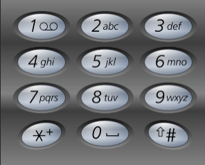

# Algorithm

# 1. Array

## 1.Two Sum

> Question: https://leetcode.com/problems/two-sum/description/
>
> Given an array of integers `nums` and an integer `target`, return *indices of the two numbers such that they add up to `target`*.
>
> You may assume that each input would have ***exactly\* one solution**, and you may not use the *same* element twice.
>
> You can return the answer in any order.

***Solution:***

```C++
#include <vector>
#include <unordered_map>
#include <map>
using namespace std;
class Solution {
public:
  // 1. Brute Force
  // Runtime: 291ms;
  // Memory: 10.2MB;
  vector<int> twoSum(vector<int> &nums, int target) {
    vector<int> result;
    for (int i = 0; i < nums.size() - 1; ++i) {
      for (int j = i + 1; j < nums.size(); ++j) {
        if ((nums[i] + nums[j]) == target) {
          return (result = {i, j});
        }
      }
    }
    return result;
  }

  // Use One-pass Hash Table:
  // Runtime: 12ms;
  // Memory: 12.1mb;
  vector<int> twoSum_v1(vector<int>& nums, int target) {
    unordered_map<int, int> numMap;
    int n = nums.size();

    // Build the hash table
    for (int i = 0; i < n; i++) {
      numMap[nums[i]] = i;
    }

    // Find the complement
    for (int i = 0; i < n; i++) {
      int complement = target - nums[i];
      // if the complement belongs to hash table and it's index != i
      if(numMap.count(complement) && numMap[complement] != i) {
        return {i, numMap[complement]};
      }
    }
    return {};
  }

  // Use map to compare with unordered_map:
  // Runtime: 18ms;
  // Memory: 12.5ms
  vector<int> twoSum_v2(vector<int>& nums, int target) {
    map<int, int> numMap;
    int n = nums.size();

    // Build the hash table
    for (int i = 0; i < n; i++) {
      numMap[nums[i]] = i;
    }

    // Find the complement
    for (int i = 0; i < n; i++) {
      int complement = target - nums[i];
      // if the complement belongs to hash table and it's index != i
      if(numMap.count(complement) && numMap[complement] != i) {
        return {i, numMap[complement]};
      }
    }
    return {};
  }
  // One-pass Hash Table:
  // Runtime: 7ms;
  // Memory: 10.9mb;
  vector<int> twoSum_v3(vector<int> &nums, int target) {
    unordered_map<int, int> num_map;
    int n = nums.size();

    // The key of this method is to search while inserting!
    for (int i = 0; i < n; i++) {
      int complement = target - nums[i];
      if (num_map.count(complement)) {
        return {num_map[complement], i};
      }
      num_map[nums[i]] = i;
    }
    return {};
  }
};
```

### (1. key of question)

As you can see, there are four solutions. 

- The first one is Bruce Force, we can loop through.
- The second one uses a hash table to use fast lookup and thus shorten the lookup time. Our most critical factor is to use the mapping to solve this problem. The realization principle of unordered_map is a hash table.
- The third one is just want to know the difference between unordered_map and map. It turns out that unordered_map is more efficient than map. The realization principle of map is Red-black tree that keep elements in order.
- The key to the fourth method is that we search while inserting! 

## 2. Add The Two Big Numbers

> Question: https://leetcode.com/problems/add-two-numbers/description/
>
> You are given two **non-empty** linked lists representing two non-negative integers. The digits are stored in **reverse order**, and each of their nodes contains a single digit. Add the two numbers and return the sum as a linked list.
>
> You may assume the two numbers do not contain any leading zero, except the number 0 itself.

***Solution:***

```C++
class Solution {
public: 
   // The second solution:
  // It's right!
  ListNode *addTwoBigNumbers(ListNode *l1, ListNode *l2) const {
    // numbers on units:
    int left = l1->val, right = l2->val;
    // the carry number:
    int carry;

    // the result of single units:
    int result = left + right;
    carry = result / 10;
    result = result % 10;

    ListNode *newNode = new ListNode(result);
    ListNode *temp = newNode;

    while (l1->next || l2->next) {
      if (l1->next != nullptr) {
        left = l1->next->val;
        result += left;
        l1 = l1->next;
      }

      if (l2->next != nullptr) {
        right = l2->next->val;
        result += right;
        l2 = l2->next;
      }

      result += carry;

      carry = result / 10;
      result = result % 10;
      temp->next = new ListNode(result);
      temp = temp->next;
    }
    if (carry != 0) {
      temp->next = new ListNode(carry);
      temp = temp->next;
    }

    return newNode;
  }
   // Wrong Solution!!!
  // The first one solution:
  // It is wrong!!!!, because I don't consider the size of number!
  // No matter how big I set the type of number, there are always
  // numbers lager than the maximum value of this type.
  //
  // So we can't easy convert the linked-list to a number, we must
  // calculate while inserting new nodes!
  ListNode *addTwoNumbers(ListNode *l1, ListNode *l2) {
    int number_1, number_2, result;
    int temp_int = 10;
    ListNode *temp;

    // convert the two linked-lists to numbers:
    temp = l1->next;
    number_1 = l1->val;
    while (temp) {
      number_1 = number_1 + (temp->val * temp_int);
      temp = temp->next;
      temp_int *= 10;
    }

    temp_int = 10;

    temp = l2->next;
    number_2 = l2->val;
    while (temp) {
      number_2 = number_2 + (temp->val * temp_int);
      temp = temp->next;
      temp_int *= 10;
    }
    // end convert
    std::cout << "number_1 is :" << number_1 << std::endl;
    std::cout << "number_2 is :" << number_2 << std::endl;

    result = number_1 + number_2;

    std::cout << "result is :" << result << std::endl;
    // convert the result into linked-list:
    ListNode *result_list = new ListNode(result % 10);
    ListNode *temp_result = result_list;
    while ((result = result / 10)) {
      temp_result->next = new ListNode(result % 10);
      temp_result = temp_result->next;
    }
    return result_list;
  }
};
```

### (2. Key of question)

As you can see, there are two solutions:

- The first one is wrong, because I didn't consider the size of number.
- The second one is right! The logic is easy!  

The key to this topic is that we need to be clear that this number may be very large, and we may not be able to store the number using the existing type, so we need to insert while calculating.

***Supplement:*** Added test code to the sample program, you can run it directly in your environment without using LeetCode for debugging!

There are the example code: [example.cpp](./Array/AddTwoNums.cpp)

# 2. BinaryTree

> In the preliminary work, a binary tree class is implemented here, and its member functions include traversal algorithms, pre-order, in-order, post-order and layer-order traversal. And a recursive version as well as a non-recursive version (iterative version) are implemented.
>
> There are the example codes: [example codes](./BinaryTree/main.cpp) . You can see the resource codes in `./BinaryTree/include/`.

## 106.Construct_Binary_Tree_from_Inorder_and_Postorder_Traversal

> Question: https://leetcode.com/problems/construct-binary-tree-from-inorder-and-postorder-traversal/description/
>
> Given two integer arrays `inorder` and `postorder` where `inorder` is the inorder traversal of a binary tree and `postorder` is the postorder traversal of the same tree, construct and return *the binary tree*.

```C++
/**
 * Definition for a binary tree node.
 * struct TreeNode {
 *     int val;
 *     TreeNode *left;
 *     TreeNode *right;
 *     TreeNode() : val(0), left(nullptr), right(nullptr) {}
 *     TreeNode(int x) : val(x), left(nullptr), right(nullptr) {}
 *     TreeNode(int x, TreeNode *left, TreeNode *right) : val(x), left(left), right(right) {}
 * };
 */
class Solution {
public:
    TreeNode* buildTree(vector<int>& inorder, vector<int>& postorder) {
      if (inorder.size() == 0 || postorder.size() == 0) {
      return nullptr;
    }

    unordered_map<int, int> number_map;

    for (int i = 0; i < inorder.size(); ++i) {
      number_map[inorder[i]] = i;
    }

    return buildHelper(inorder, postorder, 0, inorder.size(), 0,
                       postorder.size(), number_map);
  }

private:
  static TreeNode*buildHelper(vector<int> &inorder,
                                    vector<int> &postorder, int instart,
                                    int inend, int poststart, int postend, unordered_map<int, int>& number_map) {
    // nullptr node:
    if (poststart == postend) {
      return nullptr;
    }

    int rootValue = postorder[postend - 1];
    TreeNode *root = new TreeNode(rootValue);
    // leaf node:
    if (instart == (inend - 1) && poststart == (postend - 1)) {
      return root;
    }

    // find the cut point in the inorder:
    int delemiterIndex = number_map[rootValue];
    // for (delemiterIndex = instart; delemiterIndex < inend; delemiterIndex++) {
    //   if (inorder[delemiterIndex] == rootValue) {
    //     break;
    //   }
    // }


    // construct the left children:
    // inorder:
    int left_inorder_begin = instart;
    int left_inorder_end = delemiterIndex;

    int right_inorder_begin = delemiterIndex + 1;
    int right_inorder_end = inend;

    // postorder:
    int left_post_begin = poststart;
    int left_post_end = poststart + delemiterIndex - instart;

    int right_post_begin = poststart + delemiterIndex - instart;
    int right_post_end = postend - 1;

    root->left =
        buildHelper(inorder, postorder, left_inorder_begin, left_inorder_end,
                    left_post_begin, left_post_end, number_map);

    // construct the right children:
    root->right =
        buildHelper(inorder, postorder, right_inorder_begin, right_inorder_end,
                    right_post_begin, right_post_end, number_map);

    return root;
  }
};
```

### (106.Key of question)

The key to solving this problem is to understand the post-order traversal and in-order traversal of the binary tree.

After you understand it, we can split the question into these steps:

- if the size of array is zero, return nullptr;
- if the array is not NULL, let the last node of postorder the node element;
- use the node element to split the inorder-array into two children inorder-arrays;
- use the two children inorder-arrays to split the postorder-array into other two children postorder-arrays;
- handle with left children and right children recursively;

PS: You can use hash-table to improve performance.

There are the example codes :[example.cpp](./BinaryTree/106.Construct_Binary_Tree_from_Inorder_and_Postorder_Traversal/main.cpp). You can see the header codes in `./BinaryTree/include/`.

# 3. BackTracking

## 17.LetterCombinationsOfaPhoneNumber

> Question: Given a string containing digits from `2-9` inclusive, return all possible letter combinations that the number could represent. Return the answer in **any order**.
>
> A mapping of digits to letters (just like on the telephone buttons) is given below. Note that 1 does not map to any letters
>
> 
>
> **Example 1:**
>
> ```
> Input: digits = "23"
> Output: ["ad","ae","af","bd","be","bf","cd","ce","cf"]
> ```
>
> **Example 2:**
>
> ```
> Input: digits = ""
> Output: []
> ```
>
> **Example 3:**
>
> ```
> Input: digits = "2"
> Output: ["a","b","c"]
> ```

```C++
class Solution {
private:
  vector<string> result;
  string path;
  unordered_map<char, string> map{{'2', "abc"}, {'3', "def"}, {'4', "ghi"},
                                  {'5', "jkl"}, {'6', "mno"}, {'7', "pqrs"},
                                  {'8', "tuv"}, {'9', "wxyz"}};

  void backtracking(string digits, int index) {
    if (index == digits.size()) {
      result.push_back(path);
      return;
    }

    for (int i = 0; i < map[digits[index]].size(); i++) {
      path += map[digits[index]][i];
      backtracking(digits, index + 1);
      path = path.substr(0, path.size() - 1);
    }
  }

public:
  vector<string> letterCombinations(string digits) {
    if(digits.size() == 0) {
      return vector<string>();
    }
    result.clear();
    path = "";
    backtracking(digits, 0);
    return result;
  }
};
```

### (17.Key of question)

Because of the loop, we can't list all the situations. So we use the backtracking algorithm( actually recursion) , but it should be noted that this topic does not require us to preform pruning operations, because we need all situaitions.


## 77.Combinations

> Question: https://leetcode.com/problems/combinations/description/
>
> Given two integers `n` and `k`, return *all possible combinations of* `k` *numbers chosen from the range* `[1, n]`.
>
> You may return the answer in **any order**.
>
> **Example 1:**
>
> ```shell
> Input: n = 4, k = 2
> Output: [[1,2],[1,3],[1,4],[2,3],[2,4],[3,4]]
> Explanation: There are 4 choose 2 = 6 total combinations.
> Note that combinations are unordered, i.e., [1,2] and [2,1] are considered to be the same combination.
> ```
>
> **Example 2:**
>
> ```shell
> Input: n = 1, k = 1
> Output: [[1]]
> Explanation: There is 1 choose 1 = 1 total combination.
> ```
>
> ***Constrains:***
>
> - `1 <= n <= 20`
> - `1 <= k <= n`

```C++
class Solution {
private:
  vector<int> path;
  vector<vector<int>> result;
  void backtracking(int n, int k, int index) {
    // if path.size() == k, then it means that we have traversed to the leaf
    // node, that is to say, we have found a qualified subset
    if (path.size() == k) {
      result.push_back(path);
      return;
    }

    for (int i = index; i <= n - (k - path.size()) + 1; i++) {
      path.push_back(i);
      backtracking(n, k, i + 1);
      // backtracking: undo this step!
      path.pop_back();
    }
  }

public:
  vector<vector<int>> combine(int n, int k) {
    path.clear();
    result.clear();
    backtracking(n, k, 1);
    return result;
  }
};
```

### (77.Key of quesion)

Obviously, it is impossible for us to use the ***for loop*** to traverse this question, because k may be very large. In this case, our ***for loop*** can be finished, so the most important thing about this question is to use the backtracking method.

In fact, the backtracking algorithm is a recursive algorithm, and we abstract the problems that the backtracking algorithm can solve into a tree structure, because the problems solved by the backtracking algorithm are to recursively search for subsets in the set. The size of the set constitutes the width of the tree. The depth of recursion constitutes the depth of tree.

When we write backtracking algorithms, we generally need to consider a few points:

- Backtracking algorithms generally do not need to return a value, because they actually modify some public variables.
- The parameters of the backtracking algorithm are generally not determined at the beginning, but are determined one by one in the process of writing logic.
- The backtracking of algorithm is actually backtracking what we did in this step, which is backtracking, and the rest are all problems solved by the recursive algorithm.
- ***The pruning operation*** in the backtracking algorithm is actually to limit the conditions of our for loop traversal, and then directly filter out those wrong situations.

## 216.CombinationSumIII

> Question: https://leetcode.com/problems/combination-sum-iii/
>
> Find all valid combinations of `k` numbers that sum up to `n` such that the following conditions are true:
>
> - Only numbers `1` through `9` are used.
> - Each number is used **at most once**.
>
> Return *a list of all possible valid combinations*. The list must not contain the same combination twice, and the combinations may be returned in any order.
>
>  
>
> **Example 1:**
>
> ```
> Input: k = 3, n = 7
> Output: [[1,2,4]]
> Explanation:
> 1 + 2 + 4 = 7
> There are no other valid combinations.
> ```
>
> **Example 2:**
>
> ```
> Input: k = 3, n = 9
> Output: [[1,2,6],[1,3,5],[2,3,4]]
> Explanation:
> 1 + 2 + 6 = 9
> 1 + 3 + 5 = 9
> 2 + 3 + 4 = 9
> There are no other valid combinations.
> ```
>
> **Example 3:**
>
> ```
> Input: k = 4, n = 1
> Output: []
> Explanation: There are no valid combinations.
> Using 4 different numbers in the range [1,9], the smallest sum we can get is 1+2+3+4 = 10 and since 10 > 1, there are no valid combination.
> ```
>
>  
>
> **Constraints:**
>
> - `2 <= k <= 9`
> - `1 <= n <= 60`

```C++
class Solution {
private:
  int path_sum = 0;
  vector<int> path;
  vector<vector<int>> result;
  void backtracking(int k, int sum, int index) {
    bool flag = true;
    if (path_sum == sum && path.size() == k) {
      result.push_back(path);
      return;
    } else if (path_sum > sum || path.size() > k) {
      return;
    }

    for (int i = index; i <= 9; i++) {
      path_sum += i;
      path.push_back(i);
      backtracking(k, sum, i + 1);
      path_sum -= i;
      path.pop_back();
      if ((path_sum + i) > sum) {
        return;
      }
    }
  }

public:
  vector<vector<int>> combinationSum3(int k, int n) {
    backtracking(k, n, 1);
    return result;
  }
};
```

### (216.Key of question)

This problem can be solved by using the backtracking algorithm.
