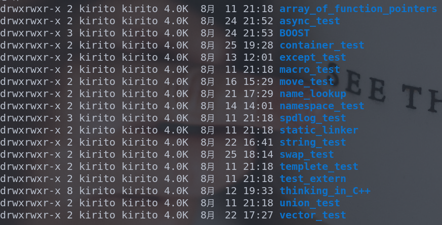
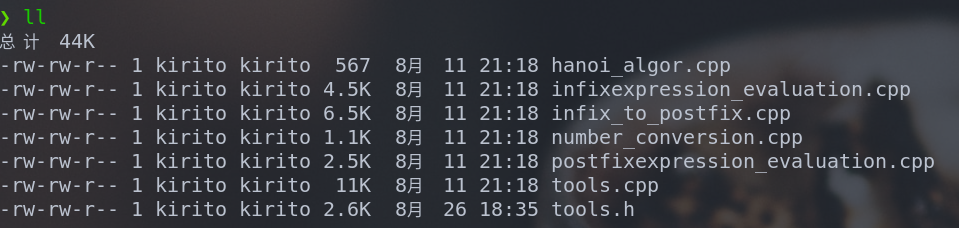
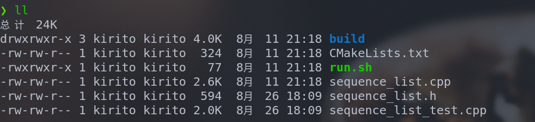

# Codes
Stored here are the test codes during my learning process, mainly about C++, data structures and algorithms. The rest are test codes for learning some new tools in C++, such as test codes for the ncurses library and so on.

The environment is divided into two types: Linux and Windows.

# LINUX

## 1. CPP_TEST

> Some test codes when learning C++

## 2. DATA_STRUCTURES_ALGORITHMS

### 2.1 Stack

### 2.2 Liner Table

### 2.3 Generalized List

[generalized_list](./LINUX/DATA_STRUCTURES_ALGORITHMS/GENERALIZED_LIST/linked_list/generalized_list.h)

### 2.4 Binary Tree

> The tree implemented here is actually a BST(Binary Search Tree).

[binary_tree](./LINUX/DATA_STRUCTURES_ALGORITHMS/BINARY_TREE/binary_tree/binary_tree.h)

> Here is the code to visualize the tree from StackOverflow: https://stackoverflow.com/questions/36802354/print-binary-tree-in-a-pretty-way-using-c
>
> After you include the header file, use the Dump() function.
>
> template <typename T> void Dump(const BinaryTree<T> &tree);

[tools](./LINUX/DATA_STRUCTURES_ALGORITHMS/BINARY_TREE/binary_tree/tools.h)

## 3. LEETCODE

> The topic and analysis I did on LeetCode.
>

### 3.1 Array

[1.TwoSum](./LINUX/LEET_CODE/Array/1.TwoSum/TwoSum.cpp)

[2.AddTwoNums](./LINUX/LEET_CODE/Array/2.AddTwoNums/AddTwoNums.cpp)

### 3.2 BinaryTree

[94.BinaryTreeInorderTraversal](./LINUX/LEET_CODE/BinaryTree/94.BinaryTreeInorderTraversal/main.cpp)

[106.ConstructBinaryTreefromInorderandPostorderTraversal](./LINUX/LEET_CODE/BinaryTree/106.ConstructBinaryTreefromInorderandPostorderTraversal/main.cpp)

### 3.3 BackTracking

[17.LetterCombinationsOfaPhoneNumber](./LINUX/LEET_CODE/BackTracking/17.LetterCombinationsOfaPhoneNumber/main.cpp)

[39.CombinationSum](./LINUX/LEET_CODE/BackTracking/39.CombinationSum/main.cpp)

[40.CombinationSumII](./LINUX/LEET_CODE/BackTracking/40.CombinationSumII/main.cpp)

[77.Combinations](./LINUX/LEET_CODE/BackTracking/77.Combinations/main.cpp)

[78.Subsets](./LINUX/LEET_CODE/BackTracking/78.Subsets/main.cpp)

[93.RestoreIPAddress_unfinished](./LINUX/LEET_CODE/BackTracking/93.RestoreIPAddress_unfinished/main.cpp)

[131.PalindromePartitioning(unfinished)](./LINUX/LEET_CODE/BackTracking/131.PalindromePartitioning_unfinished/main.cpp)

[216.CombinationSumIII](./LINUX/LEET_CODE/BackTracking/216.CombinationSumIII/main.cpp)

[ThePowerSetOfTheElements](./LINUX/LEET_CODE/BackTracking/ThePowerSetOfTheElements/main.cpp)

### 3.4 DynamicProgramming

[509.Fibonacci_Number](./LINUX/LEET_CODE/Dynamic_Programming/509.Fibonacci_Number/main.cpp)

[62.Unique_Paths](./LINUX/LEET_CODE/Dynamic_Programming/62.Unique_Paths/main.cpp)

[63.Unique_Paths_II](./LINUX/LEET_CODE/Dynamic_Programming/63.Unique_Paths_II/main.cpp)

[70.Climing_Stairs](./LINUX/LEET_CODE/Dynamic_Programming/70.Climing_Stairs/main.cpp)

[746.Min_Cost_Climbing_Stairs](./LINUX/LEET_CODE/Dynamic_Programming/746.Min_Cost_Climbing_Stairs/main.cpp)

### 3.5 Graph

[133.Clone_Graph](./LINUX/LEET_CODE/Graph/133.Clone_Graph/main.cpp)

- 200.Number_Of_Islands:

​		[200.Number_Of_Islands_DFS](./LINUX/LEET_CODE/Graph/200.Number_Of_Islands/200.number-of-islands-dfs.cpp)

​		[200.Number_Of_Islands_Union_Find](./LINUX/LEET_CODE/Graph/200.Number_Of_Islands/200.number-of-islands-union-find.cpp)

[797.All_Paths_From_Source_To_Target](./LINUX/LEET_CODE/Graph/797.All_Paths_From_Source_To_Target/main.cpp)

### 3.6 UnionSet

- 128:

​		[128.Longest_Consecutive_Sequence](./LINUX/LEET_CODE/UnionSet/128.Longest_Consecutive_Sequence/128.Longest_Consecutive_Sequence.cpp)

​		[128.Longest_Consecutive_Sequence_Another](./LINUX/LEET_CODE/UnionSet/128.Longest_Consecutive_Sequence/128.Longest_Consecutive_Sequence_another.cpp)

[130.Surrounded_Regions](./LINUX/LEET_CODE/UnionSet/130.Surrounded_Regions/130.surrounded_regions.cpp)

- 200:

​		[200.Number_Of_Islands_Union_Find](./LINUX/LEET_CODE/UnionSet/200.Number_Of_Islands/200.number-of-islands-union-find.cpp)

​		[200.Number_Of_Islands_DFS](./LINUX/LEET_CODE/UnionSet/200.Number_Of_Islands/200.number-of-islands-dfs.cpp)

- 261:

​		[261.Graph_Vaild_Tree_Union_Find](./LINUX/LEET_CODE/UnionSet/261.Graph_Vaild_Tree/261.graph_vaild_tree_union_set.cpp)

​		[261.Graph_Vaild_Tree](./LINUX/LEET_CODE/UnionSet/261.Graph_Vaild_Tree/261.graph_vaild_tree.cpp)

- 305:

​		[305.Number_Of_Islands_II_Union_Find](./LINUX/LEET_CODE/UnionSet/305.Number_Of_Islands_II/305.number_of_islands_ii_union_set.cpp)

​		[305.Number_Of_Islands_II](./LINUX/LEET_CODE/UnionSet/305.Number_Of_Islands_II/305.number_of_islands_ii_false.cpp)

[323.Number_Of_Connected_CIAUG](./LINUX/LEET_CODE/UnionSet/323.Number_Of_Connected_CIAUG/323.main.cpp)		

### OTHERS

[416.Partition_Equal_Subset_Sum](./LINUX/LEET_CODE/Problems/416.Partition_Equal_Subset_Sum/main.cpp)

[459.Repeated_Substring_Pattern](./LINUX/LEET_CODE/Problems/459.Repeated_Substring_Pattern/main.cpp)

## 4. NCURSES_TEST

> Some test code about the ncurses library

# WINDOWS

